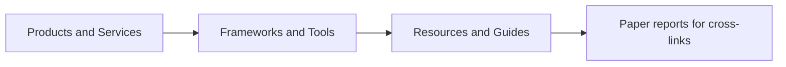

# Ecosystem Report Portal

The non-paper ecosystem reports now live in [ecosystem/README.md](./ecosystem/README.md). This portal is the front door for products, GitHub repos, tools, benchmark sites, guides, curated lists, videos, and model-hub entries that now have research-style dossiers.

- Total ecosystem reports: `83`
- Products & Services: `15`
- Frameworks & Tools: `24`
- Resources & Guides: `44`

## Jump Points

- [Coverage index](./ecosystem/README.md)
- [Products and services reports](./ecosystem/README.md#products--services)
- [Frameworks and tools reports](./ecosystem/README.md#frameworks--tools)
- [Resources and guides reports](./ecosystem/README.md#resources--guides)

## What Is Covered

- Products and commercial offerings
- Open-source frameworks, tools, demos, and infrastructure repos
- External resources such as curated lists, blog posts, benchmark sites, guides, and model hubs
