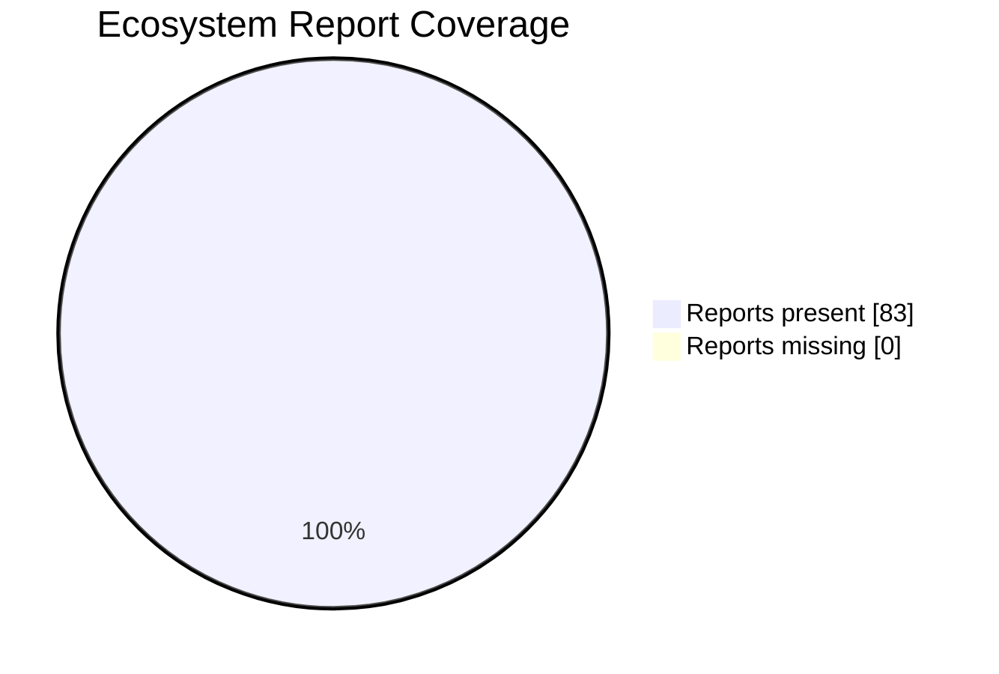

# Ecosystem Reports Index

This index tracks research-style reports for non-paper entries across products, frameworks, tools, and external resources. The `Report Included` column is future-proofed: entries with generated reports are marked `[x]`, while new link-bearing entries can stay blank until they are written.

Coverage: `83/83` tracked ecosystem entries currently have reports.

## Products & Services

| Entry | Category | Report Included | Report | Primary URL | Audit status |
| --- | --- | --- | --- | --- | --- |
| Amazon Bedrock AgentCore Browser | Browser Infrastructure Services | [x] | [Open](products-and-services/browser-infrastructure-services-amazon-bedrock-agentcore-browser.md) | [Docs](https://docs.aws.amazon.com/bedrock-agentcore/) | `ok` |
| Browserbase | Browser Infrastructure Services | [x] | [Open](products-and-services/browser-infrastructure-services-browserbase.md) | [Website](https://www.browserbase.com/) | `ok` |
| Browserless | Browser Infrastructure Services | [x] | [Open](products-and-services/browser-infrastructure-services-browserless.md) | [Website](https://www.browserless.io/) | `ok` |
| Amazon AWS - Nova Act | Major Tech Companies | [x] | [Open](products-and-services/major-tech-companies-amazon-aws-nova-act.md) | [Product](https://aws.amazon.com/nova/act/) | `ok` |
| Anthropic - Claude Computer Use | Major Tech Companies | [x] | [Open](products-and-services/major-tech-companies-anthropic-claude-computer-use.md) | [Documentation](https://platform.claude.com/docs/en/agents-and-tools/tool-use/computer-use-tool) | `ok` |
| Apple - Siri Agent (Apple Intelligence) | Major Tech Companies | [x] | [Open](products-and-services/major-tech-companies-apple-siri-agent-apple-intelligence.md) | [Apple Intelligence](https://www.apple.com/apple-intelligence/) | `error` |
| Google - Project Mariner | Major Tech Companies | [x] | [Open](products-and-services/major-tech-companies-google-project-mariner.md) | [Product](https://deepmind.google/models/project-mariner/) | `error` |
| OpenAI - Operator / CUA | Major Tech Companies | [x] | [Open](products-and-services/major-tech-companies-openai-operator-cua.md) | [Product](https://openai.com/index/introducing-operator/) | `error` |
| Adept AI - ACT-1 | Startups | [x] | [Open](products-and-services/startups-adept-ai-act-1.md) | [Blog](https://www.adept.ai/blog/act-1/) | `error` |
| H Company - Runner H | Startups | [x] | [Open](products-and-services/startups-h-company-runner-h.md) | [Website](https://www.hcompany.ai/) | `error` |
| HyperWrite - Personal Assistant | Startups | [x] | [Open](products-and-services/startups-hyperwrite-personal-assistant.md) | [Website](https://www.hyperwriteai.com/personal-assistant) | `ok` |
| Manus (Butterfly Effect) | Startups | [x] | [Open](products-and-services/startups-manus-butterfly-effect.md) | [Website](https://manus.bot) | `error` |
| MultiOn | Startups | [x] | [Open](products-and-services/startups-multion.md) | [Website](https://www.multion.ai/) | `ok` |
| Rabbit Inc - Rabbit R1 | Startups | [x] | [Open](products-and-services/startups-rabbit-inc-rabbit-r1.md) | [Website](https://www.rabbit.tech/rabbit-r1) | `error` |
| Twin Labs - Twin | Startups | [x] | [Open](products-and-services/startups-twin-labs-twin.md) | [Website](https://twin.so/) | `error` |

## Frameworks & Tools

| Entry | Category | Report Included | Report | Primary URL | Audit status |
| --- | --- | --- | --- | --- | --- |
| OpenAdapt | Desktop Agent Frameworks | [x] | [Open](frameworks-and-tools/desktop-agent-frameworks-openadapt.md) | [GitHub](https://github.com/OpenAdaptAI/OpenAdapt) | `ok` |
| OpenInterpreter | Desktop Agent Frameworks | [x] | [Open](frameworks-and-tools/desktop-agent-frameworks-openinterpreter.md) | [GitHub](https://github.com/OpenInterpreter/open-interpreter) | `ok` |
| UFO (Microsoft) | Desktop Agent Frameworks | [x] | [Open](frameworks-and-tools/desktop-agent-frameworks-ufo-microsoft.md) | [GitHub](https://github.com/microsoft/UFO) | `ok` |
| UI-TARS Desktop | Desktop Agent Frameworks | [x] | [Open](frameworks-and-tools/desktop-agent-frameworks-ui-tars-desktop.md) | [GitHub](https://github.com/bytedance/UI-TARS-desktop) | `ok` |
| PyAutoGUI | Desktop Automation Libraries | [x] | [Open](frameworks-and-tools/desktop-automation-libraries-pyautogui.md) | [GitHub](https://github.com/asweigart/pyautogui) | `ok` |
| nut.js | Desktop Automation Libraries | [x] | [Open](frameworks-and-tools/desktop-automation-libraries-nut-js.md) | [GitHub](https://github.com/nut-tree/nut.js) | `ok` |
| OmniParser | Grounding & Parsing Tools | [x] | [Open](frameworks-and-tools/grounding-and-parsing-tools-omniparser.md) | [GitHub](https://github.com/microsoft/OmniParser) | `ok` |
| SeeClick | Grounding & Parsing Tools | [x] | [Open](frameworks-and-tools/grounding-and-parsing-tools-seeclick.md) | [GitHub](https://github.com/njucckevin/SeeClick) | `ok` |
| Claude Computer Use Demo | Integration Examples | [x] | [Open](frameworks-and-tools/integration-examples-claude-computer-use-demo.md) | [Anthropic Quickstart](https://github.com/anthropics/anthropic-quickstarts) | `ok` |
| OpenAI CUA Sample App | Integration Examples | [x] | [Open](frameworks-and-tools/integration-examples-openai-cua-sample-app.md) | [GitHub](https://github.com/openai/openai-cua-sample-app) | `error` |
| AgentCPM-GUI | Mobile Agent Frameworks | [x] | [Open](frameworks-and-tools/mobile-agent-frameworks-agentcpm-gui.md) | [GitHub](https://github.com/OpenBMB/AgentCPM-GUI) | `ok` |
| AppAgent | Mobile Agent Frameworks | [x] | [Open](frameworks-and-tools/mobile-agent-frameworks-appagent.md) | [GitHub](https://github.com/TencentQQGYLab/AppAgent) | `ok` |
| AutoGLM | Mobile Agent Frameworks | [x] | [Open](frameworks-and-tools/mobile-agent-frameworks-autoglm.md) | [GitHub](https://github.com/THUDM/AutoGLM) | `error` |
| Mobile-Agent | Mobile Agent Frameworks | [x] | [Open](frameworks-and-tools/mobile-agent-frameworks-mobile-agent.md) | [GitHub](https://github.com/X-PLUG/MobileAgent) | `ok` |
| AutoGen | Multi-Agent Frameworks | [x] | [Open](frameworks-and-tools/multi-agent-frameworks-autogen.md) | [GitHub](https://github.com/microsoft/autogen) | `ok` |
| CrewAI | Multi-Agent Frameworks | [x] | [Open](frameworks-and-tools/multi-agent-frameworks-crewai.md) | [GitHub](https://github.com/joaomdmoura/crewAI) | `ok` |
| LangGraph | Multi-Agent Frameworks | [x] | [Open](frameworks-and-tools/multi-agent-frameworks-langgraph.md) | [GitHub](https://github.com/langchain-ai/langgraph) | `ok` |
| E2B Desktop Sandbox | Sandbox & Testing Environments | [x] | [Open](frameworks-and-tools/sandbox-and-testing-environments-e2b-desktop-sandbox.md) | [GitHub](https://github.com/e2b-dev/desktop) | `error` |
| Windows in Docker | Sandbox & Testing Environments | [x] | [Open](frameworks-and-tools/sandbox-and-testing-environments-windows-in-docker.md) | [GitHub](https://github.com/dockur/windows) | `error` |
| Agent Browser (Vercel) | Web/Browser Frameworks | [x] | [Open](frameworks-and-tools/web-browser-frameworks-agent-browser-vercel.md) | [GitHub](https://github.com/vercel-labs/agent-browser) | `ok` |
| Browser Use | Web/Browser Frameworks | [x] | [Open](frameworks-and-tools/web-browser-frameworks-browser-use.md) | [GitHub](https://github.com/browser-use/browser-use) | `ok` |
| LaVague | Web/Browser Frameworks | [x] | [Open](frameworks-and-tools/web-browser-frameworks-lavague.md) | [GitHub](https://github.com/lavague-ai/lavague) | `error` |
| Skyvern | Web/Browser Frameworks | [x] | [Open](frameworks-and-tools/web-browser-frameworks-skyvern.md) | [GitHub](https://github.com/Skyvern-AI/skyvern) | `ok` |
| Stagehand | Web/Browser Frameworks | [x] | [Open](frameworks-and-tools/web-browser-frameworks-stagehand.md) | [GitHub](https://github.com/browserbase/stagehand) | `ok` |

## Resources & Guides

| Entry | Category | Report Included | Report | Primary URL | Audit status |
| --- | --- | --- | --- | --- | --- |
| HuggingFace Papers | Benchmarking Resources / Leaderboards | [x] | [Open](resources-and-guides/benchmarking-resources-leaderboards-huggingface-papers.md) | [huggingface.co/papers](https://huggingface.co/papers) | `ok` |
| alphaXiv Benchmarks | Benchmarking Resources / Leaderboards | [x] | [Open](resources-and-guides/benchmarking-resources-leaderboards-alphaxiv-benchmarks.md) | [alphaxiv.org/benchmarks](https://www.alphaxiv.org/benchmarks) | `error` |
| Mind2Web | Benchmarking Resources / Official Benchmark Sites | [x] | [Open](resources-and-guides/benchmarking-resources-official-benchmark-sites-mind2web.md) | [osu-nlp-group.github.io/Mind2Web](https://osu-nlp-group.github.io/Mind2Web/) | `ok` |
| OSWorld | Benchmarking Resources / Official Benchmark Sites | [x] | [Open](resources-and-guides/benchmarking-resources-official-benchmark-sites-osworld.md) | [os-world.github.io](https://os-world.github.io/) | `ok` |
| WebArena | Benchmarking Resources / Official Benchmark Sites | [x] | [Open](resources-and-guides/benchmarking-resources-official-benchmark-sites-webarena.md) | [webarena.dev](https://webarena.dev/) | `ok` |
| Windows Agent Arena | Benchmarking Resources / Official Benchmark Sites | [x] | [Open](resources-and-guides/benchmarking-resources-official-benchmark-sites-windows-agent-arena.md) | [microsoft.github.io/WindowsAgentArena](https://microsoft.github.io/WindowsAgentArena/) | `ok` |
| ACU - AI for Computer Use | Curated Paper Lists | [x] | [Open](resources-and-guides/curated-paper-lists-acu-ai-for-computer-use.md) | [GitHub](https://github.com/trycua/acu) | `error` |
| Awesome-GUI-Agent (ShowLab) | Curated Paper Lists | [x] | [Open](resources-and-guides/curated-paper-lists-awesome-gui-agent-showlab.md) | [GitHub](https://github.com/showlab/Awesome-GUI-Agent) | `ok` |
| Awesome-GUI-Agents (ZJU-REAL) | Curated Paper Lists | [x] | [Open](resources-and-guides/curated-paper-lists-awesome-gui-agents-zju-real.md) | [GitHub](https://github.com/ZJU-REAL/Awesome-GUI-Agents) | `ok` |
| GUI-Agents-Paper-List (OSU NLP Group) | Curated Paper Lists | [x] | [Open](resources-and-guides/curated-paper-lists-gui-agents-paper-list-osu-nlp-group.md) | [GitHub](https://github.com/OSU-NLP-Group/GUI-Agents-Paper-List) | `error` |
| ai-agent-papers | Curated Paper Lists | [x] | [Open](resources-and-guides/curated-paper-lists-ai-agent-papers.md) | [GitHub](https://github.com/masamasa59/ai-agent-papers) | `ok` |
| awesome-mobile-agents | Curated Paper Lists | [x] | [Open](resources-and-guides/curated-paper-lists-awesome-mobile-agents.md) | [GitHub](https://github.com/aialt/awesome-mobile-agents) | `ok` |
| AI Agent Framework Comparison | Industry Analysis & News / Comparison Articles | [x] | [Open](resources-and-guides/industry-analysis-and-news-comparison-articles-ai-agent-framework-comparison.md) | [Article](https://fast.io/resources/ai-agent-framework-comparison/) | `error` |
| Anthropic's Computer Use vs OpenAI's CUA | Industry Analysis & News / Comparison Articles | [x] | [Open](resources-and-guides/industry-analysis-and-news-comparison-articles-anthropic-s-computer-use-vs-openai-s-cua.md) | [Article](https://workos.com/blog/anthropics-computer-use-versus-openais-computer-using-agent-cua) | `ok` |
| Manus vs MultiOn vs HyperWrite | Industry Analysis & News / Comparison Articles | [x] | [Open](resources-and-guides/industry-analysis-and-news-comparison-articles-manus-vs-multion-vs-hyperwrite.md) | [Article](https://genesysgrowth.com/blog/manus-vs-multion-vs-hyperwrite) | `ok` |
| Top 10 Browser Automation Agents | Industry Analysis & News / Comparison Articles | [x] | [Open](resources-and-guides/industry-analysis-and-news-comparison-articles-top-10-browser-automation-agents.md) | [Article](https://o-mega.ai/articles/the-top-10-browser-automation-agents) | `ok` |
| AI Agents: Why the Rabbit R1 May Be a Game Changer | Industry Analysis & News / Major Articles | [x] | [Open](resources-and-guides/industry-analysis-and-news-major-articles-ai-agents-why-the-rabbit-r1-may-be-a-game-changer.md) | [Article](https://aibusiness.com/nlp/ai-agents-why-the-rabbit-r1-may-be-a-game-changer) | `error` |
| AI is about to completely change how you use computers | Industry Analysis & News / Major Articles | [x] | [Open](resources-and-guides/industry-analysis-and-news-major-articles-ai-is-about-to-completely-change-how-you-use-computers.md) | [GatesNotes](https://www.gatesnotes.com/AI-agents) | `error` |
| State of AI Agents in 2025 | Industry Analysis & News / Major Articles | [x] | [Open](resources-and-guides/industry-analysis-and-news-major-articles-state-of-ai-agents-in-2025.md) | [Article](https://carlrannaberg.medium.com/state-of-ai-agents-in-2025-5f11444a5c78) | `error` |
| What you need to know about Manus | Industry Analysis & News / Major Articles | [x] | [Open](resources-and-guides/industry-analysis-and-news-major-articles-what-you-need-to-know-about-manus.md) | [Article](https://venturebeat.com/ai/what-you-need-to-know-about-manus-the-new-ai-agentic-system-from-china-hailed-as-a-second-deepseek-moment) | `error` |
| AgentCore Browser | Key Blog Posts & Announcements / Amazon | [x] | [Open](resources-and-guides/key-blog-posts-and-announcements-amazon-agentcore-browser.md) | [Blog](https://aws.amazon.com/blogs/machine-learning/introducing-amazon-bedrock-agentcore-browser-tool/) | `error` |
| Amazon Nova Act SDK | Key Blog Posts & Announcements / Amazon | [x] | [Open](resources-and-guides/key-blog-posts-and-announcements-amazon-amazon-nova-act-sdk.md) | [Blog](https://aws.amazon.com/blogs/machine-learning/amazon-nova-act-sdk-preview-path-to-production-for-browser-automation-agents/) | `ok` |
| Claude can now use computers | Key Blog Posts & Announcements / Anthropic | [x] | [Open](resources-and-guides/key-blog-posts-and-announcements-anthropic-claude-can-now-use-computers.md) | [Blog](https://www.anthropic.com/news/claude-computer-use-ga) | `error` |
| Introducing computer use | Key Blog Posts & Announcements / Anthropic | [x] | [Open](resources-and-guides/key-blog-posts-and-announcements-anthropic-introducing-computer-use.md) | [Blog](https://www.anthropic.com/news/3-5-models-and-computer-use) | `ok` |
| UI-TARS Research Page | Key Blog Posts & Announcements / ByteDance | [x] | [Open](resources-and-guides/key-blog-posts-and-announcements-bytedance-ui-tars-research-page.md) | [Seed](https://seed.bytedance.com/en/ui-tars) | `ok` |
| Gemini 2.5 Computer Use | Key Blog Posts & Announcements / Google | [x] | [Open](resources-and-guides/key-blog-posts-and-announcements-google-gemini-2-5-computer-use.md) | [Blog](https://blog.google/technology/google-deepmind/gemini-computer-use-model/) | `ok` |
| Project Mariner | Key Blog Posts & Announcements / Google | [x] | [Open](resources-and-guides/key-blog-posts-and-announcements-google-project-mariner.md) | [DeepMind](https://deepmind.google/models/project-mariner/) | `error` |
| Computer-Using Agent | Key Blog Posts & Announcements / OpenAI | [x] | [Open](resources-and-guides/key-blog-posts-and-announcements-openai-computer-using-agent.md) | [Blog](https://openai.com/index/computer-using-agent/) | `error` |
| Introducing Operator | Key Blog Posts & Announcements / OpenAI | [x] | [Open](resources-and-guides/key-blog-posts-and-announcements-openai-introducing-operator.md) | [Blog](https://openai.com/index/introducing-operator/) | `error` |
| New tools for building agents | Key Blog Posts & Announcements / OpenAI | [x] | [Open](resources-and-guides/key-blog-posts-and-announcements-openai-new-tools-for-building-agents.md) | [Blog](https://openai.com/index/new-tools-for-building-agents/) | `error` |
| Operator System Card | Key Blog Posts & Announcements / OpenAI | [x] | [Open](resources-and-guides/key-blog-posts-and-announcements-openai-operator-system-card.md) | [PDF](https://cdn.openai.com/operator_system_card.pdf) | `ok` |
| AutoGLM-Phone-9B | Model Hubs / HuggingFace Models | [x] | [Open](resources-and-guides/model-hubs-huggingface-models-autoglm-phone-9b.md) | [HuggingFace](https://huggingface.co/THUDM/AutoGLM-Phone-9B) | `error` |
| OmniParser-v2.0 | Model Hubs / HuggingFace Models | [x] | [Open](resources-and-guides/model-hubs-huggingface-models-omniparser-v2-0.md) | [HuggingFace](https://huggingface.co/microsoft/OmniParser-v2.0) | `ok` |
| Qwen2.5-VL-72B-Instruct | Model Hubs / HuggingFace Models | [x] | [Open](resources-and-guides/model-hubs-huggingface-models-qwen2-5-vl-72b-instruct.md) | [HuggingFace](https://huggingface.co/Qwen/Qwen2.5-VL-72B-Instruct) | `ok` |
| UI-TARS-1.5-7B | Model Hubs / HuggingFace Models | [x] | [Open](resources-and-guides/model-hubs-huggingface-models-ui-tars-1-5-7b.md) | [HuggingFace](https://huggingface.co/ByteDance-Seed/UI-TARS-1.5-7B) | `ok` |
| OmniParser | Tutorials & Guides / Framework Tutorials | [x] | [Open](resources-and-guides/tutorials-and-guides-framework-tutorials-omniparser.md) | [Tutorial](https://learnopencv.com/omniparser-vision-based-gui-agent/) | `ok` |
| Qwen2.5-VL | Tutorials & Guides / Framework Tutorials | [x] | [Open](resources-and-guides/tutorials-and-guides-framework-tutorials-qwen2-5-vl.md) | [Tutorial](https://debuggercafe.com/qwen2-5-vl/) | `error` |
| Browser Agents with Playwright & Claude | Tutorials & Guides / Getting Started | [x] | [Open](resources-and-guides/tutorials-and-guides-getting-started-browser-agents-with-playwright-and-claude.md) | [Tutorial](https://www.browserless.io/blog/building-autonomous-browser-agents-with-playwright-claude-opus-4-5) | `ok` |
| Building Browser Agents with MultiOn | Tutorials & Guides / Getting Started | [x] | [Open](resources-and-guides/tutorials-and-guides-getting-started-building-browser-agents-with-multion.md) | [Tutorial](https://medium.com/@mansi.more943/building-ai-browser-agents-with-multion-5c00c6df731e) | `error` |
| Computer Use Guide | Tutorials & Guides / Getting Started | [x] | [Open](resources-and-guides/tutorials-and-guides-getting-started-computer-use-guide.md) | [Docs](https://developers.openai.com/api/docs/guides/tools-computer-use) | `ok` |
| Computer Use Tool Guide | Tutorials & Guides / Getting Started | [x] | [Open](resources-and-guides/tutorials-and-guides-getting-started-computer-use-tool-guide.md) | [Docs](https://platform.claude.com/docs/en/agents-and-tools/tool-use/computer-use-tool) | `ok` |
| Project Mariner Guide | Tutorials & Guides / Getting Started | [x] | [Open](resources-and-guides/tutorials-and-guides-getting-started-project-mariner-guide.md) | [Tutorial](https://www.datacamp.com/tutorial/project-mariner) | `error` |
| Computer Use Demo | Video Resources / Talks & Presentations | [x] | [Open](resources-and-guides/video-resources-talks-and-presentations-computer-use-demo.md) | [YouTube](https://www.youtube.com/anthropic) | `ok` |
| Operator Introduction | Video Resources / Talks & Presentations | [x] | [Open](resources-and-guides/video-resources-talks-and-presentations-operator-introduction.md) | [YouTube](https://www.youtube.com/openai) | `ok` |
