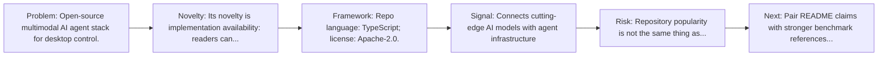
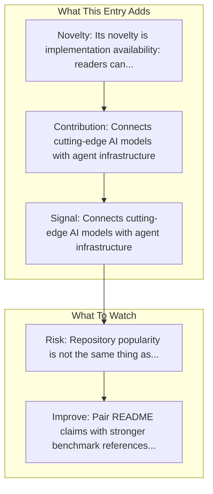

# UI-TARS Desktop

Entry report generated on 2026-03-28 (Asia/Shanghai). This report is based on the repository entry, audit-time metadata, and cross-checks against adjacent repo context.

## Snapshot

| Field | Detail |
| --- | --- |
| Repo entry | UI-TARS Desktop |
| Actual target | [GitHub](https://github.com/bytedance/UI-TARS-desktop) |
| Group | Frameworks & Tools |
| Category | Desktop Agent Frameworks |
| Source location | `frameworks/README.md:7` |
| Primary link type | `repository` |
| Audit status | `ok` |
| Organization | ByteDance |
| GitHub stars | 29127 |
| Language | TypeScript |
| License | Apache-2.0 |
| Stars | 15k+ |

## Quick Read

| Lens | Read |
| --- | --- |
| Role in repo | repository |
| Novelty | Its novelty is implementation availability: readers can inspect, run, and adapt the actual stack rather than only reading paper claims. |
| Operating frame | Repo language: TypeScript; license: Apache-2.0. |
| Main caution | Repository popularity is not the same thing as benchmark-verified reliability, maintenance quality, or deployment safety. |

## Visual Frame

## Analysis Map

## Executive Summary

Open-source multimodal AI agent stack for desktop control. The Open-Source Multimodal AI Agent Stack: Connecting Cutting-Edge AI Models and Agent Infra. Key local notes: Connects cutting-edge AI models with agent infrastructure; Desktop application (Electron-based).

## Novelty and Distinguishing Angle

- Its novelty is implementation availability: readers can inspect, run, and adapt the actual stack rather than only reading paper claims.
- The entry sits in the desktop-control lane, which usually raises stronger environment variance and safety implications than browser-only automation.
- Open-source adoption is non-trivial here: cached GitHub metadata records 29127 stars.

## Core Contributions or Offerings

- Connects cutting-edge AI models with agent infrastructure
- Desktop application (Electron-based)
- State-of-the-art performance
- UI-TARS Model
- UI-TARS-1.5-7B

## Operating Framework

- Repo language: TypeScript; license: Apache-2.0.
- Repository updated at audit time: 2026-03-27T14:30:15Z.

## Evidence and Adoption Signals

- Connects cutting-edge AI models with agent infrastructure
- Desktop application (Electron-based)
- GitHub stars: 29127.
- Open issues at audit time: 365.
- Open-source posture: TypeScript, license Apache-2.0.
- Topics: agent, agent-tars, browser-use, computer-use, cowork, gui-agent.

## Limitations and Gaps

- Repository popularity is not the same thing as benchmark-verified reliability, maintenance quality, or deployment safety.

## Improvement Paths

- Pair README claims with stronger benchmark references, maintenance notes, and example evaluations.
- Document supported environments and failure modes more explicitly so adoption signals are easier to interpret.
- Show reproducible setup paths and ongoing maintenance signals, not just launch momentum.

## Why It Matters

- It provides the implementation layer that turns research claims into developer workflows, demos, and reusable stacks.
- Framework entries help explain what the ecosystem can actually build today, not just what papers describe.

## Connections In This Repo

- [OSWorld: Multimodal Agents for Open-Ended Tasks in Real Computer Environments](../../papers/benchmarks-and-datasets/osworld-multimodal-agents-for-open-ended-tasks-in-real-computer-environments.md) - shared desktop or OS-level automation surface.
- [OpenInterpreter](desktop-agent-frameworks-openinterpreter.md) - shared desktop or OS-level automation surface.
- [OpenAdapt](desktop-agent-frameworks-openadapt.md) - shared desktop or OS-level automation surface.
- [AppAgent](mobile-agent-frameworks-appagent.md) - neighboring ecosystem entry in the same local cluster.

## Source Basis

- Primary basis: repo-local notes, report metadata, GitHub repository metadata.
- Audit access note: tracked audit status was `ok` for the primary URL.
- Maintenance note: repository metadata was current through 2026-03-27T14:30:15Z at audit time.
