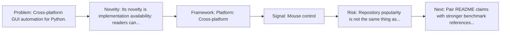
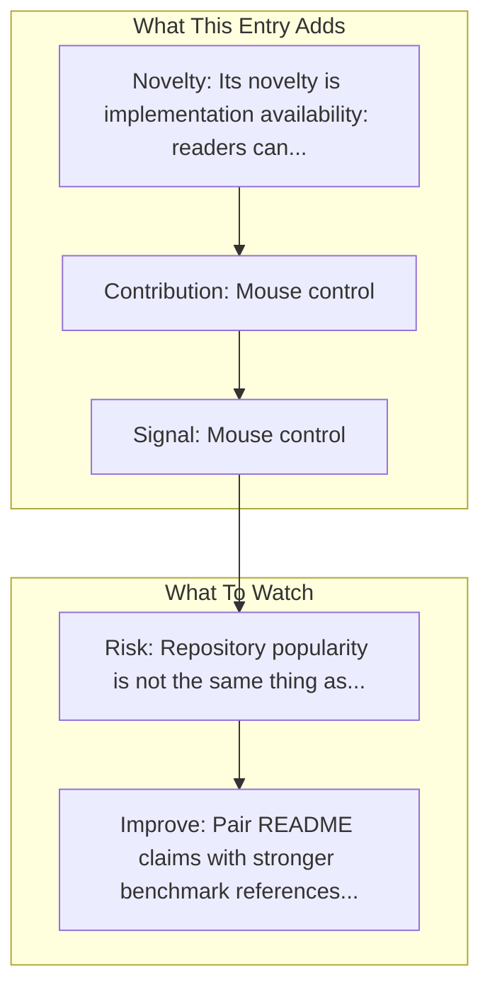

# PyAutoGUI

Entry report generated on 2026-03-28 (Asia/Shanghai). This report is based on the repository entry, audit-time metadata, and cross-checks against adjacent repo context.

## Snapshot

| Field | Detail |
| --- | --- |
| Repo entry | PyAutoGUI |
| Actual target | [GitHub](https://github.com/asweigart/pyautogui) |
| Group | Frameworks & Tools |
| Category | Desktop Automation Libraries |
| Source location | `frameworks/README.md:252` |
| Primary link type | `repository` |
| Audit status | `ok` |
| Platform | Cross-platform |
| GitHub stars | 12400 |
| Language | Python |
| License | BSD-3-Clause |
| Language | Python |

## Quick Read

| Lens | Read |
| --- | --- |
| Role in repo | repository |
| Novelty | Its novelty is implementation availability: readers can inspect, run, and adapt the actual stack rather than only reading paper claims. |
| Operating frame | Platform: Cross-platform |
| Main caution | Repository popularity is not the same thing as benchmark-verified reliability, maintenance quality, or deployment safety. |

## Visual Frame

## Analysis Map

## Executive Summary

Cross-platform GUI automation for Python. A cross-platform GUI automation Python module for human beings. Used to programmatically control the mouse & keyboard. Key local notes: Mouse control; Keyboard input.

## Novelty and Distinguishing Angle

- Its novelty is implementation availability: readers can inspect, run, and adapt the actual stack rather than only reading paper claims.
- The entry sits in the desktop-control lane, which usually raises stronger environment variance and safety implications than browser-only automation.
- Open-source adoption is non-trivial here: cached GitHub metadata records 12400 stars.

## Core Contributions or Offerings

- Mouse control
- Keyboard input
- Screenshot capture
- Image recognition

## Operating Framework

- Platform: Cross-platform
- Language: Python
- Repo language: Python; license: BSD-3-Clause.
- Repository updated at audit time: 2026-03-27T13:39:37Z.

## Evidence and Adoption Signals

- Mouse control
- Keyboard input
- GitHub stars: 12400.
- Open issues at audit time: 577.
- Open-source posture: Python, license BSD-3-Clause.
- Recent maintenance timestamp in cached metadata: 2026-03-27T13:39:37Z.

## Limitations and Gaps

- Repository popularity is not the same thing as benchmark-verified reliability, maintenance quality, or deployment safety.

## Improvement Paths

- Pair README claims with stronger benchmark references, maintenance notes, and example evaluations.
- Document supported environments and failure modes more explicitly so adoption signals are easier to interpret.
- Show reproducible setup paths and ongoing maintenance signals, not just launch momentum.

## Why It Matters

- It provides the implementation layer that turns research claims into developer workflows, demos, and reusable stacks.
- Framework entries help explain what the ecosystem can actually build today, not just what papers describe.

## Connections In This Repo

- [OpenAdapt](desktop-agent-frameworks-openadapt.md) - neighboring ecosystem entry in the same local cluster.
- [Browser Use](web-browser-frameworks-browser-use.md) - neighboring ecosystem entry in the same local cluster.
- [LaVague](web-browser-frameworks-lavague.md) - neighboring ecosystem entry in the same local cluster.
- [Skyvern](web-browser-frameworks-skyvern.md) - neighboring ecosystem entry in the same local cluster.

## Source Basis

- Primary basis: repo-local notes, report metadata, GitHub repository metadata.
- Audit access note: tracked audit status was `ok` for the primary URL.
- Maintenance note: repository metadata was current through 2026-03-27T13:39:37Z at audit time.
