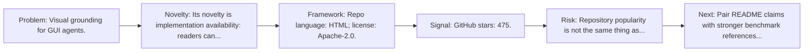
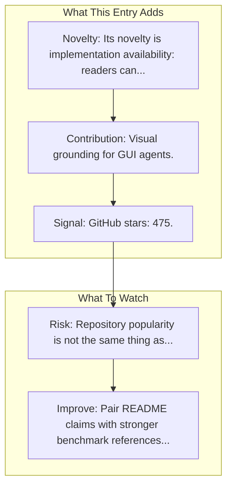

# SeeClick

Entry report generated on 2026-03-28 (Asia/Shanghai). This report is based on the repository entry, audit-time metadata, and cross-checks against adjacent repo context.

## Snapshot

| Field | Detail |
| --- | --- |
| Repo entry | SeeClick |
| Actual target | [GitHub](https://github.com/njucckevin/SeeClick) |
| Group | Frameworks & Tools |
| Category | Grounding & Parsing Tools |
| Source location | `frameworks/README.md:241` |
| Primary link type | `repository` |
| Audit status | `ok` |
| Organization | Nanjing University |
| GitHub stars | 475 |
| Language | HTML |
| License | Apache-2.0 |

## Quick Read

| Lens | Read |
| --- | --- |
| Role in repo | repository |
| Novelty | Its novelty is implementation availability: readers can inspect, run, and adapt the actual stack rather than only reading paper claims. |
| Operating frame | Repo language: HTML; license: Apache-2.0. |
| Main caution | Repository popularity is not the same thing as benchmark-verified reliability, maintenance quality, or deployment safety. |

## Visual Frame

## Analysis Map

## Executive Summary

Visual grounding for GUI agents. The model, data and code for the visual GUI Agent SeeClick.

## Novelty and Distinguishing Angle

- Its novelty is implementation availability: readers can inspect, run, and adapt the actual stack rather than only reading paper claims.
- It belongs to the grounding-heavy slice of the ecosystem, where localization quality often determines whether the rest of the stack works at all.
- Open-source adoption is non-trivial here: cached GitHub metadata records 475 stars.

## Core Contributions or Offerings

- Visual grounding for GUI agents.

## Operating Framework

- Repo language: HTML; license: Apache-2.0.
- Repository updated at audit time: 2026-03-21T18:28:07Z.

## Evidence and Adoption Signals

- GitHub stars: 475.
- Open issues at audit time: 3.
- Open-source posture: HTML, license Apache-2.0.
- Recent maintenance timestamp in cached metadata: 2026-03-21T18:28:07Z.
- Audit-time page title: GitHub - njucckevin/SeeClick: The model, data and code for the visual GUI Agent SeeClick · GitHub.
- Audit-time page description: The model, data and code for the visual GUI Agent SeeClick.

## Limitations and Gaps

- Repository popularity is not the same thing as benchmark-verified reliability, maintenance quality, or deployment safety.

## Improvement Paths

- Pair README claims with stronger benchmark references, maintenance notes, and example evaluations.
- Document supported environments and failure modes more explicitly so adoption signals are easier to interpret.
- Show reproducible setup paths and ongoing maintenance signals, not just launch momentum.

## Why It Matters

- It provides the implementation layer that turns research claims into developer workflows, demos, and reusable stacks.
- Framework entries help explain what the ecosystem can actually build today, not just what papers describe.

## Connections In This Repo

- [SeeClick: Harnessing GUI Grounding for Advanced Visual GUI Agents](../../papers/models-and-architectures/seeclick-harnessing-gui-grounding-for-advanced-visual-gui-agents.md) - shared emphasis on visual grounding or screen understanding.
- [OmniParser](grounding-and-parsing-tools-omniparser.md) - shared emphasis on visual grounding or screen understanding.
- [CogAgent: A Visual Language Model for GUI Agents](../../papers/models-and-architectures/cogagent-a-visual-language-model-for-gui-agents.md) - paper-side context for the same capability cluster.
- [ScreenAgent: A VLM-driven Computer Control Agent](../../papers/models-and-architectures/screenagent-a-vlm-driven-computer-control-agent.md) - paper-side context for the same capability cluster.

## Source Basis

- Primary basis: repo-local notes, report metadata, GitHub repository metadata.
- Audit access note: tracked audit status was `ok` for the primary URL.
- Maintenance note: repository metadata was current through 2026-03-21T18:28:07Z at audit time.
