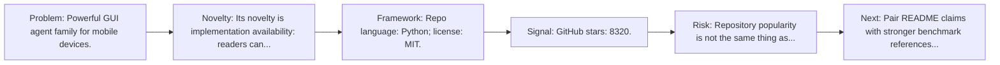
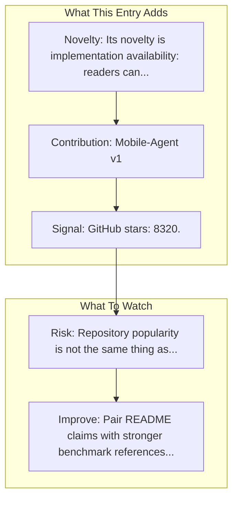

# Mobile-Agent

Entry report generated on 2026-03-28 (Asia/Shanghai). This report is based on the repository entry, audit-time metadata, and cross-checks against adjacent repo context.

## Snapshot

| Field | Detail |
| --- | --- |
| Repo entry | Mobile-Agent |
| Actual target | [GitHub](https://github.com/X-PLUG/MobileAgent) |
| Group | Frameworks & Tools |
| Category | Mobile Agent Frameworks |
| Source location | `frameworks/README.md:138` |
| Primary link type | `repository` |
| Audit status | `ok` |
| Organization | Alibaba X-PLUG |
| GitHub stars | 8320 |
| Language | Python |
| License | MIT |
| Stars | 3k+ |

## Quick Read

| Lens | Read |
| --- | --- |
| Role in repo | repository |
| Novelty | Its novelty is implementation availability: readers can inspect, run, and adapt the actual stack rather than only reading paper claims. |
| Operating frame | Repo language: Python; license: MIT. |
| Main caution | Repository popularity is not the same thing as benchmark-verified reliability, maintenance quality, or deployment safety. |

## Visual Frame

## Analysis Map

## Executive Summary

Powerful GUI agent family for mobile devices. Mobile-Agent: The Powerful GUI Agent Family. Key local notes: Mobile-Agent v1; Mobile-Agent v2 (multi-agent collaboration).

## Novelty and Distinguishing Angle

- Its novelty is implementation availability: readers can inspect, run, and adapt the actual stack rather than only reading paper claims.
- The entry leans into the mobile-agent lane, where research depth is strong but real-world productization is still uneven.
- Open-source adoption is non-trivial here: cached GitHub metadata records 8320 stars.

## Core Contributions or Offerings

- Mobile-Agent v1
- Mobile-Agent v2 (multi-agent collaboration)
- Mobile-Agent v3 (SOTA)
- GitHub topic footprint: agent, android, app, automation, copilot, gui.

## Operating Framework

- Repo language: Python; license: MIT.
- Repository updated at audit time: 2026-03-27T13:11:54Z.

## Evidence and Adoption Signals

- GitHub stars: 8320.
- Open issues at audit time: 181.
- Open-source posture: Python, license MIT.
- Topics: agent, android, app, automation, copilot, gui.
- Recent maintenance timestamp in cached metadata: 2026-03-27T13:11:54Z.
- Audit-time page title: GitHub - X-PLUG/MobileAgent: Mobile-Agent: The Powerful GUI Agent Family · GitHub.

## Limitations and Gaps

- Repository popularity is not the same thing as benchmark-verified reliability, maintenance quality, or deployment safety.

## Improvement Paths

- Pair README claims with stronger benchmark references, maintenance notes, and example evaluations.
- Document supported environments and failure modes more explicitly so adoption signals are easier to interpret.
- Show reproducible setup paths and ongoing maintenance signals, not just launch momentum.

## Why It Matters

- It provides the implementation layer that turns research claims into developer workflows, demos, and reusable stacks.
- Framework entries help explain what the ecosystem can actually build today, not just what papers describe.

## Connections In This Repo

- [Mobile-Agent-v3: Fundamental Agents for GUI Automation](../../papers/models-and-architectures/mobile-agent-v3-fundamental-agents-for-gui-automation.md) - shared mobile-agent focus.
- [AppAgent](mobile-agent-frameworks-appagent.md) - shared mobile-agent focus.
- [AutoGLM](mobile-agent-frameworks-autoglm.md) - shared mobile-agent focus.
- [AgentCPM-GUI](mobile-agent-frameworks-agentcpm-gui.md) - shared mobile-agent focus.

## Source Basis

- Primary basis: repo-local notes, report metadata, GitHub repository metadata.
- Audit access note: tracked audit status was `ok` for the primary URL.
- Maintenance note: repository metadata was current through 2026-03-27T13:11:54Z at audit time.
