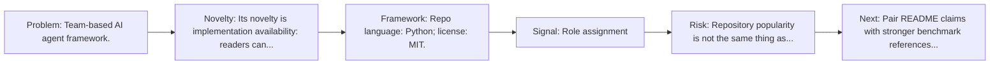
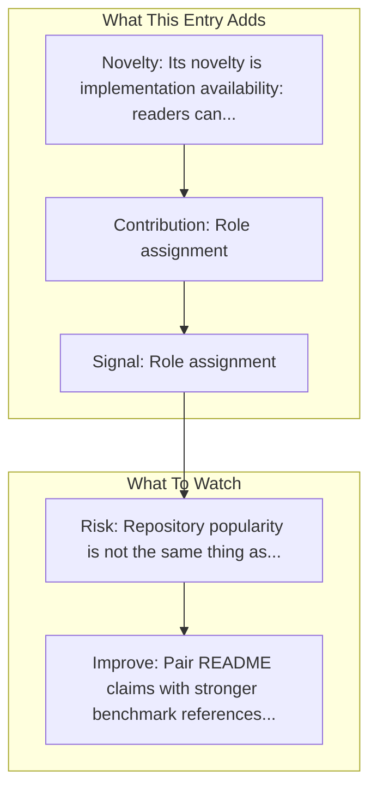

# CrewAI

Entry report generated on 2026-03-28 (Asia/Shanghai). This report is based on the repository entry, audit-time metadata, and cross-checks against adjacent repo context.

## Snapshot

| Field | Detail |
| --- | --- |
| Repo entry | CrewAI |
| Actual target | [GitHub](https://github.com/joaomdmoura/crewAI) |
| Group | Frameworks & Tools |
| Category | Multi-Agent Frameworks |
| Source location | `frameworks/README.md:193` |
| Primary link type | `repository` |
| Audit status | `ok` |
| GitHub stars | 47360 |
| Language | Python |
| License | MIT |

## Quick Read

| Lens | Read |
| --- | --- |
| Role in repo | repository |
| Novelty | Its novelty is implementation availability: readers can inspect, run, and adapt the actual stack rather than only reading paper claims. |
| Operating frame | Repo language: Python; license: MIT. |
| Main caution | Repository popularity is not the same thing as benchmark-verified reliability, maintenance quality, or deployment safety. |

## Visual Frame

## Analysis Map

## Executive Summary

Team-based AI agent framework. Framework for orchestrating role-playing, autonomous AI agents. By fostering collaborative intelligence, CrewAI empowers agents to work together seamlessly, tackling complex tasks. Key local notes: Role assignment; Task delegation.

## Novelty and Distinguishing Angle

- Its novelty is implementation availability: readers can inspect, run, and adapt the actual stack rather than only reading paper claims.
- Open-source adoption is non-trivial here: cached GitHub metadata records 47360 stars.

## Core Contributions or Offerings

- Role assignment
- Task delegation
- Built-in coordination
- GitHub topic footprint: agents, ai, ai-agents, aiagentframework, llms.

## Operating Framework

- Repo language: Python; license: MIT.
- Repository updated at audit time: 2026-03-27T15:40:38Z.

## Evidence and Adoption Signals

- Role assignment
- Task delegation
- GitHub stars: 47360.
- Open issues at audit time: 471.
- Open-source posture: Python, license MIT.
- Topics: agents, ai, ai-agents, aiagentframework, llms.

## Limitations and Gaps

- Repository popularity is not the same thing as benchmark-verified reliability, maintenance quality, or deployment safety.

## Improvement Paths

- Pair README claims with stronger benchmark references, maintenance notes, and example evaluations.
- Document supported environments and failure modes more explicitly so adoption signals are easier to interpret.
- Show reproducible setup paths and ongoing maintenance signals, not just launch momentum.

## Why It Matters

- It provides the implementation layer that turns research claims into developer workflows, demos, and reusable stacks.
- Framework entries help explain what the ecosystem can actually build today, not just what papers describe.

## Connections In This Repo

- [AutoGen](multi-agent-frameworks-autogen.md) - neighboring ecosystem entry in the same local cluster.
- [Mobile-Agent](mobile-agent-frameworks-mobile-agent.md) - neighboring ecosystem entry in the same local cluster.
- [LangGraph](multi-agent-frameworks-langgraph.md) - neighboring ecosystem entry in the same local cluster.
- [Mobile-Agent-v3: Fundamental Agents for GUI Automation](../../papers/models-and-architectures/mobile-agent-v3-fundamental-agents-for-gui-automation.md) - paper-side context for the same capability cluster.

## Source Basis

- Primary basis: repo-local notes, report metadata, GitHub repository metadata.
- Audit access note: tracked audit status was `ok` for the primary URL.
- Maintenance note: repository metadata was current through 2026-03-27T15:40:38Z at audit time.
