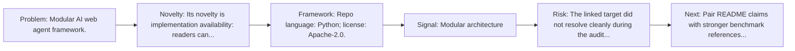
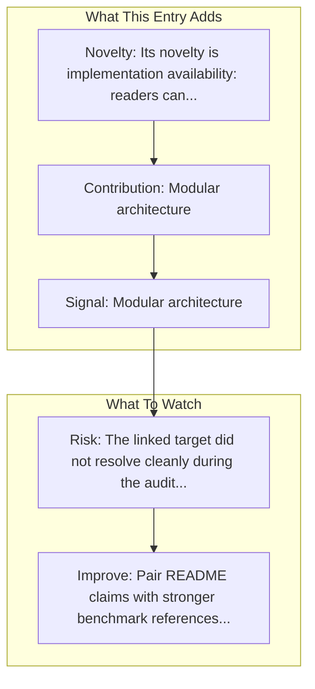

# LaVague

Entry report generated on 2026-03-28 (Asia/Shanghai). This report is based on the repository entry, audit-time metadata, and cross-checks against adjacent repo context.

## Snapshot

| Field | Detail |
| --- | --- |
| Repo entry | LaVague |
| Actual target | [GitHub](https://github.com/lavague-ai/lavague) |
| Group | Frameworks & Tools |
| Category | Web/Browser Frameworks |
| Source location | `frameworks/README.md:89` |
| Primary link type | `repository` |
| Audit status | `error` |
| GitHub stars | 6318 |
| Language | Python |
| License | Apache-2.0 |
| Stars | 5k+ |

## Quick Read

| Lens | Read |
| --- | --- |
| Role in repo | repository |
| Novelty | Its novelty is implementation availability: readers can inspect, run, and adapt the actual stack rather than only reading paper claims. |
| Operating frame | Repo language: Python; license: Apache-2.0. |
| Main caution | The linked target did not resolve cleanly during the audit, so this report leans heavily on repo-local notes and adjacent metadata. |

## Visual Frame

## Analysis Map

## Executive Summary

Modular AI web agent framework. Large Action Model framework to develop AI Web Agents. Key local notes: Modular architecture; Composable components.

## Novelty and Distinguishing Angle

- Its novelty is implementation availability: readers can inspect, run, and adapt the actual stack rather than only reading paper claims.
- The entry is browser-first, matching the part of the ecosystem that currently looks most deployment-ready.
- Open-source adoption is non-trivial here: cached GitHub metadata records 6318 stars.

## Core Contributions or Offerings

- Modular architecture
- Composable components
- Multiple LLM support
- GitHub topic footprint: ai, browser, large-action-model, llm, oss, rag.

## Operating Framework

- Repo language: Python; license: Apache-2.0.
- Repository updated at audit time: 2026-03-26T20:54:14Z.

## Evidence and Adoption Signals

- Modular architecture
- Composable components
- GitHub stars: 6318.
- Open issues at audit time: 102.
- Open-source posture: Python, license Apache-2.0.
- Topics: ai, browser, large-action-model, llm, oss, rag.

## Limitations and Gaps

- The linked target did not resolve cleanly during the audit, so this report leans heavily on repo-local notes and adjacent metadata.
- Repository popularity is not the same thing as benchmark-verified reliability, maintenance quality, or deployment safety.

## Improvement Paths

- Pair README claims with stronger benchmark references, maintenance notes, and example evaluations.
- Document supported environments and failure modes more explicitly so adoption signals are easier to interpret.
- Show reproducible setup paths and ongoing maintenance signals, not just launch momentum.

## Why It Matters

- It provides the implementation layer that turns research claims into developer workflows, demos, and reusable stacks.
- Framework entries help explain what the ecosystem can actually build today, not just what papers describe.

## Connections In This Repo

- [Browser Use](web-browser-frameworks-browser-use.md) - shared browser or web-agent operating surface.
- [Stagehand](web-browser-frameworks-stagehand.md) - shared browser or web-agent operating surface.
- [Skyvern](web-browser-frameworks-skyvern.md) - shared browser or web-agent operating surface.
- [Agent Browser (Vercel)](web-browser-frameworks-agent-browser-vercel.md) - shared browser or web-agent operating surface.

## Source Basis

- Primary basis: repo-local notes, report metadata, GitHub repository metadata.
- Audit access note: the linked target failed to resolve during the audit, so this report is more inferential than the ones backed by clean page metadata.
- Maintenance note: repository metadata was current through 2026-03-26T20:54:14Z at audit time.
