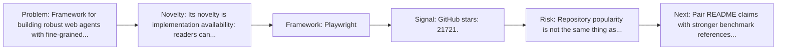
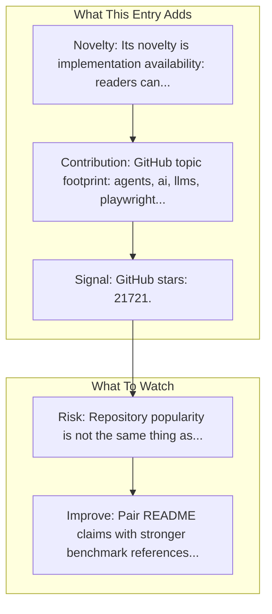

# Stagehand

Entry report generated on 2026-03-28 (Asia/Shanghai). This report is based on the repository entry, audit-time metadata, and cross-checks against adjacent repo context.

## Snapshot

| Field | Detail |
| --- | --- |
| Repo entry | Stagehand |
| Actual target | [GitHub](https://github.com/browserbase/stagehand) |
| Group | Frameworks & Tools |
| Category | Web/Browser Frameworks |
| Source location | `frameworks/README.md:74` |
| Primary link type | `repository` |
| Audit status | `ok` |
| Organization | Browserbase |
| GitHub stars | 21721 |
| Language | TypeScript |
| License | MIT |
| Stars | 5k+ |

## Quick Read

| Lens | Read |
| --- | --- |
| Role in repo | repository |
| Novelty | Its novelty is implementation availability: readers can inspect, run, and adapt the actual stack rather than only reading paper claims. |
| Operating frame | Playwright |
| Main caution | Repository popularity is not the same thing as benchmark-verified reliability, maintenance quality, or deployment safety. |

## Visual Frame

## Analysis Map

## Executive Summary

Framework for building robust web agents with fine-grained control. The AI Browser Automation Framework. Key local notes: Playwright; Anthropic Claude.

## Novelty and Distinguishing Angle

- Its novelty is implementation availability: readers can inspect, run, and adapt the actual stack rather than only reading paper claims.
- The entry is browser-first, matching the part of the ecosystem that currently looks most deployment-ready.
- Open-source adoption is non-trivial here: cached GitHub metadata records 21721 stars.

## Core Contributions or Offerings

- GitHub topic footprint: agents, ai, llms, playwright, puppeteer, selenium.

## Operating Framework

- Playwright
- Anthropic Claude
- OpenAI models
- Repo language: TypeScript; license: MIT.
- Repository updated at audit time: 2026-03-27T14:43:48Z.

## Evidence and Adoption Signals

- GitHub stars: 21721.
- Open issues at audit time: 180.
- Open-source posture: TypeScript, license MIT.
- Topics: agents, ai, llms, playwright, puppeteer, selenium.
- Recent maintenance timestamp in cached metadata: 2026-03-27T14:43:48Z.
- Audit-time page title: GitHub - browserbase/stagehand: The AI Browser Automation Framework · GitHub.

## Limitations and Gaps

- Repository popularity is not the same thing as benchmark-verified reliability, maintenance quality, or deployment safety.

## Improvement Paths

- Pair README claims with stronger benchmark references, maintenance notes, and example evaluations.
- Document supported environments and failure modes more explicitly so adoption signals are easier to interpret.
- Show reproducible setup paths and ongoing maintenance signals, not just launch momentum.

## Why It Matters

- It provides the implementation layer that turns research claims into developer workflows, demos, and reusable stacks.
- Framework entries help explain what the ecosystem can actually build today, not just what papers describe.

## Connections In This Repo

- [Browser Use](web-browser-frameworks-browser-use.md) - shared browser or web-agent operating surface.
- [LaVague](web-browser-frameworks-lavague.md) - shared browser or web-agent operating surface.
- [Skyvern](web-browser-frameworks-skyvern.md) - shared browser or web-agent operating surface.
- [Agent Browser (Vercel)](web-browser-frameworks-agent-browser-vercel.md) - shared browser or web-agent operating surface.

## Source Basis

- Primary basis: repo-local notes, report metadata, GitHub repository metadata.
- Audit access note: tracked audit status was `ok` for the primary URL.
- Maintenance note: repository metadata was current through 2026-03-27T14:43:48Z at audit time.
