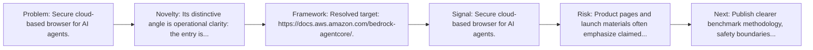
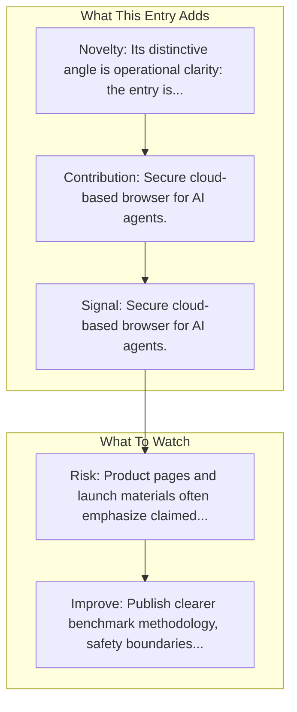

# Amazon Bedrock AgentCore Browser

Entry report generated on 2026-03-28 (Asia/Shanghai). This report is based on the repository entry, audit-time metadata, and cross-checks against adjacent repo context.

## Snapshot

| Field | Detail |
| --- | --- |
| Repo entry | Amazon Bedrock AgentCore Browser |
| Actual target | [Docs](https://docs.aws.amazon.com/bedrock-agentcore/) |
| Group | Products & Services |
| Category | Browser Infrastructure Services |
| Source location | `products/README.md:265` |
| Primary link type | `product-docs` |
| Audit status | `ok` |

## Quick Read

| Lens | Read |
| --- | --- |
| Role in repo | product-docs |
| Novelty | Its distinctive angle is operational clarity: the entry is anchored in official documentation rather than only a launch page or... |
| Operating frame | Resolved target: https://docs.aws.amazon.com/bedrock-agentcore/. |
| Main caution | Product pages and launch materials often emphasize claimed capability more than independent evaluation or failure analysis. |

## Visual Frame

## Analysis Map

## Executive Summary

Secure cloud-based browser for AI agents.

## Novelty and Distinguishing Angle

- Its distinctive angle is operational clarity: the entry is anchored in official documentation rather than only a launch page or third-party commentary.
- The entry is browser-first, matching the part of the ecosystem that currently looks most deployment-ready.

## Core Contributions or Offerings

- Secure cloud-based browser for AI agents.

## Operating Framework

- Resolved target: https://docs.aws.amazon.com/bedrock-agentcore/.

## Evidence and Adoption Signals

- Secure cloud-based browser for AI agents.

## Limitations and Gaps

- Product pages and launch materials often emphasize claimed capability more than independent evaluation or failure analysis.

## Improvement Paths

- Publish clearer benchmark methodology, safety boundaries, and real deployment limits alongside capability claims.
- Keep changelogs and API or availability notes current so the repo can track product evolution without guesswork.
- Add more concrete examples of failure handling, fallback behavior, and human takeover boundaries.

## Why It Matters

- It shows how computer-use ideas are being packaged into deployable products, not only benchmark papers.
- That product layer matters because it exposes which capabilities companies think are ready for users or enterprises.

## Connections In This Repo

- [Amazon AWS - Nova Act](major-tech-companies-amazon-aws-nova-act.md) - neighboring ecosystem entry in the same local cluster.
- [Twin Labs - Twin](startups-twin-labs-twin.md) - neighboring ecosystem entry in the same local cluster.
- [MultiOn](startups-multion.md) - neighboring ecosystem entry in the same local cluster.
- [Adept AI - ACT-1](startups-adept-ai-act-1.md) - neighboring ecosystem entry in the same local cluster.

## Source Basis

- Primary basis: repo-local notes, report metadata.
- Audit access note: tracked audit status was `ok` for the primary URL.
