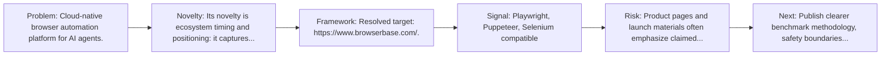
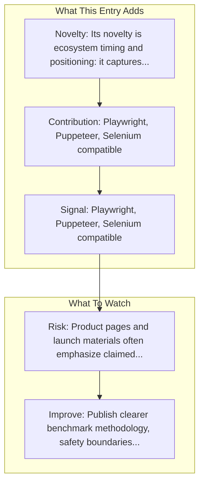

# Browserbase

Entry report generated on 2026-03-28 (Asia/Shanghai). This report is based on the repository entry, audit-time metadata, and cross-checks against adjacent repo context.

## Snapshot

| Field | Detail |
| --- | --- |
| Repo entry | Browserbase |
| Actual target | [Website](https://www.browserbase.com/) |
| Group | Products & Services |
| Category | Browser Infrastructure Services |
| Source location | `products/README.md:239` |
| Primary link type | `product` |
| Audit status | `ok` |

## Quick Read

| Lens | Read |
| --- | --- |
| Role in repo | product |
| Novelty | Its novelty is ecosystem timing and positioning: it captures how a vendor chose to frame computer use as a product capability. |
| Operating frame | Resolved target: https://www.browserbase.com/. |
| Main caution | Product pages and launch materials often emphasize claimed capability more than independent evaluation or failure analysis. |

## Visual Frame

## Analysis Map

## Executive Summary

Cloud-native browser automation platform for AI agents. Cloud browser infrastructure for AI agents and automation. Run Playwright, Puppeteer, and Selenium at scale with stealth mode, session persistence, and debugging tools. Key local notes: Playwright, Puppeteer, Selenium compatible; Sessions API for browser state control.

## Novelty and Distinguishing Angle

- Its novelty is ecosystem timing and positioning: it captures how a vendor chose to frame computer use as a product capability.
- The entry is browser-first, matching the part of the ecosystem that currently looks most deployment-ready.
- Audit-time page framing: Browserbase: A web browser for AI agents & applications.

## Core Contributions or Offerings

- Playwright, Puppeteer, Selenium compatible
- Sessions API for browser state control
- Built-in framework: Stagehand

## Operating Framework

- Resolved target: https://www.browserbase.com/.

## Evidence and Adoption Signals

- Playwright, Puppeteer, Selenium compatible
- Sessions API for browser state control
- Audit-time page title: Browserbase: A web browser for AI agents & applications.
- Audit-time page description: Cloud browser infrastructure for AI agents and automation. Run Playwright, Puppeteer, and Selenium at scale with stealth mode, session persistence, and debugging tools..

## Limitations and Gaps

- Product pages and launch materials often emphasize claimed capability more than independent evaluation or failure analysis.

## Improvement Paths

- Publish clearer benchmark methodology, safety boundaries, and real deployment limits alongside capability claims.
- Keep changelogs and API or availability notes current so the repo can track product evolution without guesswork.
- Add more concrete examples of failure handling, fallback behavior, and human takeover boundaries.

## Why It Matters

- It shows how computer-use ideas are being packaged into deployable products, not only benchmark papers.
- That product layer matters because it exposes which capabilities companies think are ready for users or enterprises.

## Connections In This Repo

- [Browserless](browser-infrastructure-services-browserless.md) - neighboring ecosystem entry in the same local cluster.
- [Anthropic - Claude Computer Use](major-tech-companies-anthropic-claude-computer-use.md) - neighboring ecosystem entry in the same local cluster.
- [OpenAI - Operator / CUA](major-tech-companies-openai-operator-cua.md) - neighboring ecosystem entry in the same local cluster.
- [MultiOn](startups-multion.md) - neighboring ecosystem entry in the same local cluster.

## Source Basis

- Primary basis: repo-local notes, report metadata.
- Audit access note: tracked audit status was `ok` for the primary URL.
