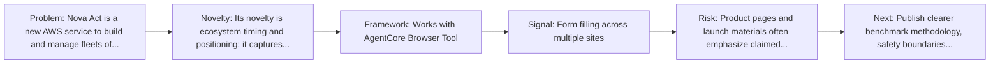
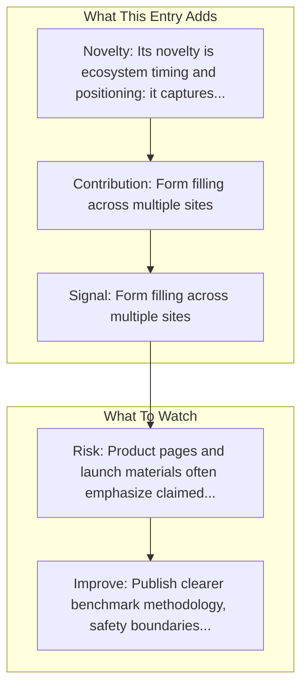

# Amazon AWS - Nova Act

Entry report generated on 2026-03-28 (Asia/Shanghai). This report is based on the repository entry, audit-time metadata, and cross-checks against adjacent repo context.

## Snapshot

| Field | Detail |
| --- | --- |
| Repo entry | Amazon AWS - Nova Act |
| Actual target | [Product](https://aws.amazon.com/nova/act/) |
| Group | Products & Services |
| Category | Major Tech Companies |
| Source location | `products/README.md:76` |
| Primary link type | `product` |
| Audit status | `ok` |
| Status | Generally Available (2025) |
| Platform | Web/Browser |
| Related assets | [SDK](https://github.com/aws/nova-act), [Bedrock AgentCore Browser](https://docs.aws.amazon.com/bedrock-agentcore/latest/devguide/browser-quickstart-nova-act.html) |

## Quick Read

| Lens | Read |
| --- | --- |
| Role in repo | product |
| Novelty | Its novelty is ecosystem timing and positioning: it captures how a vendor chose to frame computer use as a product capability. |
| Operating frame | Works with AgentCore Browser Tool |
| Main caution | Product pages and launch materials often emphasize claimed capability more than independent evaluation or failure analysis. |

## Visual Frame

## Analysis Map

## Executive Summary

Nova Act is a new AWS service to build and manage fleets of agents to automate production UI workflows with high reliability, fast time-to-value, and ease of implementation at scale. Key local notes: 90% reliability for production workflows; Custom computer use model for complex UI automation.

## Novelty and Distinguishing Angle

- Its novelty is ecosystem timing and positioning: it captures how a vendor chose to frame computer use as a product capability.
- The entry is browser-first, matching the part of the ecosystem that currently looks most deployment-ready.
- Audit-time page framing: Build reliable agents to automate production UI workflows at scale – Amazon Nova Act – AWS.

## Core Contributions or Offerings

- Form filling across multiple sites
- Payment reconciliation
- Shipment coordination
- Medical records updating

## Operating Framework

- Works with AgentCore Browser Tool
- Secure cloud-based browser environment
- Platform: Web/Browser
- Status: Generally Available (2025)
- Resolved target: https://aws.amazon.com/nova/act/.

## Evidence and Adoption Signals

- Form filling across multiple sites
- Payment reconciliation
- Audit-time page title: Build reliable agents to automate production UI workflows at scale – Amazon Nova Act – AWS.
- Audit-time page description: Nova Act is a new AWS service to build and manage fleets of agents to automate production UI workflows with high reliability, fast time-to-value, and ease of implementation at scale..

## Limitations and Gaps

- Product pages and launch materials often emphasize claimed capability more than independent evaluation or failure analysis.

## Improvement Paths

- Publish clearer benchmark methodology, safety boundaries, and real deployment limits alongside capability claims.
- Keep changelogs and API or availability notes current so the repo can track product evolution without guesswork.
- Add more concrete examples of failure handling, fallback behavior, and human takeover boundaries.

## Why It Matters

- It shows how computer-use ideas are being packaged into deployable products, not only benchmark papers.
- That product layer matters because it exposes which capabilities companies think are ready for users or enterprises.

## Connections In This Repo

- [Amazon Bedrock AgentCore Browser](browser-infrastructure-services-amazon-bedrock-agentcore-browser.md) - neighboring ecosystem entry in the same local cluster.
- [H Company - Runner H](startups-h-company-runner-h.md) - shared browser or web-agent operating surface.
- [Adept AI - ACT-1](startups-adept-ai-act-1.md) - neighboring ecosystem entry in the same local cluster.
- [Amazon Nova Act SDK](../resources-and-guides/key-blog-posts-and-announcements-amazon-amazon-nova-act-sdk.md) - neighboring ecosystem entry in the same local cluster.

## Source Basis

- Primary basis: repo-local notes, report metadata.
- Audit access note: tracked audit status was `ok` for the primary URL.
