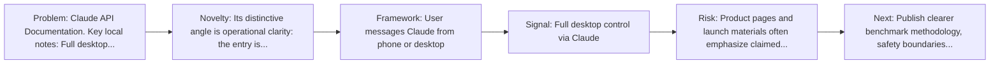
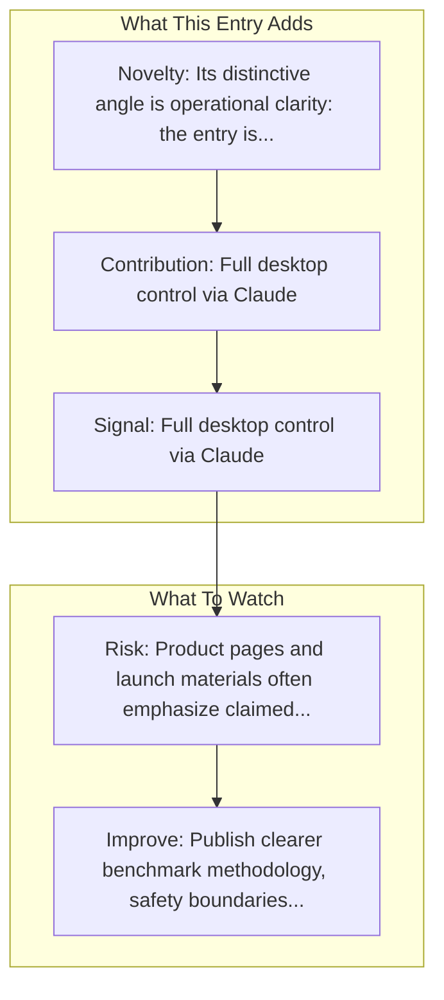

# Anthropic - Claude Computer Use

Entry report generated on 2026-03-28 (Asia/Shanghai). This report is based on the repository entry, audit-time metadata, and cross-checks against adjacent repo context.

## Snapshot

| Field | Detail |
| --- | --- |
| Repo entry | Anthropic - Claude Computer Use |
| Actual target | [Documentation](https://platform.claude.com/docs/en/agents-and-tools/tool-use/computer-use-tool) |
| Group | Products & Services |
| Category | Major Tech Companies |
| Source location | `products/README.md:7` |
| Primary link type | `product-docs` |
| Audit status | `ok` |
| Status | Generally Available (March 2025) |
| Platform | Desktop (macOS, Windows, Linux), Web |

## Quick Read

| Lens | Read |
| --- | --- |
| Role in repo | product-docs |
| Novelty | Its distinctive angle is operational clarity: the entry is anchored in official documentation rather than only a launch page or... |
| Operating frame | User messages Claude from phone or desktop |
| Main caution | Product pages and launch materials often emphasize claimed capability more than independent evaluation or failure analysis. |

## Visual Frame

## Analysis Map

## Executive Summary

Claude API Documentation. Key local notes: Full desktop control via Claude; Dispatch feature for mobile-to-desktop control.

## Novelty and Distinguishing Angle

- Its distinctive angle is operational clarity: the entry is anchored in official documentation rather than only a launch page or third-party commentary.
- The entry sits in the desktop-control lane, which usually raises stronger environment variance and safety implications than browser-only automation.
- Audit-time page framing: Computer use tool - Claude API Docs.

## Core Contributions or Offerings

- Full desktop control via Claude
- Dispatch feature for mobile-to-desktop control
- App integrations (Slack, Calendar, etc.)
- Falls back to mouse/keyboard when no integration available
- Claude Pro ($20/month)

## Operating Framework

- User messages Claude from phone or desktop
- Claude executes tasks on desktop
- Results sent back to user
- Platform: Desktop (macOS, Windows, Linux), Web
- Status: Generally Available (March 2025)

## Evidence and Adoption Signals

- Full desktop control via Claude
- Dispatch feature for mobile-to-desktop control
- Claude Pro ($20/month)
- Claude Max ($100/month)
- Audit-time page title: Computer use tool - Claude API Docs.
- Audit-time page description: Claude API Documentation.

## Limitations and Gaps

- Product pages and launch materials often emphasize claimed capability more than independent evaluation or failure analysis.

## Improvement Paths

- Publish clearer benchmark methodology, safety boundaries, and real deployment limits alongside capability claims.
- Keep changelogs and API or availability notes current so the repo can track product evolution without guesswork.
- Add more concrete examples of failure handling, fallback behavior, and human takeover boundaries.

## Why It Matters

- It shows how computer-use ideas are being packaged into deployable products, not only benchmark papers.
- That product layer matters because it exposes which capabilities companies think are ready for users or enterprises.

## Connections In This Repo

- [Claude Computer Use Demo](../frameworks-and-tools/integration-examples-claude-computer-use-demo.md) - neighboring ecosystem entry in the same local cluster.
- [OpenCUA: Open Foundations for Computer-Use Agents](../../papers/models-and-architectures/opencua-open-foundations-for-computer-use-agents.md) - shared desktop or OS-level automation surface.
- [Windows Agent Arena (WAA)](../../papers/benchmarks-and-datasets/windows-agent-arena-waa.md) - shared desktop or OS-level automation surface.
- [OSWorld-MCP: Benchmarking MCP Tool Invocation In Computer-Use Agents](../../papers/benchmarks-and-datasets/osworld-mcp-benchmarking-mcp-tool-invocation-in-computer-use-agents.md) - shared desktop or OS-level automation surface.

## Source Basis

- Primary basis: repo-local notes, report metadata.
- Audit access note: tracked audit status was `ok` for the primary URL.
