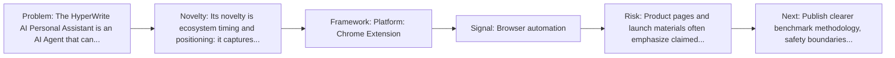
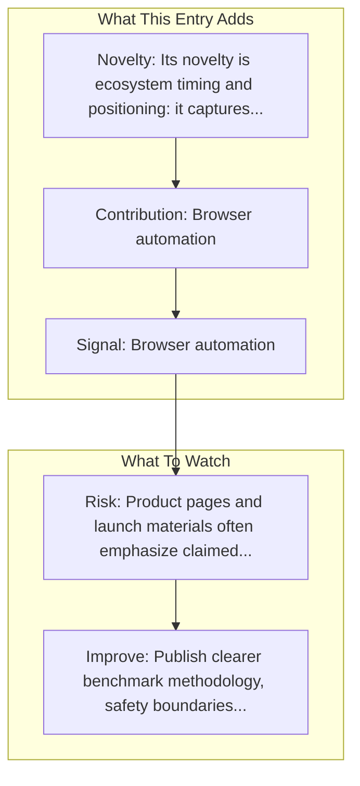

# HyperWrite - Personal Assistant

Entry report generated on 2026-03-28 (Asia/Shanghai). This report is based on the repository entry, audit-time metadata, and cross-checks against adjacent repo context.

## Snapshot

| Field | Detail |
| --- | --- |
| Repo entry | HyperWrite - Personal Assistant |
| Actual target | [Website](https://www.hyperwriteai.com/personal-assistant) |
| Group | Products & Services |
| Category | Startups |
| Source location | `products/README.md:180` |
| Primary link type | `product` |
| Audit status | `ok` |
| Platform | Chrome Extension |
| Pricing | Free tier, Premium (~$20/month), Ultra (~$45/month) |

## Quick Read

| Lens | Read |
| --- | --- |
| Role in repo | product |
| Novelty | Its novelty is ecosystem timing and positioning: it captures how a vendor chose to frame computer use as a product capability. |
| Operating frame | Platform: Chrome Extension |
| Main caution | Product pages and launch materials often emphasize claimed capability more than independent evaluation or failure analysis. |

## Visual Frame

## Analysis Map

## Executive Summary

The HyperWrite AI Personal Assistant is an AI Agent that can help you complete any task online. It's like self-driving mode, for your browser. Use your assistant for research, content creation, task automation, and more. Get started with the HyperWrite AI Chrome extension. Key local notes: Browser automation; Form filling.

## Novelty and Distinguishing Angle

- Its novelty is ecosystem timing and positioning: it captures how a vendor chose to frame computer use as a product capability.
- The entry is browser-first, matching the part of the ecosystem that currently looks most deployment-ready.
- Audit-time page framing: AI Personal Assistant | HyperWrite AI Agent.

## Core Contributions or Offerings

- Browser automation
- Form filling
- Web navigation
- Task execution

## Operating Framework

- Platform: Chrome Extension
- Pricing: Free tier, Premium (~$20/month), Ultra (~$45/month)
- Resolved target: https://www.hyperwriteai.com/personal-assistant.

## Evidence and Adoption Signals

- Browser automation
- Form filling
- Audit-time page title: AI Personal Assistant | HyperWrite AI Agent.
- Audit-time page description: The HyperWrite AI Personal Assistant is an AI Agent that can help you complete any task online. It's like self-driving mode, for your browser. Use your assistant for research, content creation, task automation, and more. Get started with the HyperWrite AI Chrome extension..

## Limitations and Gaps

- Product pages and launch materials often emphasize claimed capability more than independent evaluation or failure analysis.

## Improvement Paths

- Publish clearer benchmark methodology, safety boundaries, and real deployment limits alongside capability claims.
- Keep changelogs and API or availability notes current so the repo can track product evolution without guesswork.
- Add more concrete examples of failure handling, fallback behavior, and human takeover boundaries.

## Why It Matters

- It shows how computer-use ideas are being packaged into deployable products, not only benchmark papers.
- That product layer matters because it exposes which capabilities companies think are ready for users or enterprises.

## Connections In This Repo

- [Google - Project Mariner](major-tech-companies-google-project-mariner.md) - shared browser or web-agent operating surface.
- [OpenAI - Operator / CUA](major-tech-companies-openai-operator-cua.md) - shared browser or web-agent operating surface.
- [Twin Labs - Twin](startups-twin-labs-twin.md) - shared browser or web-agent operating surface.
- [MultiOn](startups-multion.md) - shared browser or web-agent operating surface.

## Source Basis

- Primary basis: repo-local notes, report metadata.
- Audit access note: tracked audit status was `ok` for the primary URL.
