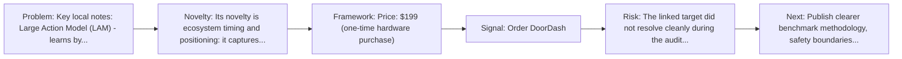
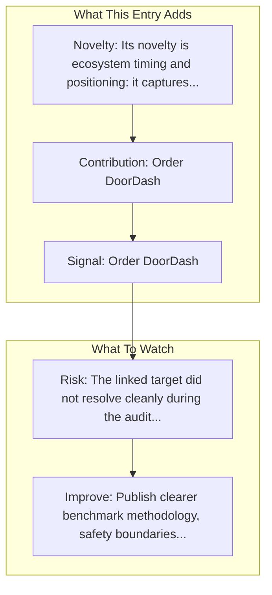

# Rabbit Inc - Rabbit R1

Entry report generated on 2026-03-28 (Asia/Shanghai). This report is based on the repository entry, audit-time metadata, and cross-checks against adjacent repo context.

## Snapshot

| Field | Detail |
| --- | --- |
| Repo entry | Rabbit Inc - Rabbit R1 |
| Actual target | [Website](https://www.rabbit.tech/rabbit-r1) |
| Group | Products & Services |
| Category | Startups |
| Source location | `products/README.md:142` |
| Primary link type | `product` |
| Audit status | `error` |
| Price | $199 (one-time hardware purchase) |

## Quick Read

| Lens | Read |
| --- | --- |
| Role in repo | product |
| Novelty | Its novelty is ecosystem timing and positioning: it captures how a vendor chose to frame computer use as a product capability. |
| Operating frame | Price: $199 (one-time hardware purchase) |
| Main caution | The linked target did not resolve cleanly during the audit, so this report leans heavily on repo-local notes and adjacent metadata. |

## Visual Frame

## Analysis Map

## Executive Summary

Key local notes: Large Action Model (LAM) - learns by observing humans; Standalone device (not reliant on APIs).

## Novelty and Distinguishing Angle

- Its novelty is ecosystem timing and positioning: it captures how a vendor chose to frame computer use as a product capability.
- The entry leans into the mobile-agent lane, where research depth is strong but real-world productization is still uneven.

## Core Contributions or Offerings

- Order DoorDash
- Call Uber
- Book vacations
- Operate apps via voice

## Operating Framework

- Price: $199 (one-time hardware purchase)

## Evidence and Adoption Signals

- Order DoorDash
- Call Uber

## Limitations and Gaps

- The linked target did not resolve cleanly during the audit, so this report leans heavily on repo-local notes and adjacent metadata.
- Product pages and launch materials often emphasize claimed capability more than independent evaluation or failure analysis.

## Improvement Paths

- Publish clearer benchmark methodology, safety boundaries, and real deployment limits alongside capability claims.
- Keep changelogs and API or availability notes current so the repo can track product evolution without guesswork.
- Add more concrete examples of failure handling, fallback behavior, and human takeover boundaries.

## Why It Matters

- It shows how computer-use ideas are being packaged into deployable products, not only benchmark papers.
- That product layer matters because it exposes which capabilities companies think are ready for users or enterprises.

## Connections In This Repo

- [Apple - Siri Agent (Apple Intelligence)](major-tech-companies-apple-siri-agent-apple-intelligence.md) - shared mobile-agent focus.
- [LLM-Powered GUI Agents in Phone Automation](../../papers/survey-papers/llm-powered-gui-agents-in-phone-automation.md) - shared mobile-agent focus.
- [AppAgent: Multimodal Agents as Smartphone Users](../../papers/models-and-architectures/appagent-multimodal-agents-as-smartphone-users.md) - shared mobile-agent focus.
- [Mobile-Agent-v3: Fundamental Agents for GUI Automation](../../papers/models-and-architectures/mobile-agent-v3-fundamental-agents-for-gui-automation.md) - shared mobile-agent focus.

## Source Basis

- Primary basis: repo-local notes, report metadata.
- Audit access note: the linked target failed to resolve during the audit, so this report is more inferential than the ones backed by clean page metadata.
