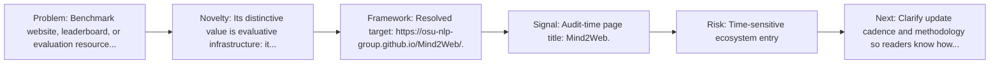
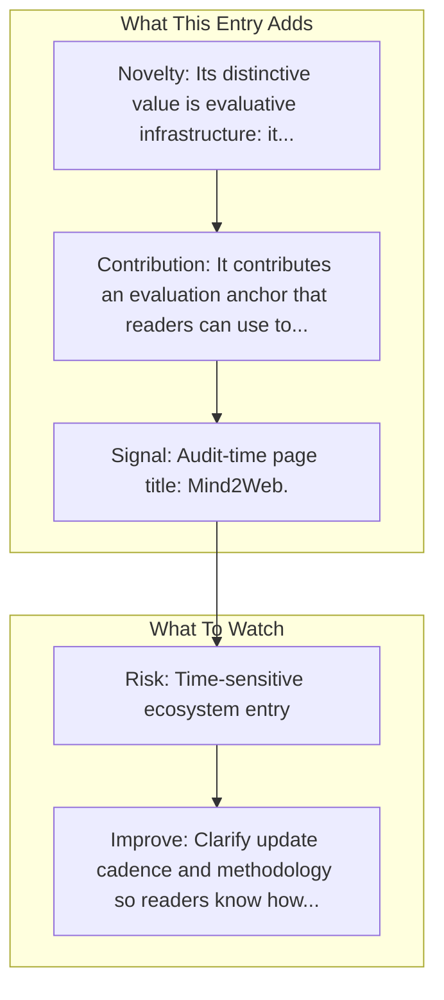

# Mind2Web

Entry report generated on 2026-03-28 (Asia/Shanghai). This report is based on the repository entry, audit-time metadata, and cross-checks against adjacent repo context.

## Snapshot

| Field | Detail |
| --- | --- |
| Repo entry | Mind2Web |
| Actual target | [osu-nlp-group.github.io/Mind2Web](https://osu-nlp-group.github.io/Mind2Web/) |
| Group | Resources & Guides |
| Category | Benchmarking Resources / Official Benchmark Sites |
| Source location | `resources/README.md:152` |
| Primary link type | `benchmark-site` |
| Audit status | `ok` |
| Benchmark | Mind2Web |

## Quick Read

| Lens | Read |
| --- | --- |
| Role in repo | benchmark-site |
| Novelty | Its distinctive value is evaluative infrastructure: it exposes where capability claims are supposed to be tested rather than merely... |
| Operating frame | Resolved target: https://osu-nlp-group.github.io/Mind2Web/. |
| Main caution | Claims should be read with source and maturity caveats in mind. |

## Visual Frame

## Analysis Map

## Executive Summary

Benchmark website, leaderboard, or evaluation resource linked from the repository. Mind2Web Towards a Generalist Agent for the Web.

## Novelty and Distinguishing Angle

- Its distinctive value is evaluative infrastructure: it exposes where capability claims are supposed to be tested rather than merely described.
- Audit-time page framing: Mind2Web.

## Core Contributions or Offerings

- It contributes an evaluation anchor that readers can use to interpret claims elsewhere in the repo.

## Operating Framework

- Resolved target: https://osu-nlp-group.github.io/Mind2Web/.
- Use it to inspect task scope, benchmark framing, and evaluation context behind nearby model claims.

## Evidence and Adoption Signals

- Audit-time page title: Mind2Web.
- Audit-time page description: Mind2Web Towards a Generalist Agent for the Web..

## Limitations and Gaps

## Improvement Paths

- Clarify update cadence and methodology so readers know how fresh and comparable the surfaced information really is.
- Cross-link more directly to primary papers, repos, or docs so the index page is not the end of the evidence chain.
- State scope boundaries more explicitly so readers know what this entry covers and what it leaves out.

## Why It Matters

- It gives the repository explanatory and operational context beyond raw project lists.
- Resource entries matter because they shape how readers interpret the surrounding products, models, and frameworks.

## Connections In This Repo

- [Mind2Web: Towards a Generalist Agent for the Web](../../papers/benchmarks-and-datasets/mind2web-towards-a-generalist-agent-for-the-web.md) - paper-side context for the same capability cluster.
- [Online-Mind2Web](../../papers/benchmarks-and-datasets/online-mind2web.md) - paper-side context for the same capability cluster.
- [OSWorld](benchmarking-resources-official-benchmark-sites-osworld.md) - neighboring ecosystem entry in the same local cluster.
- [WebArena](benchmarking-resources-official-benchmark-sites-webarena.md) - neighboring ecosystem entry in the same local cluster.

## Source Basis

- Primary basis: repo-local notes, report metadata.
- Audit access note: tracked audit status was `ok` for the primary URL.
