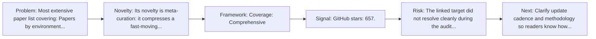
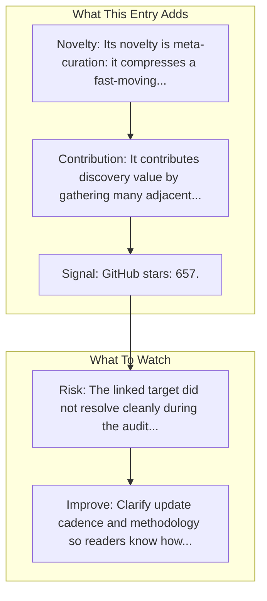

# GUI-Agents-Paper-List (OSU NLP Group)

Entry report generated on 2026-03-28 (Asia/Shanghai). This report is based on the repository entry, audit-time metadata, and cross-checks against adjacent repo context.

## Snapshot

| Field | Detail |
| --- | --- |
| Repo entry | GUI-Agents-Paper-List (OSU NLP Group) |
| Actual target | [GitHub](https://github.com/OSU-NLP-Group/GUI-Agents-Paper-List) |
| Group | Resources & Guides |
| Category | Curated Paper Lists |
| Source location | `resources/README.md:7` |
| Primary link type | `curated-list` |
| Audit status | `error` |
| Coverage | Comprehensive |
| Updated | Regularly maintained |
| GitHub stars | 657 |
| Language | Python |

## Quick Read

| Lens | Read |
| --- | --- |
| Role in repo | curated-list |
| Novelty | Its novelty is meta-curation: it compresses a fast-moving literature and tooling space into a single discovery surface. |
| Operating frame | Coverage: Comprehensive |
| Main caution | The linked target did not resolve cleanly during the audit, so this report leans heavily on repo-local notes and adjacent metadata. |

## Visual Frame

## Analysis Map

## Executive Summary

Most extensive paper list covering: Papers by environment (mobile, web, desktop, GUI) Papers by key topics (benchmark, grounding, agent framework) Regular updates. Building a comprehensive and handy list of papers for GUI agents. Key local notes: Coverage: Comprehensive; Updated: Regularly maintained.

## Novelty and Distinguishing Angle

- Its novelty is meta-curation: it compresses a fast-moving literature and tooling space into a single discovery surface.
- Open-source adoption is non-trivial here: cached GitHub metadata records 657 stars.

## Core Contributions or Offerings

- It contributes discovery value by gathering many adjacent papers, repos, or benchmarks into one place.

## Operating Framework

- Coverage: Comprehensive
- Repo language: Python; license: Not stated.
- Repository updated at audit time: 2026-03-27T03:41:26Z.
- Use it as a branching surface into papers, repos, and benchmarks rather than as a substitute for reading those primary sources.

## Evidence and Adoption Signals

- GitHub stars: 657.
- Open issues at audit time: 1.
- Open-source posture: Python, license not stated.
- Recent maintenance timestamp in cached metadata: 2026-03-27T03:41:26Z.

## Limitations and Gaps

- The linked target did not resolve cleanly during the audit, so this report leans heavily on repo-local notes and adjacent metadata.
- Curated indexes and public ranking surfaces can drift when maintainers stop updating them or when methodology changes quietly.

## Improvement Paths

- Clarify update cadence and methodology so readers know how fresh and comparable the surfaced information really is.
- Cross-link more directly to primary papers, repos, or docs so the index page is not the end of the evidence chain.
- State scope boundaries more explicitly so readers know what this entry covers and what it leaves out.

## Why It Matters

- It gives the repository explanatory and operational context beyond raw project lists.
- Resource entries matter because they shape how readers interpret the surrounding products, models, and frameworks.

## Connections In This Repo

- [Awesome-GUI-Agents (ZJU-REAL)](curated-paper-lists-awesome-gui-agents-zju-real.md) - neighboring ecosystem entry in the same local cluster.
- [Large Language Model-Brained GUI Agents: A Survey](../../papers/survey-papers/large-language-model-brained-gui-agents-a-survey.md) - paper-side context for the same capability cluster.
- [GUI Agents: A Survey](../../papers/survey-papers/gui-agents-a-survey.md) - paper-side context for the same capability cluster.
- [GUI Agents with Foundation Models: A Comprehensive Survey](../../papers/survey-papers/gui-agents-with-foundation-models-a-comprehensive-survey.md) - paper-side context for the same capability cluster.

## Source Basis

- Primary basis: repo-local notes, report metadata, GitHub repository metadata.
- Audit access note: the linked target failed to resolve during the audit, so this report is more inferential than the ones backed by clean page metadata.
- Maintenance note: repository metadata was current through 2026-03-27T03:41:26Z at audit time.
