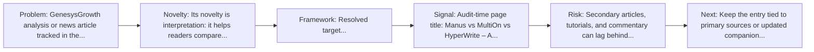
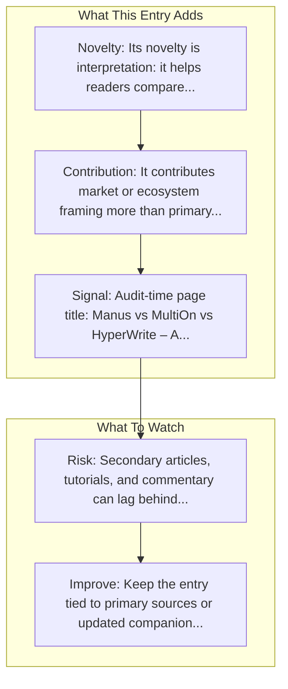

# Manus vs MultiOn vs HyperWrite

Entry report generated on 2026-03-28 (Asia/Shanghai). This report is based on the repository entry, audit-time metadata, and cross-checks against adjacent repo context.

## Snapshot

| Field | Detail |
| --- | --- |
| Repo entry | Manus vs MultiOn vs HyperWrite |
| Actual target | [Article](https://genesysgrowth.com/blog/manus-vs-multion-vs-hyperwrite) |
| Group | Resources & Guides |
| Category | Industry Analysis & News / Comparison Articles |
| Source location | `resources/README.md:120` |
| Primary link type | `article` |
| Audit status | `ok` |
| Title | Manus vs MultiOn vs HyperWrite |
| Source | GenesysGrowth |

## Quick Read

| Lens | Read |
| --- | --- |
| Role in repo | article |
| Novelty | Its novelty is interpretation: it helps readers compare, frame, or contextualize the surrounding products, models, and tools. |
| Operating frame | Resolved target: https://genesysgrowth.com/blog/manus-vs-multion-vs-hyperwrite. |
| Main caution | Secondary articles, tutorials, and commentary can lag behind primary source changes or smooth over important caveats. |

## Visual Frame

## Analysis Map

## Executive Summary

GenesysGrowth analysis or news article tracked in the repository's industry-reading section. AI advantage comes from workflow fit and transparency, not adoption — Manus leads research, MultiOn automates web tasks, HyperWrite refines content.

## Novelty and Distinguishing Angle

- Its novelty is interpretation: it helps readers compare, frame, or contextualize the surrounding products, models, and tools.
- Audit-time page framing: Manus vs MultiOn vs HyperWrite – A Complete Guide for Marketing Leaders in 2026.

## Core Contributions or Offerings

- It contributes market or ecosystem framing more than primary technical detail.
- Listed source: GenesysGrowth.

## Operating Framework

- Resolved target: https://genesysgrowth.com/blog/manus-vs-multion-vs-hyperwrite.
- Treat it as a secondary interpretation layer, not as the sole technical source of truth.
- Source context: GenesysGrowth.

## Evidence and Adoption Signals

- Audit-time page title: Manus vs MultiOn vs HyperWrite – A Complete Guide for Marketing Leaders in 2026.
- Audit-time page description: AI advantage comes from workflow fit and transparency, not adoption — Manus leads research, MultiOn automates web tasks, HyperWrite refines content..
- Resource provenance: GenesysGrowth.

## Limitations and Gaps

- Secondary articles, tutorials, and commentary can lag behind primary source changes or smooth over important caveats.

## Improvement Paths

- Keep the entry tied to primary sources or updated companion material so readers can distinguish signal from hype.
- Add clearer context on where the resource is strong, where it is partial, and what it omits.
- Cross-link it more explicitly to the products, frameworks, or papers it is most useful for understanding.

## Why It Matters

- It gives the repository explanatory and operational context beyond raw project lists.
- Resource entries matter because they shape how readers interpret the surrounding products, models, and frameworks.

## Connections In This Repo

- [What you need to know about Manus](industry-analysis-and-news-major-articles-what-you-need-to-know-about-manus.md) - neighboring ecosystem entry in the same local cluster.
- [Anthropic's Computer Use vs OpenAI's CUA](industry-analysis-and-news-comparison-articles-anthropic-s-computer-use-vs-openai-s-cua.md) - neighboring ecosystem entry in the same local cluster.
- [AI is about to completely change how you use computers](industry-analysis-and-news-major-articles-ai-is-about-to-completely-change-how-you-use-computers.md) - neighboring ecosystem entry in the same local cluster.
- [State of AI Agents in 2025](industry-analysis-and-news-major-articles-state-of-ai-agents-in-2025.md) - neighboring ecosystem entry in the same local cluster.

## Source Basis

- Primary basis: repo-local notes, report metadata.
- Audit access note: tracked audit status was `ok` for the primary URL.
