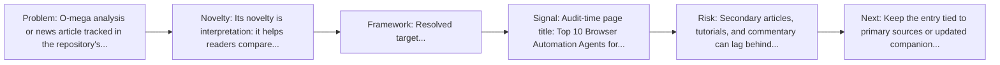
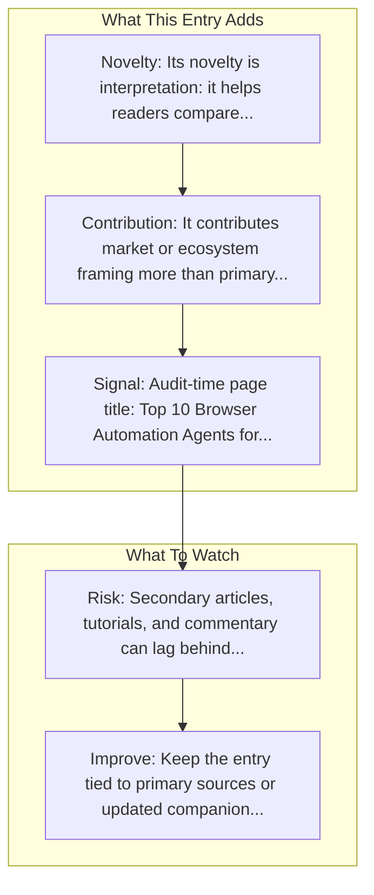

# Top 10 Browser Automation Agents

Entry report generated on 2026-03-28 (Asia/Shanghai). This report is based on the repository entry, audit-time metadata, and cross-checks against adjacent repo context.

## Snapshot

| Field | Detail |
| --- | --- |
| Repo entry | Top 10 Browser Automation Agents |
| Actual target | [Article](https://o-mega.ai/articles/the-top-10-browser-automation-agents) |
| Group | Resources & Guides |
| Category | Industry Analysis & News / Comparison Articles |
| Source location | `resources/README.md:121` |
| Primary link type | `article` |
| Audit status | `ok` |
| Title | Top 10 Browser Automation Agents |
| Source | O-mega |

## Quick Read

| Lens | Read |
| --- | --- |
| Role in repo | article |
| Novelty | Its novelty is interpretation: it helps readers compare, frame, or contextualize the surrounding products, models, and tools. |
| Operating frame | Resolved target: https://o-mega.ai/articles/the-top-10-browser-automation-agents. |
| Main caution | Secondary articles, tutorials, and commentary can lag behind primary source changes or smooth over important caveats. |

## Visual Frame

## Analysis Map

## Executive Summary

O-mega analysis or news article tracked in the repository's industry-reading section. Discover the best browser automation agents that can handle repetitive web tasks, form filling, and clicks to boost your productivity.

## Novelty and Distinguishing Angle

- Its novelty is interpretation: it helps readers compare, frame, or contextualize the surrounding products, models, and tools.
- The entry is browser-first, matching the part of the ecosystem that currently looks most deployment-ready.
- Audit-time page framing: Top 10 Browser Automation Agents for Web Task Automation 2024 | Articles | o-mega.

## Core Contributions or Offerings

- It contributes market or ecosystem framing more than primary technical detail.
- Listed source: O-mega.

## Operating Framework

- Resolved target: https://o-mega.ai/articles/the-top-10-browser-automation-agents.
- Treat it as a secondary interpretation layer, not as the sole technical source of truth.
- Source context: O-mega.

## Evidence and Adoption Signals

- Audit-time page title: Top 10 Browser Automation Agents for Web Task Automation 2024 | Articles | o-mega.
- Audit-time page description: Discover the best browser automation agents that can handle repetitive web tasks, form filling, and clicks to boost your productivity..
- Resource provenance: O-mega.

## Limitations and Gaps

- Secondary articles, tutorials, and commentary can lag behind primary source changes or smooth over important caveats.

## Improvement Paths

- Keep the entry tied to primary sources or updated companion material so readers can distinguish signal from hype.
- Add clearer context on where the resource is strong, where it is partial, and what it omits.
- Cross-link it more explicitly to the products, frameworks, or papers it is most useful for understanding.

## Why It Matters

- It gives the repository explanatory and operational context beyond raw project lists.
- Resource entries matter because they shape how readers interpret the surrounding products, models, and frameworks.

## Connections In This Repo

- [Building Browser Agents with MultiOn](tutorials-and-guides-getting-started-building-browser-agents-with-multion.md) - shared browser or web-agent operating surface.
- [Browser Agents with Playwright & Claude](tutorials-and-guides-getting-started-browser-agents-with-playwright-and-claude.md) - shared browser or web-agent operating surface.
- [State of AI Agents in 2025](industry-analysis-and-news-major-articles-state-of-ai-agents-in-2025.md) - neighboring ecosystem entry in the same local cluster.
- [AI Agents: Why the Rabbit R1 May Be a Game Changer](industry-analysis-and-news-major-articles-ai-agents-why-the-rabbit-r1-may-be-a-game-changer.md) - neighboring ecosystem entry in the same local cluster.

## Source Basis

- Primary basis: repo-local notes, report metadata.
- Audit access note: tracked audit status was `ok` for the primary URL.
