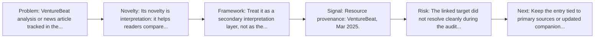
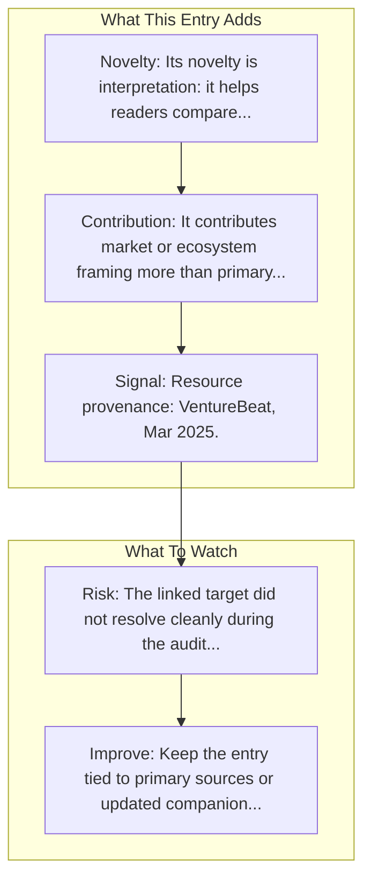

# What you need to know about Manus

Entry report generated on 2026-03-28 (Asia/Shanghai). This report is based on the repository entry, audit-time metadata, and cross-checks against adjacent repo context.

## Snapshot

| Field | Detail |
| --- | --- |
| Repo entry | What you need to know about Manus |
| Actual target | [Article](https://venturebeat.com/ai/what-you-need-to-know-about-manus-the-new-ai-agentic-system-from-china-hailed-as-a-second-deepseek-moment) |
| Group | Resources & Guides |
| Category | Industry Analysis & News / Major Articles |
| Source location | `resources/README.md:113` |
| Primary link type | `article` |
| Audit status | `error` |
| Title | What you need to know about Manus |
| Source | VentureBeat |
| Date | Mar 2025 |

## Quick Read

| Lens | Read |
| --- | --- |
| Role in repo | article |
| Novelty | Its novelty is interpretation: it helps readers compare, frame, or contextualize the surrounding products, models, and tools. |
| Operating frame | Treat it as a secondary interpretation layer, not as the sole technical source of truth. |
| Main caution | The linked target did not resolve cleanly during the audit, so this report leans heavily on repo-local notes and adjacent metadata. |

## Visual Frame

## Analysis Map

## Executive Summary

VentureBeat analysis or news article tracked in the repository's industry-reading section.

## Novelty and Distinguishing Angle

- Its novelty is interpretation: it helps readers compare, frame, or contextualize the surrounding products, models, and tools.

## Core Contributions or Offerings

- It contributes market or ecosystem framing more than primary technical detail.
- Listed source: VentureBeat.
- Tracked date in repo: Mar 2025.

## Operating Framework

- Treat it as a secondary interpretation layer, not as the sole technical source of truth.
- Source context: VentureBeat.
- Repo-tracked date: Mar 2025.

## Evidence and Adoption Signals

- Resource provenance: VentureBeat, Mar 2025.

## Limitations and Gaps

- The linked target did not resolve cleanly during the audit, so this report leans heavily on repo-local notes and adjacent metadata.
- Secondary articles, tutorials, and commentary can lag behind primary source changes or smooth over important caveats.

## Improvement Paths

- Keep the entry tied to primary sources or updated companion material so readers can distinguish signal from hype.
- Add clearer context on where the resource is strong, where it is partial, and what it omits.
- Cross-link it more explicitly to the products, frameworks, or papers it is most useful for understanding.

## Why It Matters

- It gives the repository explanatory and operational context beyond raw project lists.
- Resource entries matter because they shape how readers interpret the surrounding products, models, and frameworks.

## Connections In This Repo

- [AI is about to completely change how you use computers](industry-analysis-and-news-major-articles-ai-is-about-to-completely-change-how-you-use-computers.md) - neighboring ecosystem entry in the same local cluster.
- [Manus vs MultiOn vs HyperWrite](industry-analysis-and-news-comparison-articles-manus-vs-multion-vs-hyperwrite.md) - neighboring ecosystem entry in the same local cluster.
- [State of AI Agents in 2025](industry-analysis-and-news-major-articles-state-of-ai-agents-in-2025.md) - neighboring ecosystem entry in the same local cluster.
- [AI Agents: Why the Rabbit R1 May Be a Game Changer](industry-analysis-and-news-major-articles-ai-agents-why-the-rabbit-r1-may-be-a-game-changer.md) - neighboring ecosystem entry in the same local cluster.

## Source Basis

- Primary basis: repo-local notes, report metadata.
- Audit access note: the linked target failed to resolve during the audit, so this report is more inferential than the ones backed by clean page metadata.
