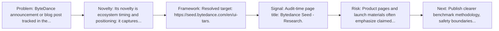
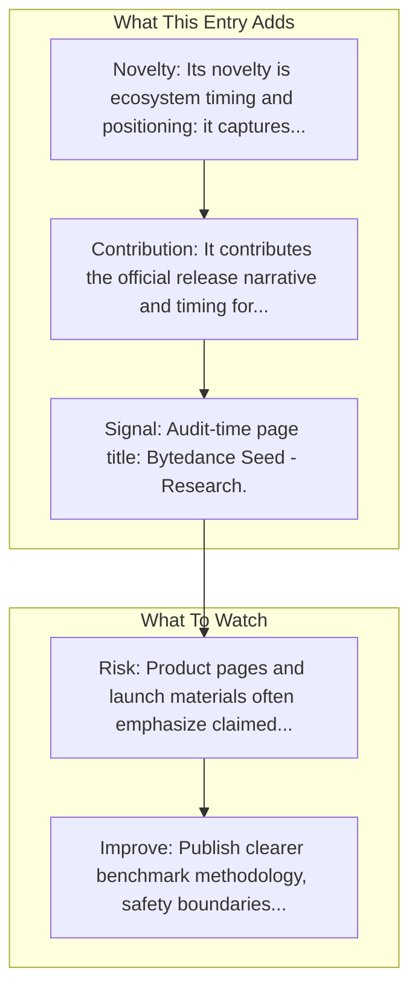

# UI-TARS Research Page

Entry report generated on 2026-03-28 (Asia/Shanghai). This report is based on the repository entry, audit-time metadata, and cross-checks against adjacent repo context.

## Snapshot

| Field | Detail |
| --- | --- |
| Repo entry | UI-TARS Research Page |
| Actual target | [Seed](https://seed.bytedance.com/en/ui-tars) |
| Group | Resources & Guides |
| Category | Key Blog Posts & Announcements / ByteDance |
| Source location | `resources/README.md:102` |
| Primary link type | `announcement` |
| Audit status | `ok` |
| Title | UI-TARS Research Page |
| Date | 2025 |

## Quick Read

| Lens | Read |
| --- | --- |
| Role in repo | announcement |
| Novelty | Its novelty is ecosystem timing and positioning: it captures how a vendor chose to frame computer use as a product capability. |
| Operating frame | Resolved target: https://seed.bytedance.com/en/ui-tars. |
| Main caution | Product pages and launch materials often emphasize claimed capability more than independent evaluation or failure analysis. |

## Visual Frame

## Analysis Map

## Executive Summary

ByteDance announcement or blog post tracked in the repository's resource list. UI-TARS: An open-source multimodal agent built upon a powerful vision-language model.

## Novelty and Distinguishing Angle

- Its novelty is ecosystem timing and positioning: it captures how a vendor chose to frame computer use as a product capability.
- Audit-time page framing: Bytedance Seed - Research.

## Core Contributions or Offerings

- It contributes the official release narrative and timing for a capability that later appears in docs, repos, or comparison articles.
- Tracked date in repo: 2025.

## Operating Framework

- Resolved target: https://seed.bytedance.com/en/ui-tars.
- Read it as a launch artifact first; pair it with docs, repos, or system cards for operational detail.
- Repo-tracked date: 2025.

## Evidence and Adoption Signals

- Audit-time page title: Bytedance Seed - Research.
- Audit-time page description: UI-TARS: An open-source multimodal agent built upon a powerful vision-language model.
- Resource provenance: unspecified source, 2025.

## Limitations and Gaps

- Product pages and launch materials often emphasize claimed capability more than independent evaluation or failure analysis.

## Improvement Paths

- Publish clearer benchmark methodology, safety boundaries, and real deployment limits alongside capability claims.
- Keep changelogs and API or availability notes current so the repo can track product evolution without guesswork.
- Add more concrete examples of failure handling, fallback behavior, and human takeover boundaries.

## Why It Matters

- It gives the repository explanatory and operational context beyond raw project lists.
- Resource entries matter because they shape how readers interpret the surrounding products, models, and frameworks.

## Connections In This Repo

- [UI-TARS-1.5-7B](model-hubs-huggingface-models-ui-tars-1-5-7b.md) - neighboring ecosystem entry in the same local cluster.
- [UI-TARS Desktop](../frameworks-and-tools/desktop-agent-frameworks-ui-tars-desktop.md) - neighboring ecosystem entry in the same local cluster.
- [Ferret-UI: Grounded Mobile UI Understanding](../../papers/models-and-architectures/ferret-ui-grounded-mobile-ui-understanding.md) - paper-side context for the same capability cluster.
- [UFO: Windows OS UI Agent via GPT-4V](../../papers/methods-and-techniques/ufo-windows-os-ui-agent-via-gpt-4v.md) - paper-side context for the same capability cluster.

## Source Basis

- Primary basis: repo-local notes, report metadata.
- Audit access note: tracked audit status was `ok` for the primary URL.
