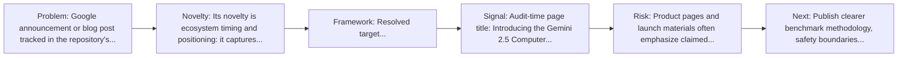
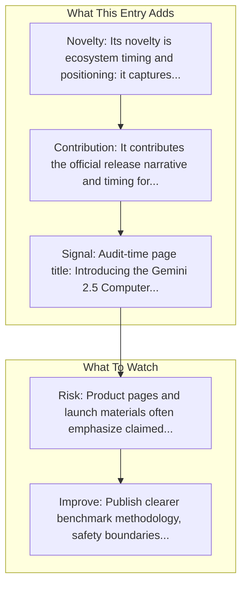

# Gemini 2.5 Computer Use

Entry report generated on 2026-03-28 (Asia/Shanghai). This report is based on the repository entry, audit-time metadata, and cross-checks against adjacent repo context.

## Snapshot

| Field | Detail |
| --- | --- |
| Repo entry | Gemini 2.5 Computer Use |
| Actual target | [Blog](https://blog.google/technology/google-deepmind/gemini-computer-use-model/) |
| Group | Resources & Guides |
| Category | Key Blog Posts & Announcements / Google |
| Source location | `resources/README.md:91` |
| Primary link type | `announcement` |
| Audit status | `ok` |
| Title | Gemini 2.5 Computer Use |
| Date | 2025 |

## Quick Read

| Lens | Read |
| --- | --- |
| Role in repo | announcement |
| Novelty | Its novelty is ecosystem timing and positioning: it captures how a vendor chose to frame computer use as a product capability. |
| Operating frame | Resolved target: https://blog.google/innovation-and-ai/models-and-research/google-deepmind/gemini-computer-use-model/. |
| Main caution | Product pages and launch materials often emphasize claimed capability more than independent evaluation or failure analysis. |

## Visual Frame

## Analysis Map

## Executive Summary

Google announcement or blog post tracked in the repository's resource list. Today we are releasing the Gemini 2.5 Computer Use model via the API, which outperforms leading alternatives at browser and mobile tasks.

## Novelty and Distinguishing Angle

- Its novelty is ecosystem timing and positioning: it captures how a vendor chose to frame computer use as a product capability.
- Audit-time page framing: Introducing the Gemini 2.5 Computer Use model.

## Core Contributions or Offerings

- It contributes the official release narrative and timing for a capability that later appears in docs, repos, or comparison articles.
- Tracked date in repo: 2025.

## Operating Framework

- Resolved target: https://blog.google/innovation-and-ai/models-and-research/google-deepmind/gemini-computer-use-model/.
- Read it as a launch artifact first; pair it with docs, repos, or system cards for operational detail.
- Repo-tracked date: 2025.

## Evidence and Adoption Signals

- Audit-time page title: Introducing the Gemini 2.5 Computer Use model.
- Audit-time page description: Today we are releasing the Gemini 2.5 Computer Use model via the API, which outperforms leading alternatives at browser and mobile tasks..
- Resource provenance: unspecified source, 2025.

## Limitations and Gaps

- Product pages and launch materials often emphasize claimed capability more than independent evaluation or failure analysis.

## Improvement Paths

- Publish clearer benchmark methodology, safety boundaries, and real deployment limits alongside capability claims.
- Keep changelogs and API or availability notes current so the repo can track product evolution without guesswork.
- Add more concrete examples of failure handling, fallback behavior, and human takeover boundaries.

## Why It Matters

- It gives the repository explanatory and operational context beyond raw project lists.
- Resource entries matter because they shape how readers interpret the surrounding products, models, and frameworks.

## Connections In This Repo

- [ACU - AI for Computer Use](curated-paper-lists-acu-ai-for-computer-use.md) - neighboring ecosystem entry in the same local cluster.
- [Introducing computer use](key-blog-posts-and-announcements-anthropic-introducing-computer-use.md) - neighboring ecosystem entry in the same local cluster.
- [Project Mariner](key-blog-posts-and-announcements-google-project-mariner.md) - neighboring ecosystem entry in the same local cluster.
- [Anthropic's Computer Use vs OpenAI's CUA](industry-analysis-and-news-comparison-articles-anthropic-s-computer-use-vs-openai-s-cua.md) - neighboring ecosystem entry in the same local cluster.

## Source Basis

- Primary basis: repo-local notes, report metadata.
- Audit access note: tracked audit status was `ok` for the primary URL.
