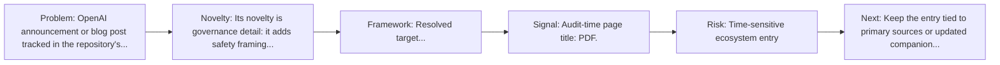
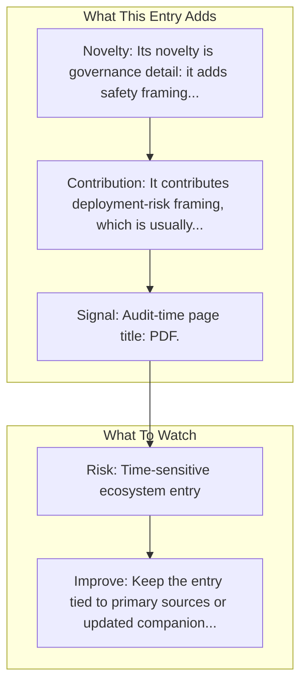

# Operator System Card

Entry report generated on 2026-03-28 (Asia/Shanghai). This report is based on the repository entry, audit-time metadata, and cross-checks against adjacent repo context.

## Snapshot

| Field | Detail |
| --- | --- |
| Repo entry | Operator System Card |
| Actual target | [PDF](https://cdn.openai.com/operator_system_card.pdf) |
| Group | Resources & Guides |
| Category | Key Blog Posts & Announcements / OpenAI |
| Source location | `resources/README.md:84` |
| Primary link type | `system-card` |
| Audit status | `ok` |
| Title | Operator System Card |
| Date | Jan 2025 |

## Quick Read

| Lens | Read |
| --- | --- |
| Role in repo | system-card |
| Novelty | Its novelty is governance detail: it adds safety framing, deployment boundaries, and risk language that launch pages often compress. |
| Operating frame | Resolved target: https://cdn.openai.com/operator_system_card.pdf. |
| Main caution | Claims should be read with source and maturity caveats in mind. |

## Visual Frame

## Analysis Map

## Executive Summary

OpenAI announcement or blog post tracked in the repository's resource list. PDF content fetched.

## Novelty and Distinguishing Angle

- Its novelty is governance detail: it adds safety framing, deployment boundaries, and risk language that launch pages often compress.
- Audit-time page framing: PDF.

## Core Contributions or Offerings

- It contributes deployment-risk framing, which is usually missing from model cards, blog posts, or sample demos alone.
- Tracked date in repo: Jan 2025.

## Operating Framework

- Resolved target: https://cdn.openai.com/operator_system_card.pdf.
- Treat it as the safety-and-boundary companion to the surrounding launch and API materials.
- Repo-tracked date: Jan 2025.

## Evidence and Adoption Signals

- Audit-time page title: PDF.
- Audit-time page description: PDF content fetched.
- Resource provenance: unspecified source, Jan 2025.

## Limitations and Gaps

## Improvement Paths

- Keep the entry tied to primary sources or updated companion material so readers can distinguish signal from hype.
- Add clearer context on where the resource is strong, where it is partial, and what it omits.
- Cross-link it more explicitly to the products, frameworks, or papers it is most useful for understanding.

## Why It Matters

- It gives the repository explanatory and operational context beyond raw project lists.
- Resource entries matter because they shape how readers interpret the surrounding products, models, and frameworks.

## Connections In This Repo

- [Introducing Operator](key-blog-posts-and-announcements-openai-introducing-operator.md) - neighboring ecosystem entry in the same local cluster.
- [Computer-Using Agent](key-blog-posts-and-announcements-openai-computer-using-agent.md) - neighboring ecosystem entry in the same local cluster.
- [New tools for building agents](key-blog-posts-and-announcements-openai-new-tools-for-building-agents.md) - neighboring ecosystem entry in the same local cluster.
- [Anthropic's Computer Use vs OpenAI's CUA](industry-analysis-and-news-comparison-articles-anthropic-s-computer-use-vs-openai-s-cua.md) - neighboring ecosystem entry in the same local cluster.

## Source Basis

- Primary basis: repo-local notes, report metadata.
- Audit access note: tracked audit status was `ok` for the primary URL.
