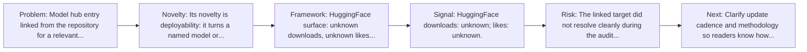
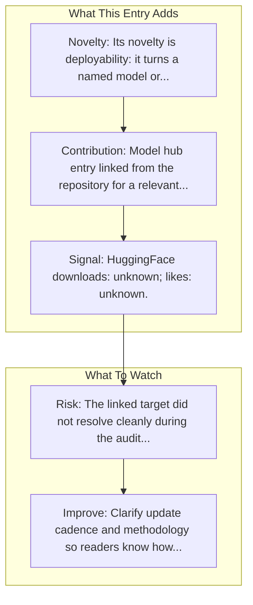

# AutoGLM-Phone-9B

Entry report generated on 2026-03-28 (Asia/Shanghai). This report is based on the repository entry, audit-time metadata, and cross-checks against adjacent repo context.

## Snapshot

| Field | Detail |
| --- | --- |
| Repo entry | AutoGLM-Phone-9B |
| Actual target | [HuggingFace](https://huggingface.co/THUDM/AutoGLM-Phone-9B) |
| Group | Resources & Guides |
| Category | Model Hubs / HuggingFace Models |
| Source location | `resources/README.md:169` |
| Primary link type | `model-hub` |
| Audit status | `error` |
| Model | AutoGLM-Phone-9B |

## Quick Read

| Lens | Read |
| --- | --- |
| Role in repo | model-hub |
| Novelty | Its novelty is deployability: it turns a named model or agent component into something readers can fetch, run, or benchmark directly. |
| Operating frame | HuggingFace surface: unknown downloads, unknown likes, library unspecified. |
| Main caution | The linked target did not resolve cleanly during the audit, so this report leans heavily on repo-local notes and adjacent metadata. |

## Visual Frame

## Analysis Map

## Executive Summary

Model hub entry linked from the repository for a relevant computer-use model or component.

## Novelty and Distinguishing Angle

- Its novelty is deployability: it turns a named model or agent component into something readers can fetch, run, or benchmark directly.
- The entry leans into the mobile-agent lane, where research depth is strong but real-world productization is still uneven.

## Core Contributions or Offerings

- Model hub entry linked from the repository for a relevant computer-use model or component.

## Operating Framework

- HuggingFace surface: unknown downloads, unknown likes, library unspecified.
- Use it as the runnable checkpoint surface for inference, demos, or downstream benchmarking.

## Evidence and Adoption Signals

- HuggingFace downloads: unknown; likes: unknown.

## Limitations and Gaps

- The linked target did not resolve cleanly during the audit, so this report leans heavily on repo-local notes and adjacent metadata.
- A hosted checkpoint page does not automatically reveal evaluation rigor, deployment limits, or failure modes.

## Improvement Paths

- Clarify update cadence and methodology so readers know how fresh and comparable the surfaced information really is.
- Cross-link more directly to primary papers, repos, or docs so the index page is not the end of the evidence chain.
- State scope boundaries more explicitly so readers know what this entry covers and what it leaves out.

## Why It Matters

- It gives the repository explanatory and operational context beyond raw project lists.
- Resource entries matter because they shape how readers interpret the surrounding products, models, and frameworks.

## Connections In This Repo

- [AutoGLM: Autonomous Foundation Agents for GUIs](../../papers/models-and-architectures/autoglm-autonomous-foundation-agents-for-guis.md) - paper-side context for the same capability cluster.
- [UI-TARS-1.5-7B](model-hubs-huggingface-models-ui-tars-1-5-7b.md) - neighboring ecosystem entry in the same local cluster.
- [Qwen2.5-VL-72B-Instruct](model-hubs-huggingface-models-qwen2-5-vl-72b-instruct.md) - neighboring ecosystem entry in the same local cluster.
- [OmniParser-v2.0](model-hubs-huggingface-models-omniparser-v2-0.md) - neighboring ecosystem entry in the same local cluster.

## Source Basis

- Primary basis: repo-local notes, report metadata, HuggingFace model metadata.
- Audit access note: the linked target failed to resolve during the audit, so this report is more inferential than the ones backed by clean page metadata.
