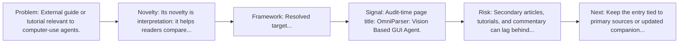
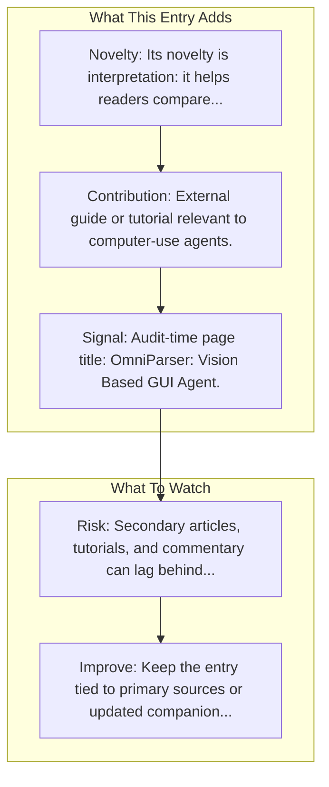

# OmniParser

Entry report generated on 2026-03-28 (Asia/Shanghai). This report is based on the repository entry, audit-time metadata, and cross-checks against adjacent repo context.

## Snapshot

| Field | Detail |
| --- | --- |
| Repo entry | OmniParser |
| Actual target | [Tutorial](https://learnopencv.com/omniparser-vision-based-gui-agent/) |
| Group | Resources & Guides |
| Category | Tutorials & Guides / Framework Tutorials |
| Source location | `resources/README.md:140` |
| Primary link type | `resource` |
| Audit status | `ok` |
| Framework | OmniParser |
| Resource | Learn OpenCV |

## Quick Read

| Lens | Read |
| --- | --- |
| Role in repo | resource |
| Novelty | Its novelty is interpretation: it helps readers compare, frame, or contextualize the surrounding products, models, and tools. |
| Operating frame | Resolved target: https://learnopencv.com/omniparser-vision-based-gui-agent/. |
| Main caution | Secondary articles, tutorials, and commentary can lag behind primary source changes or smooth over important caveats. |

## Visual Frame

## Analysis Map

## Executive Summary

External guide or tutorial relevant to computer-use agents. OmniParser is a UI screen parsing pipeline combining a YOLO for icon detection and a fine-tuned Florence 2 model for icon recognition and description.

## Novelty and Distinguishing Angle

- Its novelty is interpretation: it helps readers compare, frame, or contextualize the surrounding products, models, and tools.
- Audit-time page framing: OmniParser: Vision Based GUI Agent.

## Core Contributions or Offerings

- External guide or tutorial relevant to computer-use agents.

## Operating Framework

- Resolved target: https://learnopencv.com/omniparser-vision-based-gui-agent/.

## Evidence and Adoption Signals

- Audit-time page title: OmniParser: Vision Based GUI Agent.
- Audit-time page description: OmniParser is a UI screen parsing pipeline combining a YOLO for icon detection and a fine-tuned Florence 2 model for icon recognition and description..

## Limitations and Gaps

- Secondary articles, tutorials, and commentary can lag behind primary source changes or smooth over important caveats.

## Improvement Paths

- Keep the entry tied to primary sources or updated companion material so readers can distinguish signal from hype.
- Add clearer context on where the resource is strong, where it is partial, and what it omits.
- Cross-link it more explicitly to the products, frameworks, or papers it is most useful for understanding.

## Why It Matters

- It gives the repository explanatory and operational context beyond raw project lists.
- Resource entries matter because they shape how readers interpret the surrounding products, models, and frameworks.

## Connections In This Repo

- [OmniParser](../frameworks-and-tools/grounding-and-parsing-tools-omniparser.md) - same named artifact viewed from a different angle elsewhere in the repository.
- [OmniParser-v2.0](model-hubs-huggingface-models-omniparser-v2-0.md) - neighboring ecosystem entry in the same local cluster.
- [OmniParser: Pure Vision Based GUI Agent](../../papers/models-and-architectures/omniparser-pure-vision-based-gui-agent.md) - paper-side context for the same capability cluster.
- [GUI-Agents-Paper-List (OSU NLP Group)](curated-paper-lists-gui-agents-paper-list-osu-nlp-group.md) - neighboring ecosystem entry in the same local cluster.

## Source Basis

- Primary basis: repo-local notes, report metadata.
- Audit access note: tracked audit status was `ok` for the primary URL.
