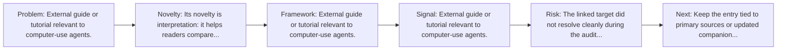
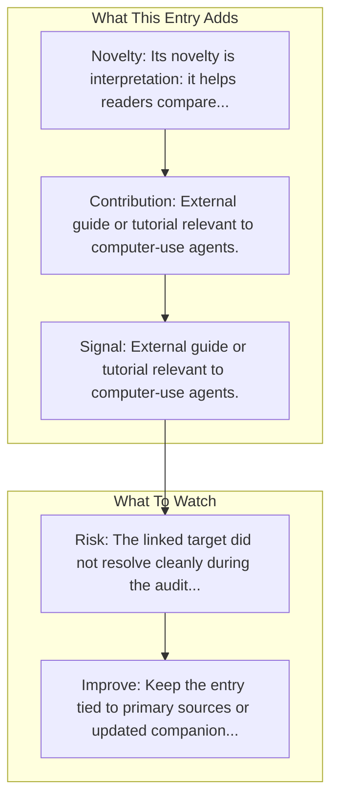

# Qwen2.5-VL

Entry report generated on 2026-03-28 (Asia/Shanghai). This report is based on the repository entry, audit-time metadata, and cross-checks against adjacent repo context.

## Snapshot

| Field | Detail |
| --- | --- |
| Repo entry | Qwen2.5-VL |
| Actual target | [Tutorial](https://debuggercafe.com/qwen2-5-vl/) |
| Group | Resources & Guides |
| Category | Tutorials & Guides / Framework Tutorials |
| Source location | `resources/README.md:141` |
| Primary link type | `resource` |
| Audit status | `error` |
| Framework | Qwen2.5-VL |
| Resource | Debugger Cafe |

## Quick Read

| Lens | Read |
| --- | --- |
| Role in repo | resource |
| Novelty | Its novelty is interpretation: it helps readers compare, frame, or contextualize the surrounding products, models, and tools. |
| Operating frame | External guide or tutorial relevant to computer-use agents. |
| Main caution | The linked target did not resolve cleanly during the audit, so this report leans heavily on repo-local notes and adjacent metadata. |

## Visual Frame

## Analysis Map

## Executive Summary

External guide or tutorial relevant to computer-use agents.

## Novelty and Distinguishing Angle

- Its novelty is interpretation: it helps readers compare, frame, or contextualize the surrounding products, models, and tools.

## Core Contributions or Offerings

- External guide or tutorial relevant to computer-use agents.

## Operating Framework

## Evidence and Adoption Signals

- External guide or tutorial relevant to computer-use agents.

## Limitations and Gaps

- The linked target did not resolve cleanly during the audit, so this report leans heavily on repo-local notes and adjacent metadata.
- Secondary articles, tutorials, and commentary can lag behind primary source changes or smooth over important caveats.

## Improvement Paths

- Keep the entry tied to primary sources or updated companion material so readers can distinguish signal from hype.
- Add clearer context on where the resource is strong, where it is partial, and what it omits.
- Cross-link it more explicitly to the products, frameworks, or papers it is most useful for understanding.

## Why It Matters

- It gives the repository explanatory and operational context beyond raw project lists.
- Resource entries matter because they shape how readers interpret the surrounding products, models, and frameworks.

## Connections In This Repo

- [Qwen2.5-VL-72B-Instruct](model-hubs-huggingface-models-qwen2-5-vl-72b-instruct.md) - neighboring ecosystem entry in the same local cluster.
- [Qwen2.5-VL Technical Report](../../papers/models-and-architectures/qwen2-5-vl-technical-report.md) - paper-side context for the same capability cluster.
- [Gemini 2.5 Computer Use](key-blog-posts-and-announcements-google-gemini-2-5-computer-use.md) - neighboring ecosystem entry in the same local cluster.
- [UI-TARS-1.5-7B](model-hubs-huggingface-models-ui-tars-1-5-7b.md) - neighboring ecosystem entry in the same local cluster.

## Source Basis

- Primary basis: repo-local notes, report metadata.
- Audit access note: the linked target failed to resolve during the audit, so this report is more inferential than the ones backed by clean page metadata.
