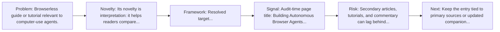
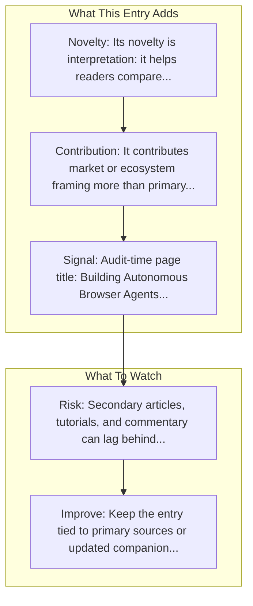

# Browser Agents with Playwright & Claude

Entry report generated on 2026-03-28 (Asia/Shanghai). This report is based on the repository entry, audit-time metadata, and cross-checks against adjacent repo context.

## Snapshot

| Field | Detail |
| --- | --- |
| Repo entry | Browser Agents with Playwright & Claude |
| Actual target | [Tutorial](https://www.browserless.io/blog/building-autonomous-browser-agents-with-playwright-claude-opus-4-5) |
| Group | Resources & Guides |
| Category | Tutorials & Guides / Getting Started |
| Source location | `resources/README.md:135` |
| Primary link type | `article` |
| Audit status | `ok` |
| Title | Browser Agents with Playwright & Claude |
| Source | Browserless |

## Quick Read

| Lens | Read |
| --- | --- |
| Role in repo | article |
| Novelty | Its novelty is interpretation: it helps readers compare, frame, or contextualize the surrounding products, models, and tools. |
| Operating frame | Resolved target: https://www.browserless.io/blog/building-autonomous-browser-agents-with-playwright-claude-opus-4-5. |
| Main caution | Secondary articles, tutorials, and commentary can lag behind primary source changes or smooth over important caveats. |

## Visual Frame

## Analysis Map

## Executive Summary

Browserless guide or tutorial relevant to computer-use agents. A guide to building autonomous browser agents with Claude Opus 4.5 and Playwright, and running them reliably at scale using Browserless-managed browsers.

## Novelty and Distinguishing Angle

- Its novelty is interpretation: it helps readers compare, frame, or contextualize the surrounding products, models, and tools.
- The entry is browser-first, matching the part of the ecosystem that currently looks most deployment-ready.
- Audit-time page framing: Building Autonomous Browser Agents with Playwright & Claude Opus 4.5.

## Core Contributions or Offerings

- It contributes market or ecosystem framing more than primary technical detail.
- Listed source: Browserless.

## Operating Framework

- Resolved target: https://www.browserless.io/blog/building-autonomous-browser-agents-with-playwright-claude-opus-4-5.
- Treat it as a secondary interpretation layer, not as the sole technical source of truth.
- Source context: Browserless.

## Evidence and Adoption Signals

- Audit-time page title: Building Autonomous Browser Agents with Playwright & Claude Opus 4.5.
- Audit-time page description: A guide to building autonomous browser agents with Claude Opus 4.5 and Playwright, and running them reliably at scale using Browserless-managed browsers..
- Resource provenance: Browserless.

## Limitations and Gaps

- Secondary articles, tutorials, and commentary can lag behind primary source changes or smooth over important caveats.

## Improvement Paths

- Keep the entry tied to primary sources or updated companion material so readers can distinguish signal from hype.
- Add clearer context on where the resource is strong, where it is partial, and what it omits.
- Cross-link it more explicitly to the products, frameworks, or papers it is most useful for understanding.

## Why It Matters

- It gives the repository explanatory and operational context beyond raw project lists.
- Resource entries matter because they shape how readers interpret the surrounding products, models, and frameworks.

## Connections In This Repo

- [Building Browser Agents with MultiOn](tutorials-and-guides-getting-started-building-browser-agents-with-multion.md) - shared browser or web-agent operating surface.
- [Top 10 Browser Automation Agents](industry-analysis-and-news-comparison-articles-top-10-browser-automation-agents.md) - shared browser or web-agent operating surface.
- [New tools for building agents](key-blog-posts-and-announcements-openai-new-tools-for-building-agents.md) - neighboring ecosystem entry in the same local cluster.
- [AgentCore Browser](key-blog-posts-and-announcements-amazon-agentcore-browser.md) - shared browser or web-agent operating surface.

## Source Basis

- Primary basis: repo-local notes, report metadata.
- Audit access note: tracked audit status was `ok` for the primary URL.
