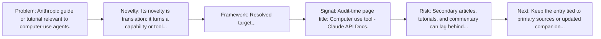
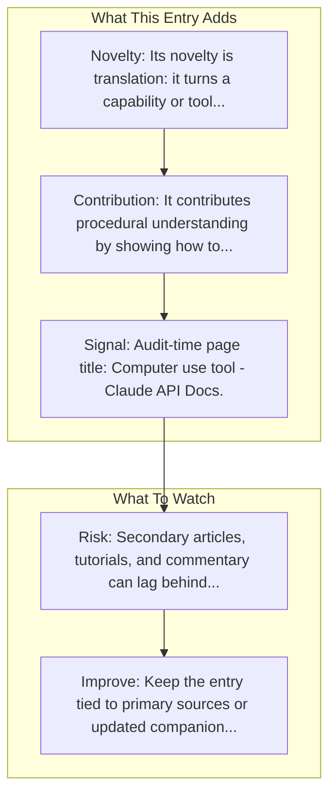

# Computer Use Tool Guide

Entry report generated on 2026-03-28 (Asia/Shanghai). This report is based on the repository entry, audit-time metadata, and cross-checks against adjacent repo context.

## Snapshot

| Field | Detail |
| --- | --- |
| Repo entry | Computer Use Tool Guide |
| Actual target | [Docs](https://platform.claude.com/docs/en/agents-and-tools/tool-use/computer-use-tool) |
| Group | Resources & Guides |
| Category | Tutorials & Guides / Getting Started |
| Source location | `resources/README.md:131` |
| Primary link type | `guide` |
| Audit status | `ok` |
| Title | Computer Use Tool Guide |
| Source | Anthropic |

## Quick Read

| Lens | Read |
| --- | --- |
| Role in repo | guide |
| Novelty | Its novelty is translation: it turns a capability or tool into a more learnable workflow for practitioners. |
| Operating frame | Resolved target: https://platform.claude.com/docs/en/agents-and-tools/tool-use/computer-use-tool. |
| Main caution | Secondary articles, tutorials, and commentary can lag behind primary source changes or smooth over important caveats. |

## Visual Frame

## Analysis Map

## Executive Summary

Anthropic guide or tutorial relevant to computer-use agents. Claude API Documentation.

## Novelty and Distinguishing Angle

- Its novelty is translation: it turns a capability or tool into a more learnable workflow for practitioners.
- Audit-time page framing: Computer use tool - Claude API Docs.

## Core Contributions or Offerings

- It contributes procedural understanding by showing how to move from concept to setup or use.
- Listed source: Anthropic.

## Operating Framework

- Resolved target: https://platform.claude.com/docs/en/agents-and-tools/tool-use/computer-use-tool.
- Use it as a workflow bridge between primary product or framework docs and hands-on implementation.
- Source context: Anthropic.

## Evidence and Adoption Signals

- Audit-time page title: Computer use tool - Claude API Docs.
- Audit-time page description: Claude API Documentation.
- Resource provenance: Anthropic.

## Limitations and Gaps

- Secondary articles, tutorials, and commentary can lag behind primary source changes or smooth over important caveats.

## Improvement Paths

- Keep the entry tied to primary sources or updated companion material so readers can distinguish signal from hype.
- Add clearer context on where the resource is strong, where it is partial, and what it omits.
- Cross-link it more explicitly to the products, frameworks, or papers it is most useful for understanding.

## Why It Matters

- It gives the repository explanatory and operational context beyond raw project lists.
- Resource entries matter because they shape how readers interpret the surrounding products, models, and frameworks.

## Connections In This Repo

- [Computer Use Guide](tutorials-and-guides-getting-started-computer-use-guide.md) - neighboring ecosystem entry in the same local cluster.
- [Introducing computer use](key-blog-posts-and-announcements-anthropic-introducing-computer-use.md) - neighboring ecosystem entry in the same local cluster.
- [Anthropic's Computer Use vs OpenAI's CUA](industry-analysis-and-news-comparison-articles-anthropic-s-computer-use-vs-openai-s-cua.md) - neighboring ecosystem entry in the same local cluster.
- [Claude can now use computers](key-blog-posts-and-announcements-anthropic-claude-can-now-use-computers.md) - neighboring ecosystem entry in the same local cluster.

## Source Basis

- Primary basis: repo-local notes, report metadata.
- Audit access note: tracked audit status was `ok` for the primary URL.
