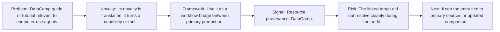
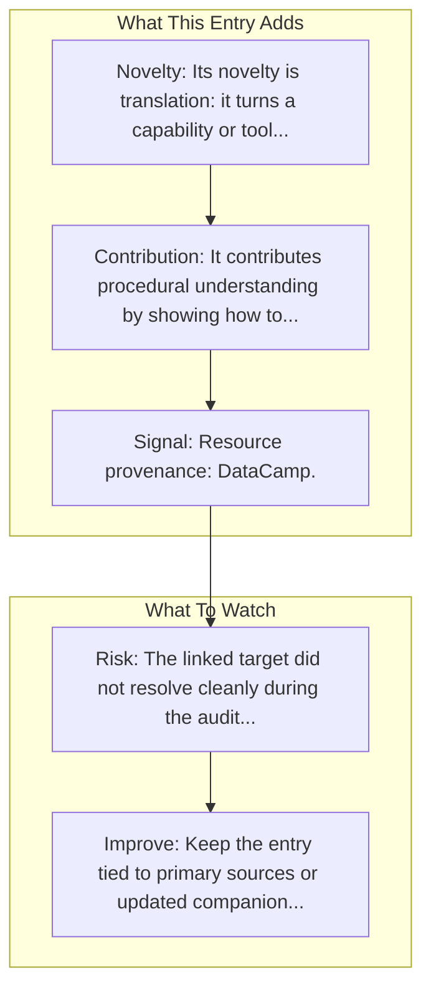

# Project Mariner Guide

Entry report generated on 2026-03-28 (Asia/Shanghai). This report is based on the repository entry, audit-time metadata, and cross-checks against adjacent repo context.

## Snapshot

| Field | Detail |
| --- | --- |
| Repo entry | Project Mariner Guide |
| Actual target | [Tutorial](https://www.datacamp.com/tutorial/project-mariner) |
| Group | Resources & Guides |
| Category | Tutorials & Guides / Getting Started |
| Source location | `resources/README.md:133` |
| Primary link type | `guide` |
| Audit status | `error` |
| Title | Project Mariner Guide |
| Source | DataCamp |

## Quick Read

| Lens | Read |
| --- | --- |
| Role in repo | guide |
| Novelty | Its novelty is translation: it turns a capability or tool into a more learnable workflow for practitioners. |
| Operating frame | Use it as a workflow bridge between primary product or framework docs and hands-on implementation. |
| Main caution | The linked target did not resolve cleanly during the audit, so this report leans heavily on repo-local notes and adjacent metadata. |

## Visual Frame

## Analysis Map

## Executive Summary

DataCamp guide or tutorial relevant to computer-use agents.

## Novelty and Distinguishing Angle

- Its novelty is translation: it turns a capability or tool into a more learnable workflow for practitioners.

## Core Contributions or Offerings

- It contributes procedural understanding by showing how to move from concept to setup or use.
- Listed source: DataCamp.

## Operating Framework

- Use it as a workflow bridge between primary product or framework docs and hands-on implementation.
- Source context: DataCamp.

## Evidence and Adoption Signals

- Resource provenance: DataCamp.

## Limitations and Gaps

- The linked target did not resolve cleanly during the audit, so this report leans heavily on repo-local notes and adjacent metadata.
- Secondary articles, tutorials, and commentary can lag behind primary source changes or smooth over important caveats.

## Improvement Paths

- Keep the entry tied to primary sources or updated companion material so readers can distinguish signal from hype.
- Add clearer context on where the resource is strong, where it is partial, and what it omits.
- Cross-link it more explicitly to the products, frameworks, or papers it is most useful for understanding.

## Why It Matters

- It gives the repository explanatory and operational context beyond raw project lists.
- Resource entries matter because they shape how readers interpret the surrounding products, models, and frameworks.

## Connections In This Repo

- [Computer Use Tool Guide](tutorials-and-guides-getting-started-computer-use-tool-guide.md) - neighboring ecosystem entry in the same local cluster.
- [Computer Use Guide](tutorials-and-guides-getting-started-computer-use-guide.md) - neighboring ecosystem entry in the same local cluster.
- [Project Mariner](key-blog-posts-and-announcements-google-project-mariner.md) - neighboring ecosystem entry in the same local cluster.
- [Google - Project Mariner](../products-and-services/major-tech-companies-google-project-mariner.md) - neighboring ecosystem entry in the same local cluster.

## Source Basis

- Primary basis: repo-local notes, report metadata.
- Audit access note: the linked target failed to resolve during the audit, so this report is more inferential than the ones backed by clean page metadata.
