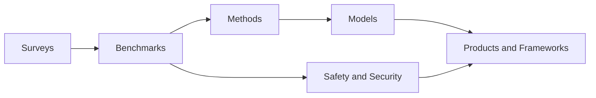
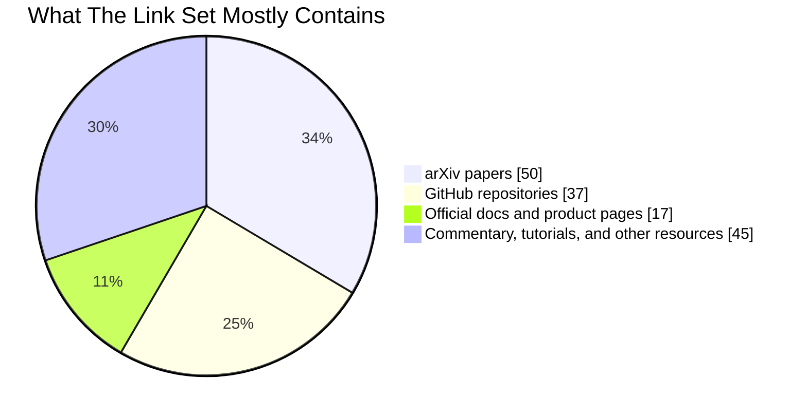

# External Link Audit Summary

Audit date: 2026-03-27 (Asia/Tokyo)

This audit checked 149 unique external URLs across 290 total link occurrences in this repository's Markdown files. The detailed inventory is in [inventory.md](./inventory.md). Actionable cleanup items are in [maintenance-findings.md](./maintenance-findings.md). The paper-by-paper dossier is in [per-paper-report.md](./per-paper-report.md), the non-paper ecosystem dossier is in [ecosystem-report.md](./ecosystem-report.md), and the focused post-2024 research expansion is in [post-2024-research-refresh.md](./post-2024-research-refresh.md).

## Visual Snapshot

## Scope

- Source files covered: `README.md`, `frameworks/README.md`, `products/README.md`, `resources/README.md`, and the five `papers/*/README.md` files.
- Primary evidence used: arXiv API metadata, GitHub API metadata, Hugging Face API metadata, official page metadata, and direct browser/search verification for a subset of anti-bot protected pages.
- What "read every link" means here: every unique outbound URL was checked for content, metadata, or current status; when a site blocked direct scripted access, that limitation was recorded explicitly instead of being silently skipped.

## Main Findings

- The repository really does cover the full computer-use-agent stack instead of just one slice of it. The links span surveys, models, benchmarks, methods, safety, products, frameworks, infrastructure, and meta-resources.
- Benchmarks are the backbone of the whole collection. OSWorld, WebArena, Mind2Web, AndroidWorld, ScreenSpot, Windows Agent Arena, and newer live-site variants explain why later papers focus so heavily on data synthesis, grounding, online RL, and recovery from interface drift.
- The research story across the links is a clear progression:
  - 2023: foundational web benchmarks and early GUI-capable multimodal agents.
  - 2024: stronger grounding, realistic environments, Windows/mobile environments, and the first serious safety attacks.
  - 2025: end-to-end native agents, online RL, large-scale trajectory synthesis, live-site evaluation, and mainstream product launches.
- The ecosystem is splitting into two design families:
  - End-to-end native GUI agents such as UI-TARS, Mobile-Agent-v3, AutoGLM, and related research models.
  - Modular stacks built from a planner plus browser/runtime/tooling layers such as Browser Use, Stagehand, Skyvern, Anthropic computer use, OpenAI CUA, Nova Act, Browserbase, and Browserless.
- Commercial offerings overwhelmingly favor constrained environments. The official docs and product pages lean toward browser sandboxes, takeover prompts, system cards, or managed runtimes rather than unrestricted autonomous desktop control.
- Safety is no longer an afterthought. The link set now includes a meaningful safety cluster: AgentHarm, RedTeamCUA, WebGuard, pop-up attacks, system cards, and higher-level security surveys. That said, the competence literature is still much denser than the safety literature.
- The post-2024 refresh strengthens the repository's newer frontier: open computer-use foundations, tool-using evaluation, privacy-preserving GUI agents, and human-preference-based analysis are now much better represented than they were in the original audit pass.

## Cross-Link Connections

### Benchmarks -> Methods -> Models

- OSWorld, WebArena, Mind2Web, AndroidWorld, and ScreenSpot create the evaluation pressure that later methods try to solve.
- AgentTrek, OS-Genesis, PC Agent-E, DigiRL, WebRL, and ComputerRL all attack the same bottleneck from different angles: there is not enough high-quality interaction data, and static demos are not enough.
- UI-TARS, Mobile-Agent-v3, OmniParser, Qwen2.5-VL, SeeClick, and related models make more sense when read alongside those method papers: the models improve because the field is improving grounding, trajectory generation, and online training.

### Grounding Cluster

- SeeClick, ScreenSpot, OmniParser, GUI-Actor, R-VLM, and the grounding-oriented method links all point to the same practical truth: GUI agents fail when they cannot localize the right thing reliably.
- This cluster also connects directly to framework and tutorial links. OmniParser appears as a paper, GitHub repo, and tutorial, showing how quickly a research primitive became part of the practical toolchain.

### Browser Agent Productization

- OpenAI CUA, Operator, Project Mariner, Gemini 2.5 Computer Use, Nova Act, MultiOn, Twin, Browserbase, Browserless, Stagehand, and Browser Use all converge around browser automation as the lowest-friction production surface.
- The comparison and tutorial articles reinforce that browser-first agents are where the commercial and developer ecosystem is currently most operationally mature.

### Mobile Agent Research Loop

- AppAgent, Mobile-Agent-v3, AutoGLM, AgentCPM-GUI, AndroidWorld, AitW, AMEX, A3, and GUI Odyssey form a tight mobile-specific subgraph.
- Compared with web/browser links, the mobile cluster is still more research-heavy than product-heavy, which suggests desktop/browser deployment is ahead of general mobile deployment.

### Curated Lists and Repo Structure

- OSU's paper list, ShowLab's collection, ACU, and the other curated resources overlap heavily with this repository's own scope.
- The same canonical links appear in multiple files, which is helpful for discoverability but increases maintenance drift. Several broken or stale links likely came from this repetition rather than from any one section being poor on its own.

## Insights By Source Type

- Most authoritative technical links:
  - arXiv papers
  - official docs
  - official GitHub repositories
  - the OpenAI Operator system card PDF
- Most useful for ecosystem orientation:
  - curated GitHub lists
  - benchmark sites
  - official product pages
- Least reliable as technical evidence:
  - comparison blogs
  - marketing-heavy startup sites
  - secondary commentary that makes performance or market claims without linking to primary sources

## Limitations

- Several sites blocked scripted access with Cloudflare, 403 responses, or timeouts. That affected some OpenAI blog pages, GatesNotes, Medium, VentureBeat, AI Business, and a few commercial homepages.
- A handful of official pages were readable only at the metadata level, not as full article text, because of anti-bot measures.
- Some product descriptions in the repository include business or roadmap claims that are not obviously supported by the linked official page alone. That does not prove the claims are false, but it does mean the link and the local note are not always equally strong evidence.
- Hardcoded GitHub star counts have drifted substantially. The framework list is directionally right, but several current repo sizes are much larger than the numbers written in the Markdown files.
- Some entries intentionally use a broader paper to stand in for a benchmark or method name. In a few cases that is acceptable, but in a few others the linked paper is clearly the wrong paper entirely. Those are listed in [maintenance-findings.md](./maintenance-findings.md).

## Overall Take

The link set tells a coherent story: computer-use agents have moved from early benchmark construction and proof-of-concept multimodal control into an era defined by trajectory scale, online learning, grounding fidelity, and browser-oriented deployment. The repository is already strong as a landscape map. Its main weakness is not scope but maintenance drift: repeated links, stale star counts, a few broken pages, and a few clearly incorrect paper mappings.
