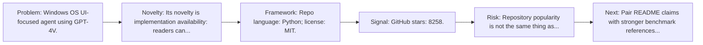
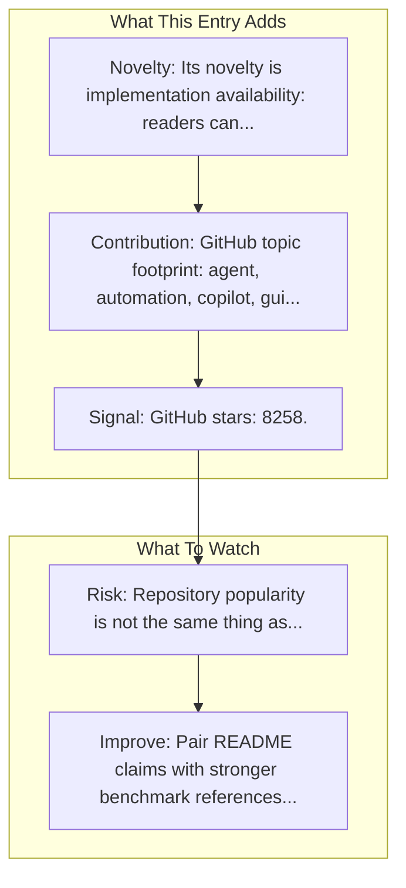

# UFO (Microsoft)

Entry report generated on 2026-03-28 (Asia/Tokyo). This report is based on the repository entry, audit-time metadata, and cross-checks against adjacent repo context.

## Snapshot

| Field | Detail |
| --- | --- |
| Repo entry | UFO (Microsoft) |
| Actual target | [GitHub](https://github.com/microsoft/UFO) |
| Group | Frameworks & Tools |
| Category | Desktop Agent Frameworks |
| Source location | `frameworks/README.md:49` |
| Primary link type | `repository` |
| Audit status | `ok` |
| Organization | Microsoft |
| GitHub stars | 8258 |
| Language | Python |
| License | MIT |

## Quick Read

| Lens | Read |
| --- | --- |
| Role in repo | repository |
| Novelty | Its novelty is implementation availability: readers can inspect, run, and adapt the actual stack rather than only reading paper claims. |
| Operating frame | Repo language: Python; license: MIT. |
| Main caution | Repository popularity is not the same thing as benchmark-verified reliability, maintenance quality, or deployment safety. |

## Visual Frame

## Analysis Map

## Executive Summary

Windows OS UI-focused agent using GPT-4V. UFO³: Weaving the Digital Agent Galaxy.

## Novelty and Distinguishing Angle

- Its novelty is implementation availability: readers can inspect, run, and adapt the actual stack rather than only reading paper claims.
- The entry sits in the desktop-control lane, which usually raises stronger environment variance and safety implications than browser-only automation.
- Open-source adoption is non-trivial here: cached GitHub metadata records 8258 stars.

## Core Contributions or Offerings

- GitHub topic footprint: agent, automation, copilot, gui, llm, windows.

## Operating Framework

- Repo language: Python; license: MIT.
- Repository updated at audit time: 2026-03-27T14:50:40Z.

## Evidence and Adoption Signals

- GitHub stars: 8258.
- Open issues at audit time: 50.
- Open-source posture: Python, license MIT.
- Topics: agent, automation, copilot, gui, llm, windows.
- Recent maintenance timestamp in cached metadata: 2026-03-27T14:50:40Z.
- Audit-time page title: GitHub - microsoft/UFO: UFO³: Weaving the Digital Agent Galaxy · GitHub.

## Limitations and Gaps

- Repository popularity is not the same thing as benchmark-verified reliability, maintenance quality, or deployment safety.

## Improvement Paths

- Pair README claims with stronger benchmark references, maintenance notes, and example evaluations.
- Document supported environments and failure modes more explicitly so adoption signals are easier to interpret.
- Show reproducible setup paths and ongoing maintenance signals, not just launch momentum.

## Why It Matters

- It provides the implementation layer that turns research claims into developer workflows, demos, and reusable stacks.
- Framework entries help explain what the ecosystem can actually build today, not just what papers describe.

## Connections In This Repo

- [UFO: Windows OS UI Agent via GPT-4V](../../papers/methods-and-techniques/ufo-windows-os-ui-agent-via-gpt-4v.md) - shared desktop or OS-level automation surface.
- [Windows in Docker](sandbox-and-testing-environments-windows-in-docker.md) - shared desktop or OS-level automation surface.
- [OmniParser: Pure Vision Based GUI Agent](../../papers/models-and-architectures/omniparser-pure-vision-based-gui-agent.md) - paper-side context for the same capability cluster.
- [GUI-Actor: Coordinate-Free Visual Grounding](../../papers/models-and-architectures/gui-actor-coordinate-free-visual-grounding.md) - paper-side context for the same capability cluster.

## Source Basis

- Primary basis: repo-local notes, link-audit page metadata, GitHub repository metadata.
- Audit access note: link-audit status was `ok` for the primary URL.
- Maintenance note: repository metadata was current through 2026-03-27T14:50:40Z at audit time.
