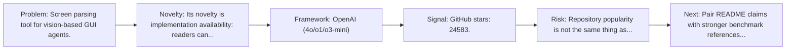
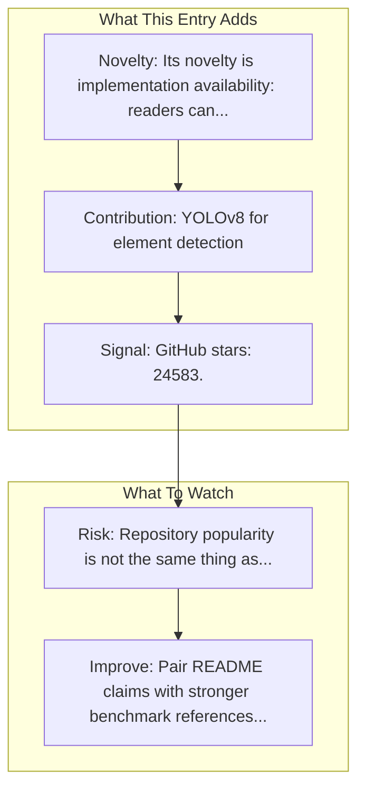

# OmniParser

Entry report generated on 2026-03-28 (Asia/Tokyo). This report is based on the repository entry, audit-time metadata, and cross-checks against adjacent repo context.

## Snapshot

| Field | Detail |
| --- | --- |
| Repo entry | OmniParser |
| Actual target | [GitHub](https://github.com/microsoft/OmniParser) |
| Group | Frameworks & Tools |
| Category | Grounding & Parsing Tools |
| Source location | `frameworks/README.md:222` |
| Primary link type | `repository` |
| Audit status | `ok` |
| Organization | Microsoft |
| GitHub stars | 24583 |
| Language | Jupyter Notebook |
| License | CC-BY-4.0 |

## Quick Read

| Lens | Read |
| --- | --- |
| Role in repo | repository |
| Novelty | Its novelty is implementation availability: readers can inspect, run, and adapt the actual stack rather than only reading paper claims. |
| Operating frame | OpenAI (4o/o1/o3-mini) |
| Main caution | Repository popularity is not the same thing as benchmark-verified reliability, maintenance quality, or deployment safety. |

## Visual Frame

## Analysis Map

## Executive Summary

Screen parsing tool for vision-based GUI agents. A simple screen parsing tool towards pure vision based GUI agent. Key local notes: YOLOv8 for element detection; Florence-2 for element captioning.

## Novelty and Distinguishing Angle

- Its novelty is implementation availability: readers can inspect, run, and adapt the actual stack rather than only reading paper claims.
- It belongs to the grounding-heavy slice of the ecosystem, where localization quality often determines whether the rest of the stack works at all.
- Open-source adoption is non-trivial here: cached GitHub metadata records 24583 stars.

## Core Contributions or Offerings

- YOLOv8 for element detection
- Florence-2 for element captioning

## Operating Framework

- OpenAI (4o/o1/o3-mini)
- DeepSeek (R1)
- Qwen (2.5VL)
- Anthropic Computer Use
- Repo language: Jupyter Notebook; license: CC-BY-4.0.

## Evidence and Adoption Signals

- GitHub stars: 24583.
- Open issues at audit time: 230.
- Open-source posture: Jupyter Notebook, license CC-BY-4.0.
- Recent maintenance timestamp in cached metadata: 2026-03-27T14:21:19Z.
- Audit-time page title: GitHub - microsoft/OmniParser: A simple screen parsing tool towards pure vision based GUI agent · GitHub.
- Audit-time page description: A simple screen parsing tool towards pure vision based GUI agent.

## Limitations and Gaps

- Repository popularity is not the same thing as benchmark-verified reliability, maintenance quality, or deployment safety.

## Improvement Paths

- Pair README claims with stronger benchmark references, maintenance notes, and example evaluations.
- Document supported environments and failure modes more explicitly so adoption signals are easier to interpret.
- Show reproducible setup paths and ongoing maintenance signals, not just launch momentum.

## Why It Matters

- It provides the implementation layer that turns research claims into developer workflows, demos, and reusable stacks.
- Framework entries help explain what the ecosystem can actually build today, not just what papers describe.

## Connections In This Repo

- [OmniParser](../resources-and-guides/tutorials-and-guides-framework-tutorials-omniparser.md) - same named artifact viewed from a different angle elsewhere in the repository.
- [OmniParser: Pure Vision Based GUI Agent](../../papers/models-and-architectures/omniparser-pure-vision-based-gui-agent.md) - shared emphasis on visual grounding or screen understanding.
- [SeeClick](grounding-and-parsing-tools-seeclick.md) - shared emphasis on visual grounding or screen understanding.
- [SeeClick: Harnessing GUI Grounding for Advanced Visual GUI Agents](../../papers/models-and-architectures/seeclick-harnessing-gui-grounding-for-advanced-visual-gui-agents.md) - shared emphasis on visual grounding or screen understanding.

## Source Basis

- Primary basis: repo-local notes, link-audit page metadata, GitHub repository metadata.
- Audit access note: link-audit status was `ok` for the primary URL.
- Maintenance note: repository metadata was current through 2026-03-27T14:21:19Z at audit time.
