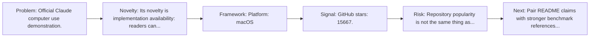
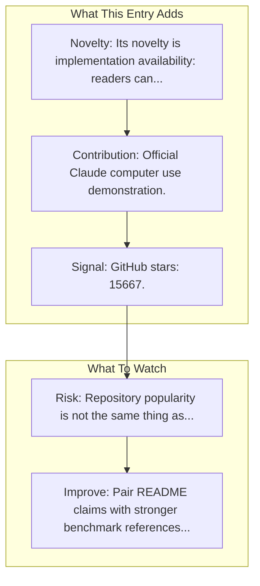

# Claude Computer Use Demo

Entry report generated on 2026-03-28 (Asia/Tokyo). This report is based on the repository entry, audit-time metadata, and cross-checks against adjacent repo context.

## Snapshot

| Field | Detail |
| --- | --- |
| Repo entry | Claude Computer Use Demo |
| Actual target | [Anthropic Quickstart](https://github.com/anthropics/anthropic-quickstarts) |
| Group | Frameworks & Tools |
| Category | Integration Examples |
| Source location | `frameworks/README.md:298` |
| Primary link type | `repository` |
| Audit status | `ok` |
| Platform | macOS |
| GitHub stars | 15667 |
| Language | Python |
| License | MIT |

## Quick Read

| Lens | Read |
| --- | --- |
| Role in repo | repository |
| Novelty | Its novelty is implementation availability: readers can inspect, run, and adapt the actual stack rather than only reading paper claims. |
| Operating frame | Platform: macOS |
| Main caution | Repository popularity is not the same thing as benchmark-verified reliability, maintenance quality, or deployment safety. |

## Visual Frame

## Analysis Map

## Executive Summary

Official Claude computer use demonstration. A collection of projects designed to help developers quickly get started with building deployable applications using the Claude API. Key local notes: Platform: macOS.

## Novelty and Distinguishing Angle

- Its novelty is implementation availability: readers can inspect, run, and adapt the actual stack rather than only reading paper claims.
- The entry sits in the desktop-control lane, which usually raises stronger environment variance and safety implications than browser-only automation.
- Open-source adoption is non-trivial here: cached GitHub metadata records 15667 stars.

## Core Contributions or Offerings

- Official Claude computer use demonstration.

## Operating Framework

- Platform: macOS
- Repo language: Python; license: MIT.
- Repository updated at audit time: 2026-03-27T15:34:35Z.

## Evidence and Adoption Signals

- GitHub stars: 15667.
- Open issues at audit time: 159.
- Open-source posture: Python, license MIT.
- Recent maintenance timestamp in cached metadata: 2026-03-27T15:34:35Z.
- Audit-time page title: GitHub - anthropics/claude-quickstarts: A collection of projects designed to help developers quickly get started with building deployable applications using the Claude API · GitHub.
- Audit-time page description: A collection of projects designed to help developers quickly get started with building deployable applications using the Claude API.

## Limitations and Gaps

- Repository popularity is not the same thing as benchmark-verified reliability, maintenance quality, or deployment safety.

## Improvement Paths

- Pair README claims with stronger benchmark references, maintenance notes, and example evaluations.
- Document supported environments and failure modes more explicitly so adoption signals are easier to interpret.
- Show reproducible setup paths and ongoing maintenance signals, not just launch momentum.

## Why It Matters

- It provides the implementation layer that turns research claims into developer workflows, demos, and reusable stacks.
- Framework entries help explain what the ecosystem can actually build today, not just what papers describe.

## Connections In This Repo

- [Anthropic - Claude Computer Use](../products-and-services/major-tech-companies-anthropic-claude-computer-use.md) - neighboring ecosystem entry in the same local cluster.
- [Computer Use Demo](../resources-and-guides/video-resources-talks-and-presentations-computer-use-demo.md) - neighboring ecosystem entry in the same local cluster.
- [OpenAI CUA Sample App](integration-examples-openai-cua-sample-app.md) - neighboring ecosystem entry in the same local cluster.
- [macOSWorld](../../papers/benchmarks-and-datasets/macosworld.md) - shared desktop or OS-level automation surface.

## Source Basis

- Primary basis: repo-local notes, link-audit page metadata, GitHub repository metadata.
- Audit access note: link-audit status was `ok` for the primary URL.
- Maintenance note: repository metadata was current through 2026-03-27T15:34:35Z at audit time.
