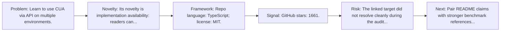
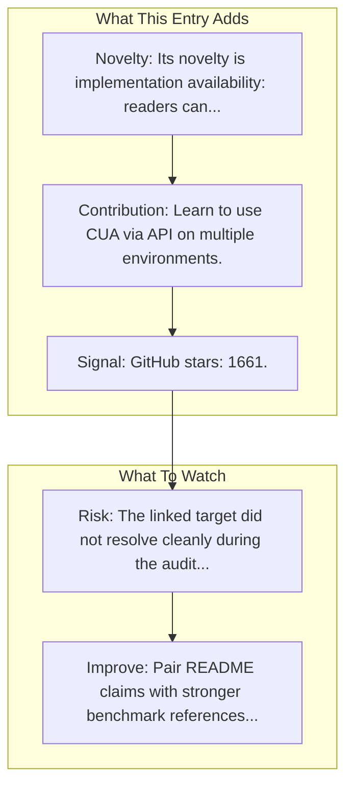

# OpenAI CUA Sample App

Entry report generated on 2026-03-28 (Asia/Tokyo). This report is based on the repository entry, audit-time metadata, and cross-checks against adjacent repo context.

## Snapshot

| Field | Detail |
| --- | --- |
| Repo entry | OpenAI CUA Sample App |
| Actual target | [GitHub](https://github.com/openai/openai-cua-sample-app) |
| Group | Frameworks & Tools |
| Category | Integration Examples |
| Source location | `frameworks/README.md:307` |
| Primary link type | `repository` |
| Audit status | `error` |
| GitHub stars | 1661 |
| Language | TypeScript |
| License | MIT |

## Quick Read

| Lens | Read |
| --- | --- |
| Role in repo | repository |
| Novelty | Its novelty is implementation availability: readers can inspect, run, and adapt the actual stack rather than only reading paper claims. |
| Operating frame | Repo language: TypeScript; license: MIT. |
| Main caution | The linked target did not resolve cleanly during the audit, so this report leans heavily on repo-local notes and adjacent metadata. |

## Visual Frame

## Analysis Map

## Executive Summary

Learn to use CUA via API on multiple environments. Learn how to use CUA (our Computer Using Agent) via the API on multiple computer environments.

## Novelty and Distinguishing Angle

- Its novelty is implementation availability: readers can inspect, run, and adapt the actual stack rather than only reading paper claims.
- Open-source adoption is non-trivial here: cached GitHub metadata records 1661 stars.

## Core Contributions or Offerings

- Learn to use CUA via API on multiple environments.

## Operating Framework

- Repo language: TypeScript; license: MIT.
- Repository updated at audit time: 2026-03-27T09:59:50Z.

## Evidence and Adoption Signals

- GitHub stars: 1661.
- Open issues at audit time: 41.
- Open-source posture: TypeScript, license MIT.
- Recent maintenance timestamp in cached metadata: 2026-03-27T09:59:50Z.

## Limitations and Gaps

- The linked target did not resolve cleanly during the audit, so this report leans heavily on repo-local notes and adjacent metadata.
- Repository popularity is not the same thing as benchmark-verified reliability, maintenance quality, or deployment safety.

## Improvement Paths

- Pair README claims with stronger benchmark references, maintenance notes, and example evaluations.
- Document supported environments and failure modes more explicitly so adoption signals are easier to interpret.
- Show reproducible setup paths and ongoing maintenance signals, not just launch momentum.

## Why It Matters

- It provides the implementation layer that turns research claims into developer workflows, demos, and reusable stacks.
- Framework entries help explain what the ecosystem can actually build today, not just what papers describe.

## Connections In This Repo

- [Anthropic's Computer Use vs OpenAI's CUA](../resources-and-guides/industry-analysis-and-news-comparison-articles-anthropic-s-computer-use-vs-openai-s-cua.md) - neighboring ecosystem entry in the same local cluster.
- [Claude Computer Use Demo](integration-examples-claude-computer-use-demo.md) - neighboring ecosystem entry in the same local cluster.
- [OpenAI - Operator / CUA](../products-and-services/major-tech-companies-openai-operator-cua.md) - neighboring ecosystem entry in the same local cluster.
- [Computer-Using Agent](../resources-and-guides/key-blog-posts-and-announcements-openai-computer-using-agent.md) - neighboring ecosystem entry in the same local cluster.

## Source Basis

- Primary basis: repo-local notes, link-audit page metadata, GitHub repository metadata.
- Audit access note: the linked target failed to resolve during the audit, so this report is more inferential than the ones backed by clean page metadata.
- Maintenance note: repository metadata was current through 2026-03-27T09:59:50Z at audit time.
