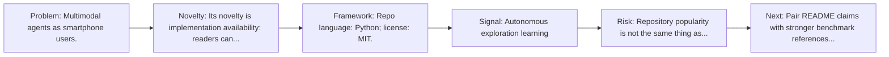
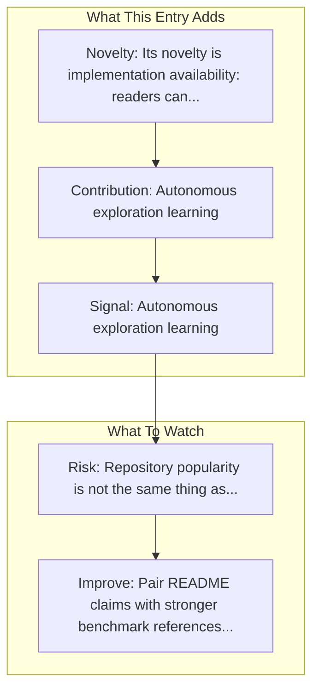

# AppAgent

Entry report generated on 2026-03-28 (Asia/Tokyo). This report is based on the repository entry, audit-time metadata, and cross-checks against adjacent repo context.

## Snapshot

| Field | Detail |
| --- | --- |
| Repo entry | AppAgent |
| Actual target | [GitHub](https://github.com/TencentQQGYLab/AppAgent) |
| Group | Frameworks & Tools |
| Category | Mobile Agent Frameworks |
| Source location | `frameworks/README.md:123` |
| Primary link type | `repository` |
| Audit status | `ok` |
| Organization | Tencent QQGYLab |
| GitHub stars | 6621 |
| Language | Python |
| License | MIT |
| Stars | 5k+ |

## Quick Read

| Lens | Read |
| --- | --- |
| Role in repo | repository |
| Novelty | Its novelty is implementation availability: readers can inspect, run, and adapt the actual stack rather than only reading paper claims. |
| Operating frame | Repo language: Python; license: MIT. |
| Main caution | Repository popularity is not the same thing as benchmark-verified reliability, maintenance quality, or deployment safety. |

## Visual Frame

## Analysis Map

## Executive Summary

Multimodal agents as smartphone users. AppAgent: Multimodal Agents as Smartphone Users, an LLM-based multimodal agent framework designed to operate smartphone apps. Key local notes: Autonomous exploration learning; Human demonstration learning.

## Novelty and Distinguishing Angle

- Its novelty is implementation availability: readers can inspect, run, and adapt the actual stack rather than only reading paper claims.
- The entry leans into the mobile-agent lane, where research depth is strong but real-world productization is still uneven.
- Open-source adoption is non-trivial here: cached GitHub metadata records 6621 stars.

## Core Contributions or Offerings

- Autonomous exploration learning
- Human demonstration learning
- Knowledge base generation
- GitHub topic footprint: agent, chatgpt, generative-ai, gpt4, gpt4v, llm.

## Operating Framework

- Repo language: Python; license: MIT.
- Repository updated at audit time: 2026-03-27T13:39:50Z.

## Evidence and Adoption Signals

- Autonomous exploration learning
- Human demonstration learning
- GitHub stars: 6621.
- Open issues at audit time: 95.
- Open-source posture: Python, license MIT.
- Topics: agent, chatgpt, generative-ai, gpt4, gpt4v, llm.

## Limitations and Gaps

- Repository popularity is not the same thing as benchmark-verified reliability, maintenance quality, or deployment safety.

## Improvement Paths

- Pair README claims with stronger benchmark references, maintenance notes, and example evaluations.
- Document supported environments and failure modes more explicitly so adoption signals are easier to interpret.
- Show reproducible setup paths and ongoing maintenance signals, not just launch momentum.

## Why It Matters

- It provides the implementation layer that turns research claims into developer workflows, demos, and reusable stacks.
- Framework entries help explain what the ecosystem can actually build today, not just what papers describe.

## Connections In This Repo

- [AppAgent: Multimodal Agents as Smartphone Users](../../papers/models-and-architectures/appagent-multimodal-agents-as-smartphone-users.md) - shared mobile-agent focus.
- [Mobile-Agent](mobile-agent-frameworks-mobile-agent.md) - shared mobile-agent focus.
- [AutoGLM](mobile-agent-frameworks-autoglm.md) - shared mobile-agent focus.
- [AgentCPM-GUI](mobile-agent-frameworks-agentcpm-gui.md) - shared mobile-agent focus.

## Source Basis

- Primary basis: repo-local notes, link-audit page metadata, GitHub repository metadata.
- Audit access note: link-audit status was `ok` for the primary URL.
- Maintenance note: repository metadata was current through 2026-03-27T13:39:50Z at audit time.
