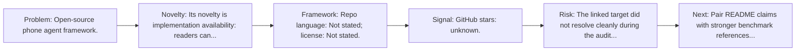
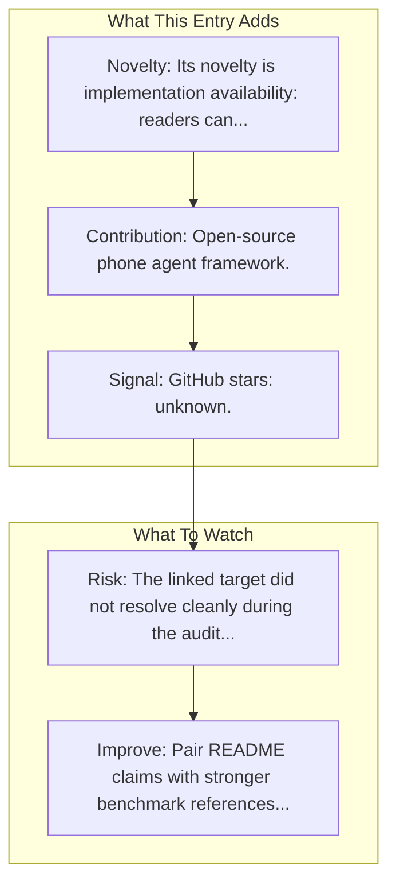

# AutoGLM

Entry report generated on 2026-03-28 (Asia/Tokyo). This report is based on the repository entry, audit-time metadata, and cross-checks against adjacent repo context.

## Snapshot

| Field | Detail |
| --- | --- |
| Repo entry | AutoGLM |
| Actual target | [GitHub](https://github.com/THUDM/AutoGLM) |
| Group | Frameworks & Tools |
| Category | Mobile Agent Frameworks |
| Source location | `frameworks/README.md:153` |
| Primary link type | `repository` |
| Audit status | `error` |
| Organization | Tsinghua/ChatGLM |
| Stars | 2k+ |
| Related assets | [HuggingFace](https://huggingface.co/THUDM/AutoGLM-Phone-9B) |

## Quick Read

| Lens | Read |
| --- | --- |
| Role in repo | repository |
| Novelty | Its novelty is implementation availability: readers can inspect, run, and adapt the actual stack rather than only reading paper claims. |
| Operating frame | Repo language: Not stated; license: Not stated. |
| Main caution | The linked target did not resolve cleanly during the audit, so this report leans heavily on repo-local notes and adjacent metadata. |

## Visual Frame

## Analysis Map

## Executive Summary

Open-source phone agent framework. Key local notes: Gmail, Google Maps (English); WeChat, Taobao, Meituan (Chinese).

## Novelty and Distinguishing Angle

- Its novelty is implementation availability: readers can inspect, run, and adapt the actual stack rather than only reading paper claims.
- The entry leans into the mobile-agent lane, where research depth is strong but real-world productization is still uneven.

## Core Contributions or Offerings

- Open-source phone agent framework.

## Operating Framework

- Repo language: Not stated; license: Not stated.

## Evidence and Adoption Signals

- GitHub stars: unknown.
- Open-source posture: unknown language, license not stated.

## Limitations and Gaps

- The linked target did not resolve cleanly during the audit, so this report leans heavily on repo-local notes and adjacent metadata.
- Repository popularity is not the same thing as benchmark-verified reliability, maintenance quality, or deployment safety.

## Improvement Paths

- Pair README claims with stronger benchmark references, maintenance notes, and example evaluations.
- Document supported environments and failure modes more explicitly so adoption signals are easier to interpret.
- Show reproducible setup paths and ongoing maintenance signals, not just launch momentum.

## Why It Matters

- It provides the implementation layer that turns research claims into developer workflows, demos, and reusable stacks.
- Framework entries help explain what the ecosystem can actually build today, not just what papers describe.

## Connections In This Repo

- [AutoGLM: Autonomous Foundation Agents for GUIs](../../papers/models-and-architectures/autoglm-autonomous-foundation-agents-for-guis.md) - shared mobile-agent focus.
- [AppAgent](mobile-agent-frameworks-appagent.md) - shared mobile-agent focus.
- [Mobile-Agent](mobile-agent-frameworks-mobile-agent.md) - shared mobile-agent focus.
- [AgentCPM-GUI](mobile-agent-frameworks-agentcpm-gui.md) - shared mobile-agent focus.

## Source Basis

- Primary basis: repo-local notes, link-audit page metadata, GitHub repository metadata.
- Audit access note: the linked target failed to resolve during the audit, so this report is more inferential than the ones backed by clean page metadata.
