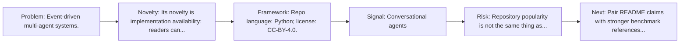
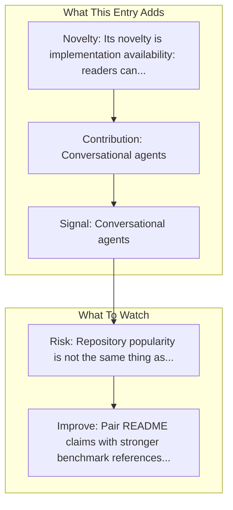

# AutoGen

Entry report generated on 2026-03-28 (Asia/Tokyo). This report is based on the repository entry, audit-time metadata, and cross-checks against adjacent repo context.

## Snapshot

| Field | Detail |
| --- | --- |
| Repo entry | AutoGen |
| Actual target | [GitHub](https://github.com/microsoft/autogen) |
| Group | Frameworks & Tools |
| Category | Multi-Agent Frameworks |
| Source location | `frameworks/README.md:179` |
| Primary link type | `repository` |
| Audit status | `ok` |
| Organization | Microsoft |
| GitHub stars | 56301 |
| Language | Python |
| License | CC-BY-4.0 |

## Quick Read

| Lens | Read |
| --- | --- |
| Role in repo | repository |
| Novelty | Its novelty is implementation availability: readers can inspect, run, and adapt the actual stack rather than only reading paper claims. |
| Operating frame | Repo language: Python; license: CC-BY-4.0. |
| Main caution | Repository popularity is not the same thing as benchmark-verified reliability, maintenance quality, or deployment safety. |

## Visual Frame

## Analysis Map

## Executive Summary

Event-driven multi-agent systems. A programming framework for agentic AI. Key local notes: Conversational agents; Task orchestration.

## Novelty and Distinguishing Angle

- Its novelty is implementation availability: readers can inspect, run, and adapt the actual stack rather than only reading paper claims.
- Open-source adoption is non-trivial here: cached GitHub metadata records 56301 stars.

## Core Contributions or Offerings

- Conversational agents
- Task orchestration
- Tool integration
- GitHub topic footprint: agentic, agentic-agi, agents, ai, autogen, autogen-ecosystem.

## Operating Framework

- Repo language: Python; license: CC-BY-4.0.
- Repository updated at audit time: 2026-03-27T15:44:40Z.

## Evidence and Adoption Signals

- Conversational agents
- Task orchestration
- GitHub stars: 56301.
- Open issues at audit time: 711.
- Open-source posture: Python, license CC-BY-4.0.
- Topics: agentic, agentic-agi, agents, ai, autogen, autogen-ecosystem.

## Limitations and Gaps

- Repository popularity is not the same thing as benchmark-verified reliability, maintenance quality, or deployment safety.

## Improvement Paths

- Pair README claims with stronger benchmark references, maintenance notes, and example evaluations.
- Document supported environments and failure modes more explicitly so adoption signals are easier to interpret.
- Show reproducible setup paths and ongoing maintenance signals, not just launch momentum.

## Why It Matters

- It provides the implementation layer that turns research claims into developer workflows, demos, and reusable stacks.
- Framework entries help explain what the ecosystem can actually build today, not just what papers describe.

## Connections In This Repo

- [CrewAI](multi-agent-frameworks-crewai.md) - neighboring ecosystem entry in the same local cluster.
- [Mobile-Agent](mobile-agent-frameworks-mobile-agent.md) - neighboring ecosystem entry in the same local cluster.
- [LangGraph](multi-agent-frameworks-langgraph.md) - neighboring ecosystem entry in the same local cluster.
- [Mobile-Agent-v3: Fundamental Agents for GUI Automation](../../papers/models-and-architectures/mobile-agent-v3-fundamental-agents-for-gui-automation.md) - paper-side context for the same capability cluster.

## Source Basis

- Primary basis: repo-local notes, link-audit page metadata, GitHub repository metadata.
- Audit access note: link-audit status was `ok` for the primary URL.
- Maintenance note: repository metadata was current through 2026-03-27T15:44:40Z at audit time.
