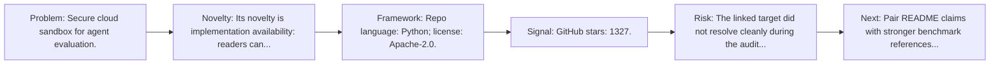
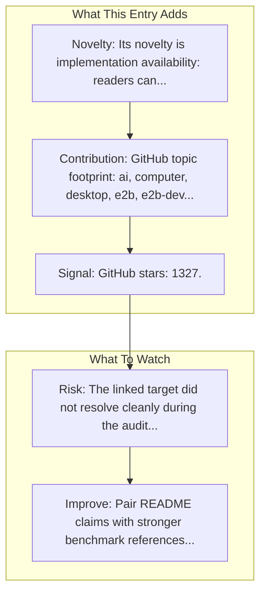

# E2B Desktop Sandbox

Entry report generated on 2026-03-28 (Asia/Tokyo). This report is based on the repository entry, audit-time metadata, and cross-checks against adjacent repo context.

## Snapshot

| Field | Detail |
| --- | --- |
| Repo entry | E2B Desktop Sandbox |
| Actual target | [GitHub](https://github.com/e2b-dev/desktop) |
| Group | Frameworks & Tools |
| Category | Sandbox & Testing Environments |
| Source location | `frameworks/README.md:280` |
| Primary link type | `repository` |
| Audit status | `error` |
| GitHub stars | 1327 |
| Language | Python |
| License | Apache-2.0 |

## Quick Read

| Lens | Read |
| --- | --- |
| Role in repo | repository |
| Novelty | Its novelty is implementation availability: readers can inspect, run, and adapt the actual stack rather than only reading paper claims. |
| Operating frame | Repo language: Python; license: Apache-2.0. |
| Main caution | The linked target did not resolve cleanly during the audit, so this report leans heavily on repo-local notes and adjacent metadata. |

## Visual Frame

## Analysis Map

## Executive Summary

Secure cloud sandbox for agent evaluation. E2B Desktop Sandbox for LLMs. E2B Sandbox with desktop graphical environment that you can connect to any LLM for secure computer use.

## Novelty and Distinguishing Angle

- Its novelty is implementation availability: readers can inspect, run, and adapt the actual stack rather than only reading paper claims.
- The entry sits in the desktop-control lane, which usually raises stronger environment variance and safety implications than browser-only automation.
- Open-source adoption is non-trivial here: cached GitHub metadata records 1327 stars.

## Core Contributions or Offerings

- GitHub topic footprint: ai, computer, desktop, e2b, e2b-dev, gpt.

## Operating Framework

- Repo language: Python; license: Apache-2.0.
- Repository updated at audit time: 2026-03-27T11:10:56Z.

## Evidence and Adoption Signals

- GitHub stars: 1327.
- Open issues at audit time: 10.
- Open-source posture: Python, license Apache-2.0.
- Topics: ai, computer, desktop, e2b, e2b-dev, gpt.
- Recent maintenance timestamp in cached metadata: 2026-03-27T11:10:56Z.

## Limitations and Gaps

- The linked target did not resolve cleanly during the audit, so this report leans heavily on repo-local notes and adjacent metadata.
- Repository popularity is not the same thing as benchmark-verified reliability, maintenance quality, or deployment safety.

## Improvement Paths

- Pair README claims with stronger benchmark references, maintenance notes, and example evaluations.
- Document supported environments and failure modes more explicitly so adoption signals are easier to interpret.
- Show reproducible setup paths and ongoing maintenance signals, not just launch momentum.

## Why It Matters

- It provides the implementation layer that turns research claims into developer workflows, demos, and reusable stacks.
- Framework entries help explain what the ecosystem can actually build today, not just what papers describe.

## Connections In This Repo

- [Browserbase](../products-and-services/browser-infrastructure-services-browserbase.md) - neighboring ecosystem entry in the same local cluster.
- [Browserless](../products-and-services/browser-infrastructure-services-browserless.md) - neighboring ecosystem entry in the same local cluster.
- [UI-TARS Desktop](desktop-agent-frameworks-ui-tars-desktop.md) - neighboring ecosystem entry in the same local cluster.
- [OpenInterpreter](desktop-agent-frameworks-openinterpreter.md) - neighboring ecosystem entry in the same local cluster.

## Source Basis

- Primary basis: repo-local notes, link-audit page metadata, GitHub repository metadata.
- Audit access note: the linked target failed to resolve during the audit, so this report is more inferential than the ones backed by clean page metadata.
- Maintenance note: repository metadata was current through 2026-03-27T11:10:56Z at audit time.
