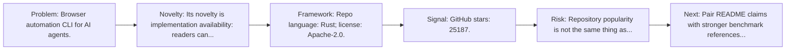
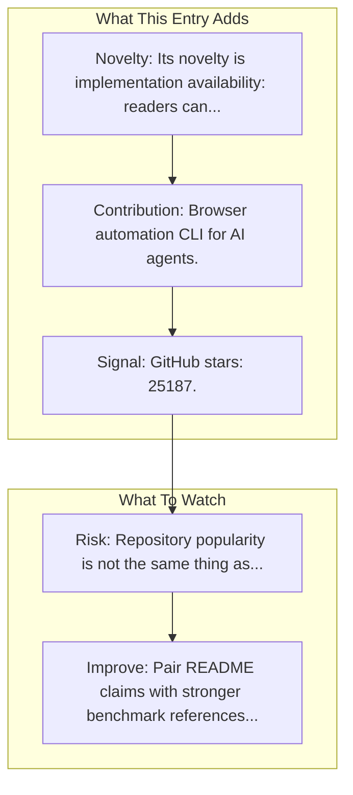

# Agent Browser (Vercel)

Entry report generated on 2026-03-28 (Asia/Tokyo). This report is based on the repository entry, audit-time metadata, and cross-checks against adjacent repo context.

## Snapshot

| Field | Detail |
| --- | --- |
| Repo entry | Agent Browser (Vercel) |
| Actual target | [GitHub](https://github.com/vercel-labs/agent-browser) |
| Group | Frameworks & Tools |
| Category | Web/Browser Frameworks |
| Source location | `frameworks/README.md:112` |
| Primary link type | `repository` |
| Audit status | `ok` |
| Organization | Vercel |
| GitHub stars | 25187 |
| Language | Rust |
| License | Apache-2.0 |

## Quick Read

| Lens | Read |
| --- | --- |
| Role in repo | repository |
| Novelty | Its novelty is implementation availability: readers can inspect, run, and adapt the actual stack rather than only reading paper claims. |
| Operating frame | Repo language: Rust; license: Apache-2.0. |
| Main caution | Repository popularity is not the same thing as benchmark-verified reliability, maintenance quality, or deployment safety. |

## Visual Frame

## Analysis Map

## Executive Summary

Browser automation CLI for AI agents. Browser automation CLI for AI agents. Contribute to vercel-labs/agent-browser development by creating an account on GitHub.

## Novelty and Distinguishing Angle

- Its novelty is implementation availability: readers can inspect, run, and adapt the actual stack rather than only reading paper claims.
- The entry is browser-first, matching the part of the ecosystem that currently looks most deployment-ready.
- Open-source adoption is non-trivial here: cached GitHub metadata records 25187 stars.

## Core Contributions or Offerings

- Browser automation CLI for AI agents.

## Operating Framework

- Repo language: Rust; license: Apache-2.0.
- Repository updated at audit time: 2026-03-27T15:37:37Z.

## Evidence and Adoption Signals

- GitHub stars: 25187.
- Open issues at audit time: 327.
- Open-source posture: Rust, license Apache-2.0.
- Recent maintenance timestamp in cached metadata: 2026-03-27T15:37:37Z.
- Audit-time page title: GitHub - vercel-labs/agent-browser: Browser automation CLI for AI agents · GitHub.
- Audit-time page description: Browser automation CLI for AI agents. Contribute to vercel-labs/agent-browser development by creating an account on GitHub..

## Limitations and Gaps

- Repository popularity is not the same thing as benchmark-verified reliability, maintenance quality, or deployment safety.

## Improvement Paths

- Pair README claims with stronger benchmark references, maintenance notes, and example evaluations.
- Document supported environments and failure modes more explicitly so adoption signals are easier to interpret.
- Show reproducible setup paths and ongoing maintenance signals, not just launch momentum.

## Why It Matters

- It provides the implementation layer that turns research claims into developer workflows, demos, and reusable stacks.
- Framework entries help explain what the ecosystem can actually build today, not just what papers describe.

## Connections In This Repo

- [Skyvern](web-browser-frameworks-skyvern.md) - shared browser or web-agent operating surface.
- [OpenAI - Operator / CUA](../products-and-services/major-tech-companies-openai-operator-cua.md) - shared browser or web-agent operating surface.
- [Google - Project Mariner](../products-and-services/major-tech-companies-google-project-mariner.md) - shared browser or web-agent operating surface.
- [MultiOn](../products-and-services/startups-multion.md) - shared browser or web-agent operating surface.

## Source Basis

- Primary basis: repo-local notes, link-audit page metadata, GitHub repository metadata.
- Audit access note: link-audit status was `ok` for the primary URL.
- Maintenance note: repository metadata was current through 2026-03-27T15:37:37Z at audit time.
