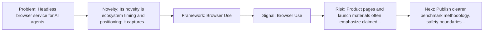
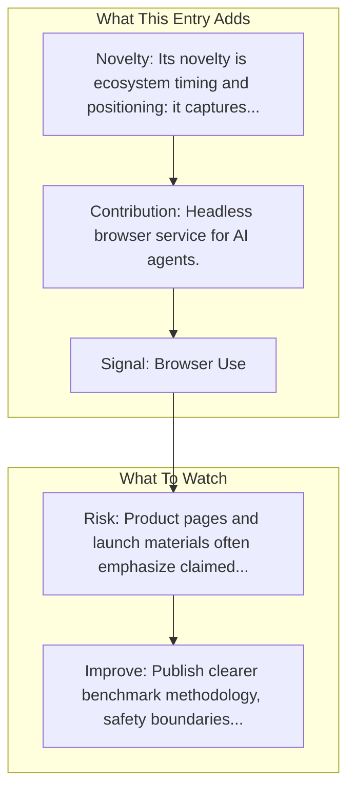

# Browserless

Entry report generated on 2026-03-28 (Asia/Tokyo). This report is based on the repository entry, audit-time metadata, and cross-checks against adjacent repo context.

## Snapshot

| Field | Detail |
| --- | --- |
| Repo entry | Browserless |
| Actual target | [Website](https://www.browserless.io/) |
| Group | Products & Services |
| Category | Browser Infrastructure Services |
| Source location | `products/README.md:252` |
| Primary link type | `product` |
| Audit status | `ok` |

## Quick Read

| Lens | Read |
| --- | --- |
| Role in repo | product |
| Novelty | Its novelty is ecosystem timing and positioning: it captures how a vendor chose to frame computer use as a product capability. |
| Operating frame | Browser Use |
| Main caution | Product pages and launch materials often emphasize claimed capability more than independent evaluation or failure analysis. |

## Visual Frame

## Analysis Map

## Executive Summary

Headless browser service for AI agents. Bypass any bot detection for your scraping or automations. Sign up for free today, to use our API, proxies and captcha solving. Key local notes: Browser Use; LangChain.

## Novelty and Distinguishing Angle

- Its novelty is ecosystem timing and positioning: it captures how a vendor chose to frame computer use as a product capability.
- The entry is browser-first, matching the part of the ecosystem that currently looks most deployment-ready.
- Audit-time page framing: Browserless - Browser Automation and Bypass Bot Detectors.

## Core Contributions or Offerings

- Headless browser service for AI agents.

## Operating Framework

- Browser Use
- LangChain
- Vercel AI SDK
- Resolved target: https://www.browserless.io/.

## Evidence and Adoption Signals

- Browser Use
- LangChain
- Audit-time page title: Browserless - Browser Automation and Bypass Bot Detectors.
- Audit-time page description: Bypass any bot detection for your scraping or automations. Sign up for free today, to use our API, proxies and captcha solving..

## Limitations and Gaps

- Product pages and launch materials often emphasize claimed capability more than independent evaluation or failure analysis.

## Improvement Paths

- Publish clearer benchmark methodology, safety boundaries, and real deployment limits alongside capability claims.
- Keep changelogs and API or availability notes current so the repo can track product evolution without guesswork.
- Add more concrete examples of failure handling, fallback behavior, and human takeover boundaries.

## Why It Matters

- It shows how computer-use ideas are being packaged into deployable products, not only benchmark papers.
- That product layer matters because it exposes which capabilities companies think are ready for users or enterprises.

## Connections In This Repo

- [Browserbase](browser-infrastructure-services-browserbase.md) - neighboring ecosystem entry in the same local cluster.
- [Amazon Bedrock AgentCore Browser](browser-infrastructure-services-amazon-bedrock-agentcore-browser.md) - neighboring ecosystem entry in the same local cluster.
- [Stagehand](../frameworks-and-tools/web-browser-frameworks-stagehand.md) - neighboring ecosystem entry in the same local cluster.
- [E2B Desktop Sandbox](../frameworks-and-tools/sandbox-and-testing-environments-e2b-desktop-sandbox.md) - neighboring ecosystem entry in the same local cluster.

## Source Basis

- Primary basis: repo-local notes, link-audit page metadata.
- Audit access note: link-audit status was `ok` for the primary URL.
