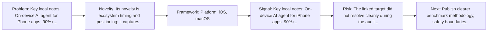
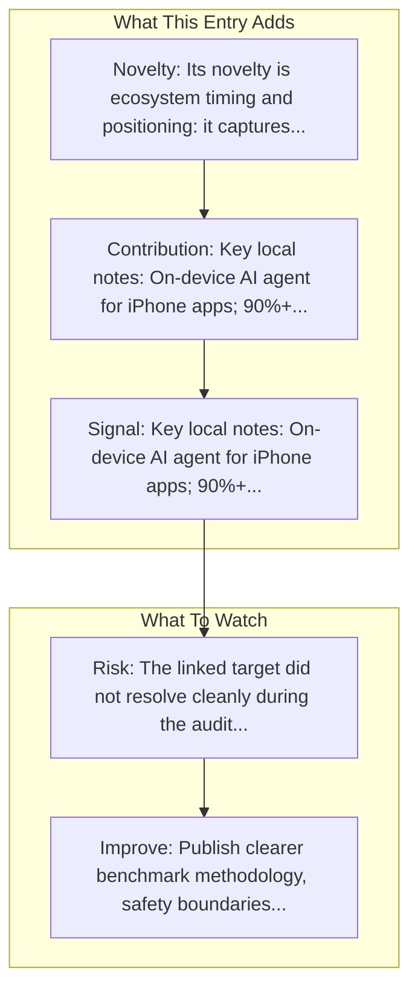

# Apple - Siri Agent (Apple Intelligence)

Entry report generated on 2026-03-28 (Asia/Tokyo). This report is based on the repository entry, audit-time metadata, and cross-checks against adjacent repo context.

## Snapshot

| Field | Detail |
| --- | --- |
| Repo entry | Apple - Siri Agent (Apple Intelligence) |
| Actual target | [Apple Intelligence](https://www.apple.com/apple-intelligence/) |
| Group | Products & Services |
| Category | Major Tech Companies |
| Source location | `products/README.md:102` |
| Primary link type | `product` |
| Audit status | `error` |
| Status | In Development (Expected WWDC 2026) |
| Platform | iOS, macOS |

## Quick Read

| Lens | Read |
| --- | --- |
| Role in repo | product |
| Novelty | Its novelty is ecosystem timing and positioning: it captures how a vendor chose to frame computer use as a product capability. |
| Operating frame | Platform: iOS, macOS |
| Main caution | The linked target did not resolve cleanly during the audit, so this report leans heavily on repo-local notes and adjacent metadata. |

## Visual Frame

## Analysis Map

## Executive Summary

Key local notes: On-device AI agent for iPhone apps; 90%+ success rate in controlled conditions.

## Novelty and Distinguishing Angle

- Its novelty is ecosystem timing and positioning: it captures how a vendor chose to frame computer use as a product capability.
- The entry sits in the desktop-control lane, which usually raises stronger environment variance and safety implications than browser-only automation.

## Core Contributions or Offerings

## Operating Framework

- Platform: iOS, macOS
- Status: In Development (Expected WWDC 2026)

## Evidence and Adoption Signals

## Limitations and Gaps

- The linked target did not resolve cleanly during the audit, so this report leans heavily on repo-local notes and adjacent metadata.
- Product pages and launch materials often emphasize claimed capability more than independent evaluation or failure analysis.
- Preview or in-development status means the product surface may change quickly and can outdate the repo summary fast.

## Improvement Paths

- Publish clearer benchmark methodology, safety boundaries, and real deployment limits alongside capability claims.
- Keep changelogs and API or availability notes current so the repo can track product evolution without guesswork.
- Add more concrete examples of failure handling, fallback behavior, and human takeover boundaries.

## Why It Matters

- It shows how computer-use ideas are being packaged into deployable products, not only benchmark papers.
- That product layer matters because it exposes which capabilities companies think are ready for users or enterprises.

## Connections In This Repo

- [AgentCPM-GUI: On-device Mobile Agent](../../papers/models-and-architectures/agentcpm-gui-on-device-mobile-agent.md) - shared mobile-agent focus.
- [AgentCPM-GUI](../frameworks-and-tools/mobile-agent-frameworks-agentcpm-gui.md) - shared mobile-agent focus.
- [Mobile-Agent-v3: Fundamental Agents for GUI Automation](../../papers/models-and-architectures/mobile-agent-v3-fundamental-agents-for-gui-automation.md) - shared mobile-agent focus.
- [Mobile-Agent](../frameworks-and-tools/mobile-agent-frameworks-mobile-agent.md) - shared mobile-agent focus.

## Source Basis

- Primary basis: repo-local notes, link-audit page metadata.
- Audit access note: the linked target failed to resolve during the audit, so this report is more inferential than the ones backed by clean page metadata.
