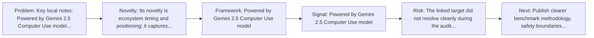
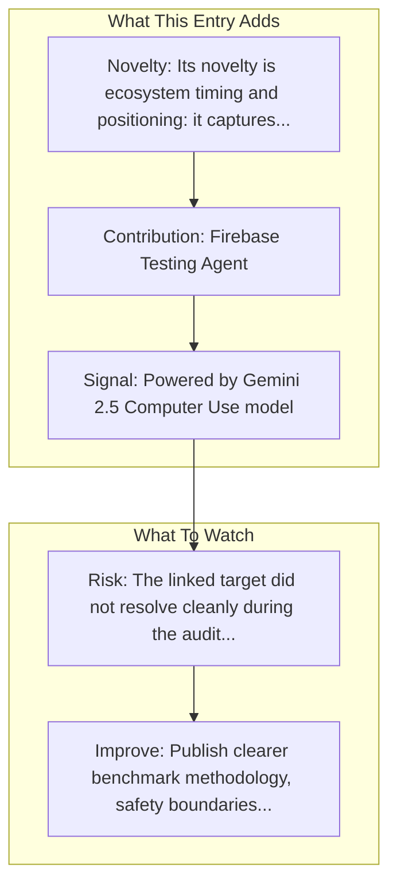

# Google - Project Mariner

Entry report generated on 2026-03-28 (Asia/Tokyo). This report is based on the repository entry, audit-time metadata, and cross-checks against adjacent repo context.

## Snapshot

| Field | Detail |
| --- | --- |
| Repo entry | Google - Project Mariner |
| Actual target | [Product](https://deepmind.google/models/project-mariner/) |
| Group | Products & Services |
| Category | Major Tech Companies |
| Source location | `products/README.md:56` |
| Primary link type | `product` |
| Audit status | `error` |
| Status | Preview (May 2025) |
| Platform | Chrome Browser, Web |
| Related assets | [Computer Use Model](https://blog.google/technology/google-deepmind/gemini-computer-use-model/) |

## Quick Read

| Lens | Read |
| --- | --- |
| Role in repo | product |
| Novelty | Its novelty is ecosystem timing and positioning: it captures how a vendor chose to frame computer use as a product capability. |
| Operating frame | Powered by Gemini 2.5 Computer Use model |
| Main caution | The linked target did not resolve cleanly during the audit, so this report leans heavily on repo-local notes and adjacent metadata. |

## Visual Frame

## Analysis Map

## Executive Summary

Key local notes: Powered by Gemini 2.5 Computer Use model; Takes frequent screenshots.

## Novelty and Distinguishing Angle

- Its novelty is ecosystem timing and positioning: it captures how a vendor chose to frame computer use as a product capability.
- The entry is browser-first, matching the part of the ecosystem that currently looks most deployment-ready.

## Core Contributions or Offerings

- Firebase Testing Agent
- AI Mode in Search

## Operating Framework

- Powered by Gemini 2.5 Computer Use model
- Takes frequent screenshots
- Identifies interactive elements via spatial reasoning
- Generates clicks and keystrokes
- Platform: Chrome Browser, Web

## Evidence and Adoption Signals

- Powered by Gemini 2.5 Computer Use model
- Takes frequent screenshots

## Limitations and Gaps

- The linked target did not resolve cleanly during the audit, so this report leans heavily on repo-local notes and adjacent metadata.
- Product pages and launch materials often emphasize claimed capability more than independent evaluation or failure analysis.
- Preview or in-development status means the product surface may change quickly and can outdate the repo summary fast.

## Improvement Paths

- Publish clearer benchmark methodology, safety boundaries, and real deployment limits alongside capability claims.
- Keep changelogs and API or availability notes current so the repo can track product evolution without guesswork.
- Add more concrete examples of failure handling, fallback behavior, and human takeover boundaries.

## Why It Matters

- It shows how computer-use ideas are being packaged into deployable products, not only benchmark papers.
- That product layer matters because it exposes which capabilities companies think are ready for users or enterprises.

## Connections In This Repo

- [OpenAI - Operator / CUA](major-tech-companies-openai-operator-cua.md) - shared browser or web-agent operating surface.
- [HyperWrite - Personal Assistant](startups-hyperwrite-personal-assistant.md) - shared browser or web-agent operating surface.
- [Agent Browser (Vercel)](../frameworks-and-tools/web-browser-frameworks-agent-browser-vercel.md) - shared browser or web-agent operating surface.
- [Amazon AWS - Nova Act](major-tech-companies-amazon-aws-nova-act.md) - shared browser or web-agent operating surface.

## Source Basis

- Primary basis: repo-local notes, link-audit page metadata.
- Audit access note: the linked target failed to resolve during the audit, so this report is more inferential than the ones backed by clean page metadata.
