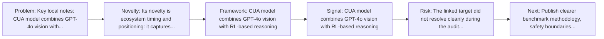
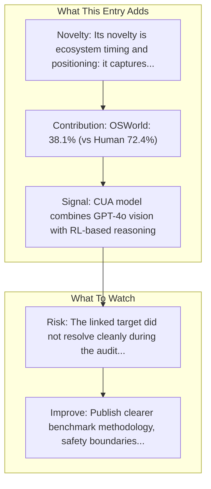

# OpenAI - Operator / CUA

Entry report generated on 2026-03-28 (Asia/Tokyo). This report is based on the repository entry, audit-time metadata, and cross-checks against adjacent repo context.

## Snapshot

| Field | Detail |
| --- | --- |
| Repo entry | OpenAI - Operator / CUA |
| Actual target | [Product](https://openai.com/index/introducing-operator/) |
| Group | Products & Services |
| Category | Major Tech Companies |
| Source location | `products/README.md:30` |
| Primary link type | `product` |
| Audit status | `error` |
| Status | Research Preview (January 2025) |
| Platform | Web/Browser |
| Related assets | [CUA Model](https://openai.com/index/computer-using-agent/), [System Card](https://cdn.openai.com/operator_system_card.pdf), [API Docs](https://developers.openai.com/api/docs/guides/tools-computer-use), [Sample App](https://github.com/openai/openai-cua-sample-app) |

## Quick Read

| Lens | Read |
| --- | --- |
| Role in repo | product |
| Novelty | Its novelty is ecosystem timing and positioning: it captures how a vendor chose to frame computer use as a product capability. |
| Operating frame | CUA model combines GPT-4o vision with RL-based reasoning |
| Main caution | The linked target did not resolve cleanly during the audit, so this report leans heavily on repo-local notes and adjacent metadata. |

## Visual Frame

## Analysis Map

## Executive Summary

Key local notes: CUA model combines GPT-4o vision with RL-based reasoning; Trained on GUI interaction.

## Novelty and Distinguishing Angle

- Its novelty is ecosystem timing and positioning: it captures how a vendor chose to frame computer use as a product capability.
- The entry is browser-first, matching the part of the ecosystem that currently looks most deployment-ready.

## Core Contributions or Offerings

- OSWorld: 38.1% (vs Human 72.4%)
- WebArena: 58.1% (vs Human 78.2%)
- 97% refusal rate on illicit activity tasks
- Proactive user takeover for logins, payments, CAPTCHAs

## Operating Framework

- CUA model combines GPT-4o vision with RL-based reasoning
- Trained on GUI interaction
- Multi-step planning with self-correction
- Platform: Web/Browser
- Status: Research Preview (January 2025)

## Evidence and Adoption Signals

- CUA model combines GPT-4o vision with RL-based reasoning
- Trained on GUI interaction
- OSWorld: 38.1% (vs Human 72.4%)
- WebArena: 58.1% (vs Human 78.2%)
- 97% refusal rate on illicit activity tasks
- Proactive user takeover for logins, payments, CAPTCHAs

## Limitations and Gaps

- The linked target did not resolve cleanly during the audit, so this report leans heavily on repo-local notes and adjacent metadata.
- Product pages and launch materials often emphasize claimed capability more than independent evaluation or failure analysis.
- Preview or in-development status means the product surface may change quickly and can outdate the repo summary fast.

## Improvement Paths

- Publish clearer benchmark methodology, safety boundaries, and real deployment limits alongside capability claims.
- Keep changelogs and API or availability notes current so the repo can track product evolution without guesswork.
- Add more concrete examples of failure handling, fallback behavior, and human takeover boundaries.

## Why It Matters

- It shows how computer-use ideas are being packaged into deployable products, not only benchmark papers.
- That product layer matters because it exposes which capabilities companies think are ready for users or enterprises.

## Connections In This Repo

- [Google - Project Mariner](major-tech-companies-google-project-mariner.md) - shared browser or web-agent operating surface.
- [MultiOn](startups-multion.md) - shared browser or web-agent operating surface.
- [Agent Browser (Vercel)](../frameworks-and-tools/web-browser-frameworks-agent-browser-vercel.md) - shared browser or web-agent operating surface.
- [Anthropic - Claude Computer Use](major-tech-companies-anthropic-claude-computer-use.md) - neighboring ecosystem entry in the same local cluster.

## Source Basis

- Primary basis: repo-local notes, link-audit page metadata.
- Audit access note: the linked target failed to resolve during the audit, so this report is more inferential than the ones backed by clean page metadata.
