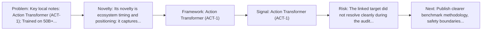
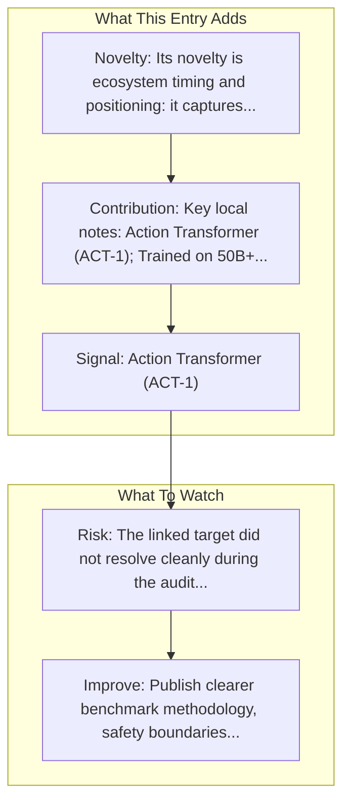

# Adept AI - ACT-1

Entry report generated on 2026-03-28 (Asia/Tokyo). This report is based on the repository entry, audit-time metadata, and cross-checks against adjacent repo context.

## Snapshot

| Field | Detail |
| --- | --- |
| Repo entry | Adept AI - ACT-1 |
| Actual target | [Blog](https://www.adept.ai/blog/act-1/) |
| Group | Products & Services |
| Category | Startups |
| Source location | `products/README.md:213` |
| Primary link type | `product-announcement` |
| Audit status | `error` |
| Status | Talent acquired by Amazon (2024) |

## Quick Read

| Lens | Read |
| --- | --- |
| Role in repo | product-announcement |
| Novelty | Its novelty is ecosystem timing and positioning: it captures how a vendor chose to frame computer use as a product capability. |
| Operating frame | Action Transformer (ACT-1) |
| Main caution | The linked target did not resolve cleanly during the audit, so this report leans heavily on repo-local notes and adjacent metadata. |

## Visual Frame

## Analysis Map

## Executive Summary

Key local notes: Action Transformer (ACT-1); Trained on 50B+ tokens.

## Novelty and Distinguishing Angle

- Its novelty is ecosystem timing and positioning: it captures how a vendor chose to frame computer use as a product capability.

## Core Contributions or Offerings

## Operating Framework

- Action Transformer (ACT-1)
- Trained on 50B+ tokens
- Natural language to software actions
- Status: Talent acquired by Amazon (2024)

## Evidence and Adoption Signals

- Action Transformer (ACT-1)
- Trained on 50B+ tokens

## Limitations and Gaps

- The linked target did not resolve cleanly during the audit, so this report leans heavily on repo-local notes and adjacent metadata.
- Product pages and launch materials often emphasize claimed capability more than independent evaluation or failure analysis.
- Acquisition history creates continuity risk around product direction, pricing, and long-term availability.

## Improvement Paths

- Publish clearer benchmark methodology, safety boundaries, and real deployment limits alongside capability claims.
- Keep changelogs and API or availability notes current so the repo can track product evolution without guesswork.
- Add more concrete examples of failure handling, fallback behavior, and human takeover boundaries.

## Why It Matters

- It shows how computer-use ideas are being packaged into deployable products, not only benchmark papers.
- That product layer matters because it exposes which capabilities companies think are ready for users or enterprises.

## Connections In This Repo

- [Amazon AWS - Nova Act](major-tech-companies-amazon-aws-nova-act.md) - neighboring ecosystem entry in the same local cluster.
- [Twin Labs - Twin](startups-twin-labs-twin.md) - neighboring ecosystem entry in the same local cluster.
- [MultiOn](startups-multion.md) - neighboring ecosystem entry in the same local cluster.
- [H Company - Runner H](startups-h-company-runner-h.md) - neighboring ecosystem entry in the same local cluster.

## Source Basis

- Primary basis: repo-local notes, link-audit page metadata.
- Audit access note: the linked target failed to resolve during the audit, so this report is more inferential than the ones backed by clean page metadata.
