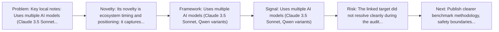
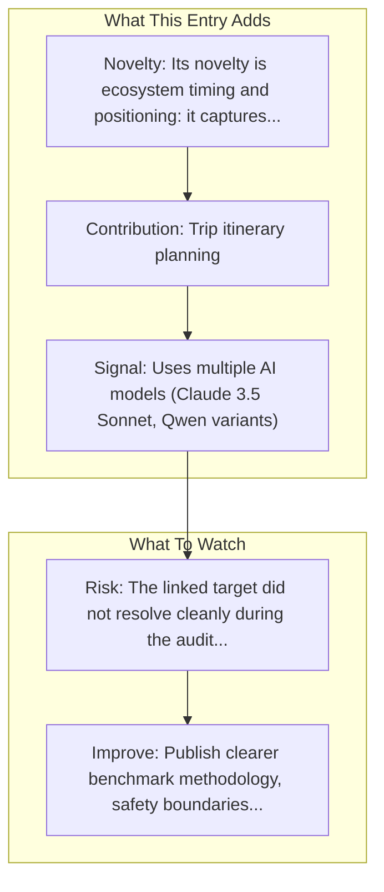

# Manus (Butterfly Effect)

Entry report generated on 2026-03-28 (Asia/Tokyo). This report is based on the repository entry, audit-time metadata, and cross-checks against adjacent repo context.

## Snapshot

| Field | Detail |
| --- | --- |
| Repo entry | Manus (Butterfly Effect) |
| Actual target | [Website](https://manus.bot) |
| Group | Products & Services |
| Category | Startups |
| Source location | `products/README.md:118` |
| Primary link type | `product` |
| Audit status | `error` |
| Status | Acquired by Meta (December 2025, $2-3B) |
| Location | Wuhan, China (with Beijing office) |

## Quick Read

| Lens | Read |
| --- | --- |
| Role in repo | product |
| Novelty | Its novelty is ecosystem timing and positioning: it captures how a vendor chose to frame computer use as a product capability. |
| Operating frame | Uses multiple AI models (Claude 3.5 Sonnet, Qwen variants) |
| Main caution | The linked target did not resolve cleanly during the audit, so this report leans heavily on repo-local notes and adjacent metadata. |

## Visual Frame

## Analysis Map

## Executive Summary

Key local notes: Uses multiple AI models (Claude 3.5 Sonnet, Qwen variants); Multiple independently operating agents.

## Novelty and Distinguishing Angle

- Its novelty is ecosystem timing and positioning: it captures how a vendor chose to frame computer use as a product capability.

## Core Contributions or Offerings

- Trip itinerary planning
- Stock analysis
- Real estate recommendations
- Code writing and deployment

## Operating Framework

- Uses multiple AI models (Claude 3.5 Sonnet, Qwen variants)
- Multiple independently operating agents
- General-purpose task completion
- Founded by Xiao Hong (33-year-old serial entrepreneur)
- Launched March 6, 2025

## Evidence and Adoption Signals

- Uses multiple AI models (Claude 3.5 Sonnet, Qwen variants)
- Multiple independently operating agents
- Trip itinerary planning
- Stock analysis

## Limitations and Gaps

- The linked target did not resolve cleanly during the audit, so this report leans heavily on repo-local notes and adjacent metadata.
- Product pages and launch materials often emphasize claimed capability more than independent evaluation or failure analysis.
- Acquisition history creates continuity risk around product direction, pricing, and long-term availability.

## Improvement Paths

- Publish clearer benchmark methodology, safety boundaries, and real deployment limits alongside capability claims.
- Keep changelogs and API or availability notes current so the repo can track product evolution without guesswork.
- Add more concrete examples of failure handling, fallback behavior, and human takeover boundaries.

## Why It Matters

- It shows how computer-use ideas are being packaged into deployable products, not only benchmark papers.
- That product layer matters because it exposes which capabilities companies think are ready for users or enterprises.

## Connections In This Repo

- [OpenInterpreter](../frameworks-and-tools/desktop-agent-frameworks-openinterpreter.md) - neighboring ecosystem entry in the same local cluster.
- [What you need to know about Manus](../resources-and-guides/industry-analysis-and-news-major-articles-what-you-need-to-know-about-manus.md) - neighboring ecosystem entry in the same local cluster.
- [Manus vs MultiOn vs HyperWrite](../resources-and-guides/industry-analysis-and-news-comparison-articles-manus-vs-multion-vs-hyperwrite.md) - neighboring ecosystem entry in the same local cluster.
- [Anthropic - Claude Computer Use](major-tech-companies-anthropic-claude-computer-use.md) - neighboring ecosystem entry in the same local cluster.

## Source Basis

- Primary basis: repo-local notes, link-audit page metadata.
- Audit access note: the linked target failed to resolve during the audit, so this report is more inferential than the ones backed by clean page metadata.
