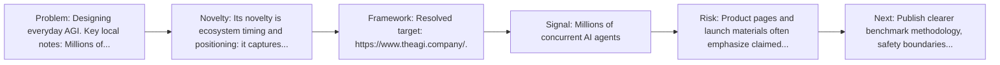
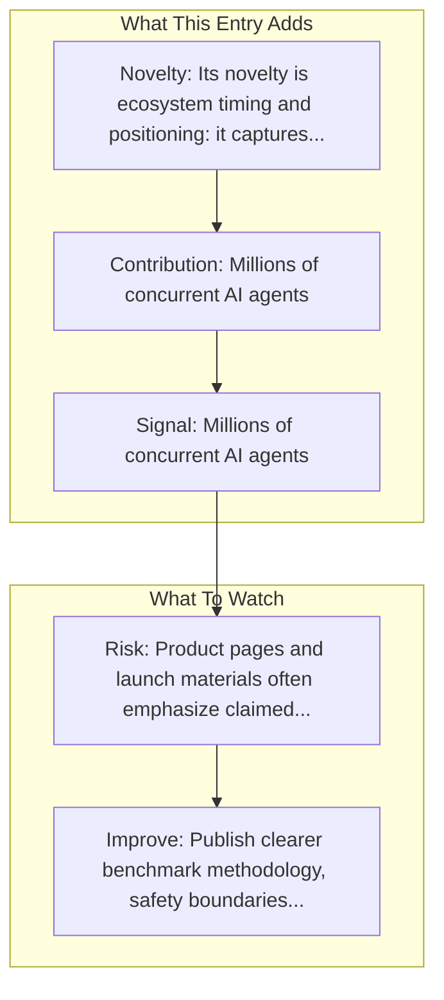

# MultiOn

Entry report generated on 2026-03-28 (Asia/Tokyo). This report is based on the repository entry, audit-time metadata, and cross-checks against adjacent repo context.

## Snapshot

| Field | Detail |
| --- | --- |
| Repo entry | MultiOn |
| Actual target | [Website](https://www.multion.ai/) |
| Group | Products & Services |
| Category | Startups |
| Source location | `products/README.md:194` |
| Primary link type | `product` |
| Audit status | `ok` |
| Related assets | [Documentation](https://docs.multion.ai/) |

## Quick Read

| Lens | Read |
| --- | --- |
| Role in repo | product |
| Novelty | Its novelty is ecosystem timing and positioning: it captures how a vendor chose to frame computer use as a product capability. |
| Operating frame | Resolved target: https://www.theagi.company/. |
| Main caution | Product pages and launch materials often emphasize claimed capability more than independent evaluation or failure analysis. |

## Visual Frame

## Analysis Map

## Executive Summary

Designing everyday AGI. Key local notes: Millions of concurrent AI agents; Natural language task specification.

## Novelty and Distinguishing Angle

- Its novelty is ecosystem timing and positioning: it captures how a vendor chose to frame computer use as a product capability.
- The entry is browser-first, matching the part of the ecosystem that currently looks most deployment-ready.
- Audit-time page framing: AGI, Inc..

## Core Contributions or Offerings

- Millions of concurrent AI agents
- Natural language task specification
- End-to-end web task completion
- Booking reservations
- Ordering products

## Operating Framework

- Resolved target: https://www.theagi.company/.

## Evidence and Adoption Signals

- Millions of concurrent AI agents
- Natural language task specification
- Booking reservations
- Ordering products
- Audit-time page title: AGI, Inc..
- Audit-time page description: Designing everyday AGI..

## Limitations and Gaps

- Product pages and launch materials often emphasize claimed capability more than independent evaluation or failure analysis.

## Improvement Paths

- Publish clearer benchmark methodology, safety boundaries, and real deployment limits alongside capability claims.
- Keep changelogs and API or availability notes current so the repo can track product evolution without guesswork.
- Add more concrete examples of failure handling, fallback behavior, and human takeover boundaries.

## Why It Matters

- It shows how computer-use ideas are being packaged into deployable products, not only benchmark papers.
- That product layer matters because it exposes which capabilities companies think are ready for users or enterprises.

## Connections In This Repo

- [OpenAI - Operator / CUA](major-tech-companies-openai-operator-cua.md) - shared browser or web-agent operating surface.
- [Twin Labs - Twin](startups-twin-labs-twin.md) - shared browser or web-agent operating surface.
- [Agent Browser (Vercel)](../frameworks-and-tools/web-browser-frameworks-agent-browser-vercel.md) - shared browser or web-agent operating surface.
- [Building Browser Agents with MultiOn](../resources-and-guides/tutorials-and-guides-getting-started-building-browser-agents-with-multion.md) - shared browser or web-agent operating surface.

## Source Basis

- Primary basis: repo-local notes, link-audit page metadata.
- Audit access note: link-audit status was `ok` for the primary URL.
