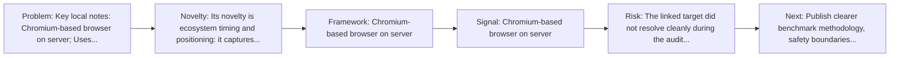
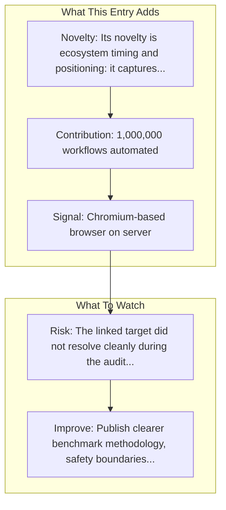

# Twin Labs - Twin

Entry report generated on 2026-03-28 (Asia/Tokyo). This report is based on the repository entry, audit-time metadata, and cross-checks against adjacent repo context.

## Snapshot

| Field | Detail |
| --- | --- |
| Repo entry | Twin Labs - Twin |
| Actual target | [Website](https://twin.so/) |
| Group | Products & Services |
| Category | Startups |
| Source location | `products/README.md:160` |
| Primary link type | `product` |
| Audit status | `error` |
| Location | Paris, France |
| Funding | €12M from LocalGlobe + unicorn founders |

## Quick Read

| Lens | Read |
| --- | --- |
| Role in repo | product |
| Novelty | Its novelty is ecosystem timing and positioning: it captures how a vendor chose to frame computer use as a product capability. |
| Operating frame | Chromium-based browser on server |
| Main caution | The linked target did not resolve cleanly during the audit, so this report leans heavily on repo-local notes and adjacent metadata. |

## Visual Frame

## Analysis Map

## Executive Summary

Key local notes: Chromium-based browser on server; Uses OpenAI CUA model.

## Novelty and Distinguishing Angle

- Its novelty is ecosystem timing and positioning: it captures how a vendor chose to frame computer use as a product capability.
- The entry is browser-first, matching the part of the ecosystem that currently looks most deployment-ready.

## Core Contributions or Offerings

- 1,000,000 workflows automated
- 100,000 agents deployed
- 60,000 users

## Operating Framework

- Chromium-based browser on server
- Uses OpenAI CUA model
- Schedule or trigger-based execution
- Location: Paris, France
- Funding: €12M from LocalGlobe + unicorn founders

## Evidence and Adoption Signals

- Chromium-based browser on server
- Uses OpenAI CUA model
- 1,000,000 workflows automated
- 100,000 agents deployed

## Limitations and Gaps

- The linked target did not resolve cleanly during the audit, so this report leans heavily on repo-local notes and adjacent metadata.
- Product pages and launch materials often emphasize claimed capability more than independent evaluation or failure analysis.

## Improvement Paths

- Publish clearer benchmark methodology, safety boundaries, and real deployment limits alongside capability claims.
- Keep changelogs and API or availability notes current so the repo can track product evolution without guesswork.
- Add more concrete examples of failure handling, fallback behavior, and human takeover boundaries.

## Why It Matters

- It shows how computer-use ideas are being packaged into deployable products, not only benchmark papers.
- That product layer matters because it exposes which capabilities companies think are ready for users or enterprises.

## Connections In This Repo

- [MultiOn](startups-multion.md) - shared browser or web-agent operating surface.
- [OpenAI - Operator / CUA](major-tech-companies-openai-operator-cua.md) - shared browser or web-agent operating surface.
- [Google - Project Mariner](major-tech-companies-google-project-mariner.md) - shared browser or web-agent operating surface.
- [Amazon AWS - Nova Act](major-tech-companies-amazon-aws-nova-act.md) - neighboring ecosystem entry in the same local cluster.

## Source Basis

- Primary basis: repo-local notes, link-audit page metadata.
- Audit access note: the linked target failed to resolve during the audit, so this report is more inferential than the ones backed by clean page metadata.
