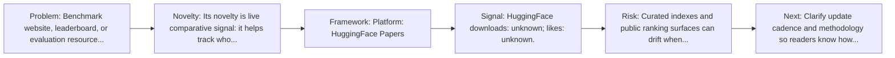
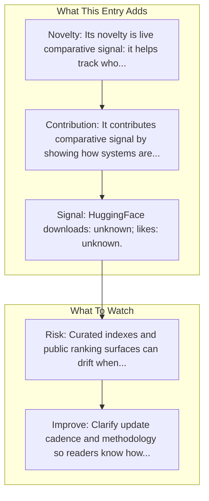

# HuggingFace Papers

Entry report generated on 2026-03-28 (Asia/Tokyo). This report is based on the repository entry, audit-time metadata, and cross-checks against adjacent repo context.

## Snapshot

| Field | Detail |
| --- | --- |
| Repo entry | HuggingFace Papers |
| Actual target | [huggingface.co/papers](https://huggingface.co/papers) |
| Group | Resources & Guides |
| Category | Benchmarking Resources / Leaderboards |
| Source location | `resources/README.md:159` |
| Primary link type | `leaderboard` |
| Audit status | `ok` |
| Platform | HuggingFace Papers |

## Quick Read

| Lens | Read |
| --- | --- |
| Role in repo | leaderboard |
| Novelty | Its novelty is live comparative signal: it helps track who is actually showing up on public evaluation surfaces over time. |
| Operating frame | Platform: HuggingFace Papers |
| Main caution | Curated indexes and public ranking surfaces can drift when maintainers stop updating them or when methodology changes quietly. |

## Visual Frame

## Analysis Map

## Executive Summary

Benchmark website, leaderboard, or evaluation resource linked from the repository. Your daily dose of AI research from AK. Key local notes: Platform: HuggingFace Papers.

## Novelty and Distinguishing Angle

- Its novelty is live comparative signal: it helps track who is actually showing up on public evaluation surfaces over time.
- Audit-time page framing: Daily Papers - Hugging Face.

## Core Contributions or Offerings

- It contributes comparative signal by showing how systems are ranked or surfaced in public-facing benchmark views.

## Operating Framework

- Platform: HuggingFace Papers
- HuggingFace surface: unknown downloads, unknown likes, library unspecified.
- Use it to track comparative movement, but cross-check methodology with the underlying benchmark itself.

## Evidence and Adoption Signals

- HuggingFace downloads: unknown; likes: unknown.
- Audit-time page title: Daily Papers - Hugging Face.
- Audit-time page description: Your daily dose of AI research from AK.

## Limitations and Gaps

- Curated indexes and public ranking surfaces can drift when maintainers stop updating them or when methodology changes quietly.

## Improvement Paths

- Clarify update cadence and methodology so readers know how fresh and comparable the surfaced information really is.
- Cross-link more directly to primary papers, repos, or docs so the index page is not the end of the evidence chain.
- State scope boundaries more explicitly so readers know what this entry covers and what it leaves out.

## Why It Matters

- It gives the repository explanatory and operational context beyond raw project lists.
- Resource entries matter because they shape how readers interpret the surrounding products, models, and frameworks.

## Connections In This Repo

- [ai-agent-papers](curated-paper-lists-ai-agent-papers.md) - neighboring ecosystem entry in the same local cluster.
- [ScreenSuite (HuggingFace)](../../papers/benchmarks-and-datasets/screensuite-huggingface.md) - paper-side context for the same capability cluster.
- [GUI-Agents-Paper-List (OSU NLP Group)](curated-paper-lists-gui-agents-paper-list-osu-nlp-group.md) - neighboring ecosystem entry in the same local cluster.
- [Awesome-GUI-Agent (ShowLab)](curated-paper-lists-awesome-gui-agent-showlab.md) - neighboring ecosystem entry in the same local cluster.

## Source Basis

- Primary basis: repo-local notes, link-audit page metadata, HuggingFace model metadata.
- Audit access note: link-audit status was `ok` for the primary URL.
