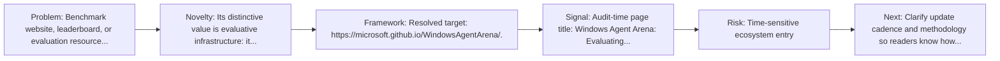
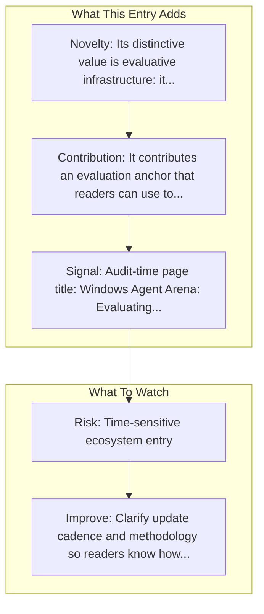

# Windows Agent Arena

Entry report generated on 2026-03-28 (Asia/Tokyo). This report is based on the repository entry, audit-time metadata, and cross-checks against adjacent repo context.

## Snapshot

| Field | Detail |
| --- | --- |
| Repo entry | Windows Agent Arena |
| Actual target | [microsoft.github.io/WindowsAgentArena](https://microsoft.github.io/WindowsAgentArena/) |
| Group | Resources & Guides |
| Category | Benchmarking Resources / Official Benchmark Sites |
| Source location | `resources/README.md:153` |
| Primary link type | `benchmark-site` |
| Audit status | `ok` |
| Benchmark | Windows Agent Arena |

## Quick Read

| Lens | Read |
| --- | --- |
| Role in repo | benchmark-site |
| Novelty | Its distinctive value is evaluative infrastructure: it exposes where capability claims are supposed to be tested rather than merely... |
| Operating frame | Resolved target: https://microsoft.github.io/WindowsAgentArena/. |
| Main caution | Claims should be read with source and maturity caveats in mind. |

## Visual Frame

## Analysis Map

## Executive Summary

Benchmark website, leaderboard, or evaluation resource linked from the repository. Windows Agent Arena (WAA) is a scalable Windows AI agent platform for testing and benchmarking multi-modal, desktop AI agents. WAA provides researchers and developers with a reproducible and realistic Windows OS environment for AI research, where agentic AI workflows can be tested across a diverse range of tasks. WAA supports the deployment of agents at scale using the Azure ML cloud infrastructure, allowing for the parallel running of multiple agents and delivering quick benchmark results for hundreds of tasks in minutes, not days.

## Novelty and Distinguishing Angle

- Its distinctive value is evaluative infrastructure: it exposes where capability claims are supposed to be tested rather than merely described.
- The entry sits in the desktop-control lane, which usually raises stronger environment variance and safety implications than browser-only automation.
- Audit-time page framing: Windows Agent Arena: Evaluating Multi-modal OS Agents at Scale.

## Core Contributions or Offerings

- It contributes an evaluation anchor that readers can use to interpret claims elsewhere in the repo.

## Operating Framework

- Resolved target: https://microsoft.github.io/WindowsAgentArena/.
- Use it to inspect task scope, benchmark framing, and evaluation context behind nearby model claims.

## Evidence and Adoption Signals

- Audit-time page title: Windows Agent Arena: Evaluating Multi-modal OS Agents at Scale.
- Audit-time page description: Windows Agent Arena (WAA) is a scalable Windows AI agent platform for testing and benchmarking multi-modal, desktop AI agents. WAA provides researchers and developers with a reproducible and realistic Windows OS environment for AI research, where agentic AI workflows can be tested across a diverse range of tasks. WAA supports the deployment of agents at scale using the Azure ML cloud infrastructure, allowing for the parallel running of multiple agents and delivering quick benchmark results for hundreds of tasks in minutes, not days..

## Limitations and Gaps

## Improvement Paths

- Clarify update cadence and methodology so readers know how fresh and comparable the surfaced information really is.
- Cross-link more directly to primary papers, repos, or docs so the index page is not the end of the evidence chain.
- State scope boundaries more explicitly so readers know what this entry covers and what it leaves out.

## Why It Matters

- It gives the repository explanatory and operational context beyond raw project lists.
- Resource entries matter because they shape how readers interpret the surrounding products, models, and frameworks.

## Connections In This Repo

- [Windows Agent Arena (WAA)](../../papers/benchmarks-and-datasets/windows-agent-arena-waa.md) - paper-side context for the same capability cluster.
- [A3: Android Agent Arena](../../papers/benchmarks-and-datasets/a3-android-agent-arena.md) - paper-side context for the same capability cluster.
- [Mind2Web: Towards a Generalist Agent for the Web](../../papers/benchmarks-and-datasets/mind2web-towards-a-generalist-agent-for-the-web.md) - paper-side context for the same capability cluster.
- [WebVoyager: End-to-End Web Agent with LMMs](../../papers/benchmarks-and-datasets/webvoyager-end-to-end-web-agent-with-lmms.md) - paper-side context for the same capability cluster.

## Source Basis

- Primary basis: repo-local notes, link-audit page metadata.
- Audit access note: link-audit status was `ok` for the primary URL.
