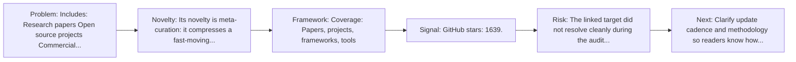
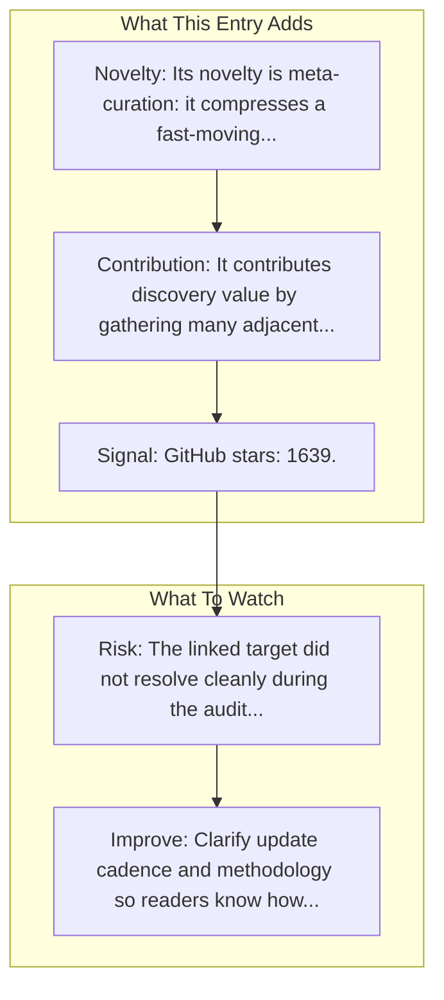

# ACU - AI for Computer Use

Entry report generated on 2026-03-28 (Asia/Tokyo). This report is based on the repository entry, audit-time metadata, and cross-checks against adjacent repo context.

## Snapshot

| Field | Detail |
| --- | --- |
| Repo entry | ACU - AI for Computer Use |
| Actual target | [GitHub](https://github.com/trycua/acu) |
| Group | Resources & Guides |
| Category | Curated Paper Lists |
| Source location | `resources/README.md:42` |
| Primary link type | `curated-list` |
| Audit status | `error` |
| Coverage | Papers, projects, frameworks, tools |
| GitHub stars | 1639 |

## Quick Read

| Lens | Read |
| --- | --- |
| Role in repo | curated-list |
| Novelty | Its novelty is meta-curation: it compresses a fast-moving literature and tooling space into a single discovery surface. |
| Operating frame | Coverage: Papers, projects, frameworks, tools |
| Main caution | The linked target did not resolve cleanly during the audit, so this report leans heavily on repo-local notes and adjacent metadata. |

## Visual Frame

## Analysis Map

## Executive Summary

Includes: Research papers Open source projects Commercial solutions Safety research. A curated list of resources about AI agents for Computer Use, including research papers, projects, frameworks, and tools. Key local notes: Coverage: Papers, projects, frameworks, tools.

## Novelty and Distinguishing Angle

- Its novelty is meta-curation: it compresses a fast-moving literature and tooling space into a single discovery surface.
- Open-source adoption is non-trivial here: cached GitHub metadata records 1639 stars.

## Core Contributions or Offerings

- It contributes discovery value by gathering many adjacent papers, repos, or benchmarks into one place.
- GitHub topic footprint: ai, ai-research, awesome, computer, computer-use, gui-agent.

## Operating Framework

- Coverage: Papers, projects, frameworks, tools
- Repo language: Not stated; license: Not stated.
- Repository updated at audit time: 2026-03-26T10:53:08Z.
- Use it as a branching surface into papers, repos, and benchmarks rather than as a substitute for reading those primary sources.

## Evidence and Adoption Signals

- GitHub stars: 1639.
- Open issues at audit time: 7.
- Open-source posture: unknown language, license not stated.
- Topics: ai, ai-research, awesome, computer, computer-use, gui-agent.
- Recent maintenance timestamp in cached metadata: 2026-03-26T10:53:08Z.

## Limitations and Gaps

- The linked target did not resolve cleanly during the audit, so this report leans heavily on repo-local notes and adjacent metadata.
- Curated indexes and public ranking surfaces can drift when maintainers stop updating them or when methodology changes quietly.

## Improvement Paths

- Clarify update cadence and methodology so readers know how fresh and comparable the surfaced information really is.
- Cross-link more directly to primary papers, repos, or docs so the index page is not the end of the evidence chain.
- State scope boundaries more explicitly so readers know what this entry covers and what it leaves out.

## Why It Matters

- It gives the repository explanatory and operational context beyond raw project lists.
- Resource entries matter because they shape how readers interpret the surrounding products, models, and frameworks.

## Connections In This Repo

- [ComputerRL: End-to-End Online RL for Computer Use Agents](../../papers/methods-and-techniques/computerrl-end-to-end-online-rl-for-computer-use-agents.md) - paper-side context for the same capability cluster.
- [PC Agent-E: Efficient Agent Training for Computer Use](../../papers/methods-and-techniques/pc-agent-e-efficient-agent-training-for-computer-use.md) - paper-side context for the same capability cluster.
- [RedTeamCUA: Security Testing for Computer Use Agents](../../papers/safety-and-security/redteamcua-security-testing-for-computer-use-agents.md) - paper-side context for the same capability cluster.
- [Introducing computer use](key-blog-posts-and-announcements-anthropic-introducing-computer-use.md) - neighboring ecosystem entry in the same local cluster.

## Source Basis

- Primary basis: repo-local notes, link-audit page metadata, GitHub repository metadata.
- Audit access note: the linked target failed to resolve during the audit, so this report is more inferential than the ones backed by clean page metadata.
- Maintenance note: repository metadata was current through 2026-03-26T10:53:08Z at audit time.
